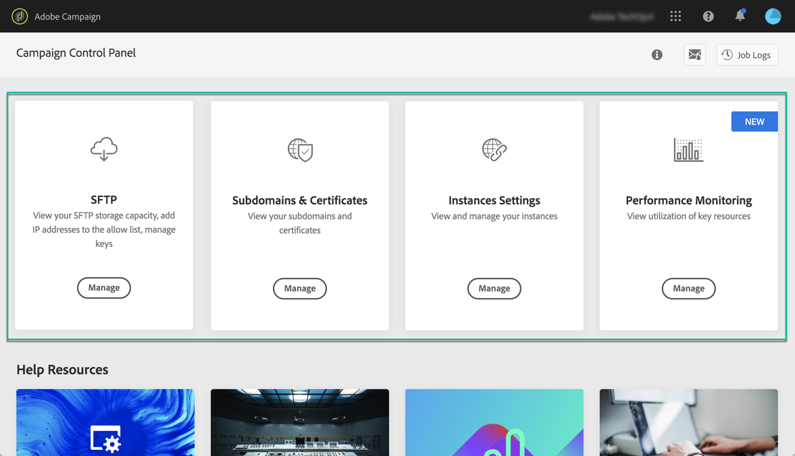
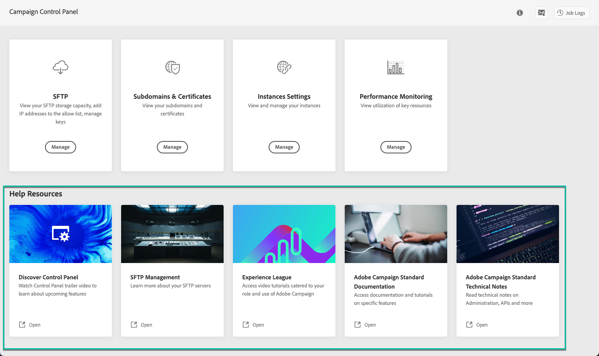

# Lär känna Kontrollpanelens gränssnitt {#discovering-interface}

På Kontrollpanelens startsida får du tillgång till alla åtgärder som kan utföras på instanserna i Campaign.

De representeras av kort som är ordnade i ämnen, till exempel **Prestandaövervakning**.

<!--With upcoming Campaign releases, more topics and cards will be made available.-->

## Jobbloggar {#job-logs}

Med knappen **[!UICONTROL Job Logs]** i det övre högra hörnet kan du granska alla ändringar som har gjorts av användare i din organisation.

Klicka på ett element i listan om du vill ha mer information.

Med knappen **[!UICONTROL Open]** kommer du direkt till den flik på kontrollpanelen där ändringen gjordes.

## Hjälpresurser {#help-resources}

Avsnittet **[!UICONTROL Help Resources]** innehåller användbar dokumentation som kan hjälpa dig att använda Kontrollpanelen och Campaign-produkterna. Tveka inte att utforska dem.

## Språk som stöds {#languages}

Användargränssnittet i Kontrollpanelen är utformat för att visas på det språk som motsvarar webbläsarens konfiguration.

Om webbläsaren är inställd på ett språk som inte stöds kontrolleras de tre första språken i webbläsarens språklista på Kontrollpanelen tills ett språk som stöds hittas. Om inget av de tre första språken stöds av Kontrollpanelen används engelska (USA) som standard.

Nedan finns en lista över de språk som för närvarande stöds av Kontrollpanelen:

* Engelska (USA)
* Tyska
* Franska
* Japanska
* Italienska (Italien)
* Spanska (Spanien)
* Koreanska
* Portugisiska (Brasilien)
* Kinesiska (förenklad)
* Kinesiska (traditionell)
