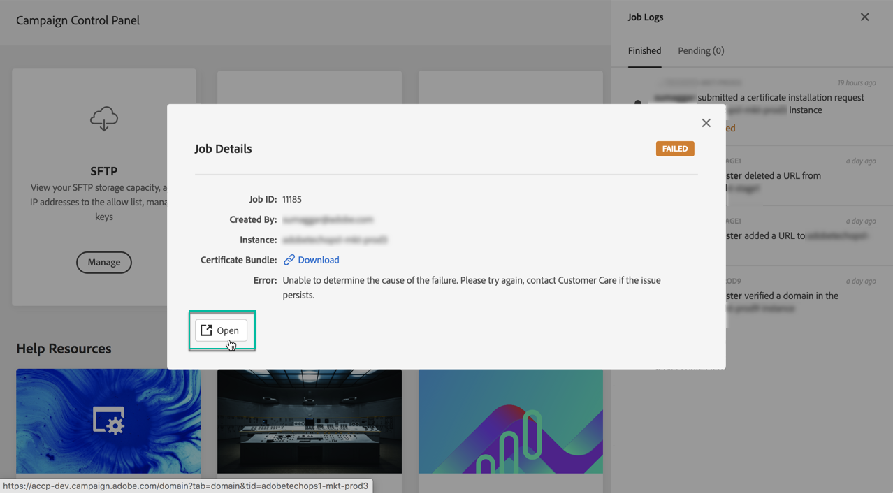

# Lär känna Kontrollpanelens gränssnitt {#discovering-interface}

På Kontrollpanelens startsida får du tillgång till alla åtgärder som kan utföras på instanserna i Campaign.

De representeras av kort som är ordnade i ämnen, till exempel **Lagring och databashantering**.

I kommande kampanjversioner kommer fler ämnen och kort att bli tillgängliga.

## Jobbloggar {#job-logs}

Med knappen **[!UICONTROL Job Logs]** i det övre högra hörnet kan du granska alla ändringar som har gjorts av användare i din organisation.

Klicka på ett element i listan om du vill ha mer information.

Med knappen **[!UICONTROL Open]** kommer du direkt till den flik på kontrollpanelen där ändringen gjordes.

## Hjälpresurser {#help-resources}

Avsnittet **[!UICONTROL Help Resources]** innehåller användbar dokumentation som hjälper dig att använda kontrollpanelen och Campaign-produkterna. Tveka inte att utforska dem.

