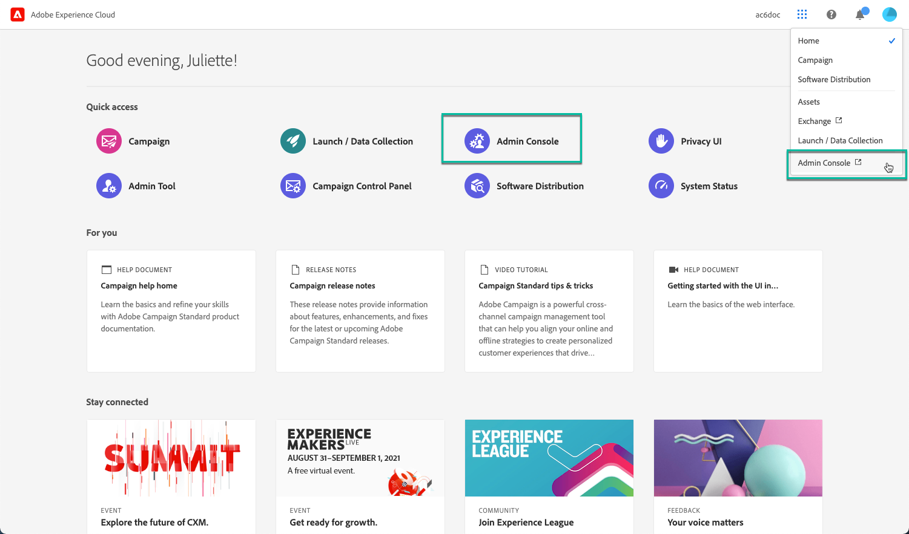

# Hantera behörigheter till Kontrollpanelen {#managing-permissions-control-panel}

Kontrollpanelen är tillgänglig för alla administratörsanvändare för en Campaign-instans. Följ stegen nedan för att tilldela användare till gruppen Administratörer och ge dem åtkomst till Kontrollpanelen.

 Upptäck den här funktionen i [video](../../discover/using/managing-permissions.md#video)

1. Gå till [Adobe Experience Cloud hemsida](https://experiencecloud.adobe.com/){target="_blank"}.

1. Starta **Admin Console** genom att klicka på den tillgängliga länken i **snabbåtkomstavsnittet** eller den övre högra menyn.

   

   >[!NOTE]
   >
   >Om länken **Admin Console** inte visas innebär det att du inte har administratörsbehörighet för din organisation. Kontakta organisationens administratörer för att utföra stegen med dem.

1. I **Admin Console** väljer du önskad kampanjprodukt i listan **[!UICONTROL Products and services]**.

   

   >[!NOTE]
   >
   >Om du inte ser din produkt kontaktar du organisationens administratörer så att de ger dig tillgång till den.

1. Listan med instanser för din Campaign-produkt visas. Markera instansen som du vill lägga till en Admin-användare i.

   

   >[!NOTE]
   >
   >Du kan lägga till olika administratörsanvändare för varje Campaign-instans. Administratörsanvändare kommer bara åt Kontrollpanelen för den instans de tillhör.

1. Listan med **[!UICONTROL Product Profiles]** för den valda instansen visas. Klicka på produktprofilen för **[!UICONTROL Administrators]** för att komma åt listan med admin-användare.

   

   >[!IMPORTANT]
   >
   >Kontrollpanelen är som standard tillgänglig för administratörsanvändare som tillhör produktprofilen &quot;Administratörer&quot;. Enligt din organisations konfiguration kan produktprofilen namnges på ett annat sätt (&quot;admin&quot;,&quot;admins&quot;,&quot;approval admin&quot; osv.). **Alla produktprofiler som innehåller ordet &quot;admin&quot; i namnet ger automatiskt åtkomst till Kontrollpanelen.**
   >
   >Granska noga namngivningskonventionerna för produktprofiler i Admin Console för att säkerställa att endast behöriga användare har tillgång till Kontrollpanelen, eftersom det gör det möjligt att göra betydande ändringar i Campaign-instanser.

1. Listan med admin-användare visas. Klicka på knappen **[!UICONTROL Add User]** för att lägga till önskad användare.

   

>[!NOTE]
>
>När åtkomsten är konfigurerad måste användaren logga ut från Adobe Experience Cloud och logga in igen för att komma åt Kontrollpanelen.

## Självstudievideo {#video}

>[!VIDEO](https://video.tv.adobe.com/v/27147?quality=12)
