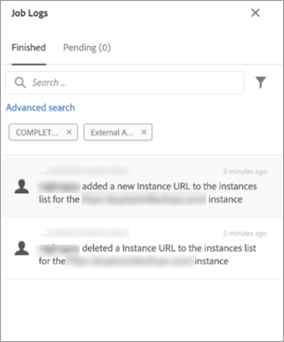

# Lägg till MID/RT-instanser (hybridmodell)

>[!CONTEXTUALHELP]
>id="cp_externalaccounts"
>title="Externa konton"
>abstract="På den här skärmen kan kunder med hybridvärdmodell tillhandahålla sin MID/RT-instans-URL som konfigurerats i marknadsinstansen på Kontrollpanelen för att utnyttja funktionerna på Kontrollpanelen."

Kontrollpanelen gör det möjligt för kunder med hybridhosting-modeller att utnyttja särskilda funktioner i Kontrollpanelen. För att göra detta måste de ange den MID/RT-instans-URL som konfigurerats i deras marknadsföringsinstans på Kontrollpanelen.

Mer information om värdmodeller finns i [Campaign Classic dokumentation](https://experienceleague.adobe.com/docs/campaign-classic/using/installing-campaign-classic/architecture-and-hosting-models/hosting-models-lp/hosting-models.html).

## Lägg till en MID/RT-instans {#add}

>[!CONTEXTUALHELP]
>id="cp_externalaccounts_url"
>title="URL"
>abstract="URL för instansen, som finns i Campaign Client Console i menyn Administration > Plattform > Externa konton."

>[!CONTEXTUALHELP]
>id="cp_externalaccounts_operator"
>title="Operatör"
>abstract="ID för den operator som tillhandahålls efter inledande etablering av Adobe Admin."

>[!CONTEXTUALHELP]
>id="cp_externalaccounts_password"
>title="Lösenord"
>abstract="Lösenord för operatorn som tillhandahålls efter inledande etablering av Adobe Admin."

Hybridkunder bör ansluta till Kontrollpanelen via Experience Cloud. Första gången du öppnar Kontrollpanelen visas bara två kort på hemsidan.

>[!NOTE]
>
>Om du stöter på några problem med åtkomst till Kontrollpanelen är det troligast att din marknadsföringsinstans inte har mappats med ditt organisations-ID än. Kontakta kundtjänst för att slutföra den här installationen och fortsätta. När anslutningen lyckades visas startsidan för Kontrollpanelen.

För att kunna komma åt funktioner på Kontrollpanelen måste du ange din MID/RT-instansinformation i **[!UICONTROL Instances Settings]** kort. Följ stegen nedan för att göra detta.

1. I **[!UICONTROL Instances Settings]** välj **[!UICONTROL External Accounts]** -fliken.

1. Välj önskad marknadsinstans i listrutan och klicka sedan på **[!UICONTROL Add new URL]**.

   

1. Ange information om MID/RT-instansen som ska läggas till.

   

   * **[!UICONTROL URL]**: URL för instansen som finns i Campaign Client Console i **[!UICONTROL Administration]** > **[!UICONTROL Platform]** > **[!UICONTROL External Accounts]** -menyn.

      

   * **[!UICONTROL Operator]** / **[!UICONTROL Password]**: Autentiseringsuppgifter för operatorn som tillhandahålls efter inledande etablering av Adobe Admin.

      >[!NOTE]
      >
      >Kontakta kundtjänst om dessa uppgifter inte är tillgängliga.

1. Klicka **[!UICONTROL Save]** för att bekräfta.

När du lägger till MID/RT-URL aktiveras en asynkron process för att validera URL-adressernas korrekthet. Den här processen kan ta några minuter. Jobbet väntar tills MID/RT-instans-URL:en har verifierats. Du kan bara komma åt huvudfunktionerna i Kontrollpanelen när valideringen är klar.

Du kan när som helst ta bort eller inaktivera en MID/RT-instans-URL genom att markera den i listan.

Observera att du kan övervaka alla åtgärder som utförs i **[!UICONTROL External Accounts]** på en MID/RT-instans-URL från **[!UICONTROL Job Logs]**:

## Funktioner för hybridkunder {#capabilities}

När du har lagt till en MID/RT-instans på Kontrollpanelen kan du utnyttja funktionerna som listas nedan:

* [Övervaka viktiga kontakter och händelser](../../service-events/service-events.md)
* [Visa din instansinformation](../../instances-settings/using/instance-details.md),
* [Lägg till IP-adresser i tillåtelselista](../../instances-settings/using/ip-allow-listing-instance-access.md) (för RT-instanser),
* [Visa information om delegerade underdomäner](../../subdomains-certificates/using/monitoring-subdomains.md),
* [Visa information om SSL-certifikat](../../subdomains-certificates/using/monitoring-ssl-certificates.md).