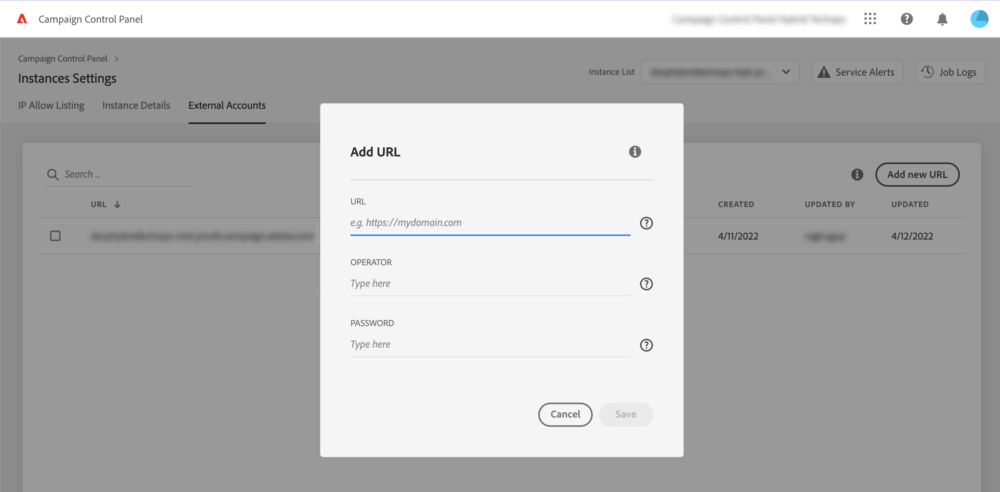

# Lägg till MID/RT-instanser (hybridmodell)

>[!CONTEXTUALHELP]
>id="cp_externalaccounts"
>title="Externa konton"
>abstract="På den här skärmen kan kunder med hybridvärdmodell tillhandahålla URL:en för MID/RT-instansen som konfigurerats i marknadsinstansen på Kontrollpanelen för att utnyttja funktionerna på Kontrollpanelen."

Kontrollpanelen gör det möjligt för kunder med hybridvärdmodeller att utnyttja särskilda funktioner i Kontrollpanelen. För att göra detta måste de ange den URL för MID/RT-instansen som konfigurerats i deras marknadsföringsinstans på Kontrollpanelen.

Mer information om värdmodeller finns i [Dokumentation för Campaign Classic](https://experienceleague.adobe.com/docs/campaign-classic/using/installing-campaign-classic/architecture-and-hosting-models/hosting-models-lp/hosting-models.html?lang=sv).

## Lägg till en MID/RT-instans {#add}

>[!CONTEXTUALHELP]
>id="cp_externalaccounts_url"
>title="URL"
>abstract="URL för instansen, som finns i klientkonsolen för Campaign i menyn Administration > Plattform > Externa konton."

>[!CONTEXTUALHELP]
>id="cp_externalaccounts_operator"
>title="Operatör"
>abstract="ID för den operator som tillhandahålls efter inledande etablering av Adobe Admin."

>[!CONTEXTUALHELP]
>id="cp_externalaccounts_password"
>title="Lösenord"
>abstract="Lösenord för den operator som tillhandahålls efter inledande etablering av Adobe Admin."

Hybridkunder bör ansluta till Kontrollpanelen via Experience Cloud. Första gången du öppnar Kontrollpanelen visas bara två kort på hemsidan.

>[!NOTE]
>
>Om du stöter på några problem med åtkomst till Kontrollpanelen är det troligast att din marknadsföringsinstans inte har mappats med ditt organisations-ID än. Kontakta kundtjänst för att slutföra den här installationen och fortsätta. När anslutningen lyckas visas startsidan för Kontrollpanelen.

För att kunna komma åt funktioner på Kontrollpanelen måste du ange din information för MID/RT-instansen i kortet **[!UICONTROL Instances Settings]**. Följ stegen nedan för att göra detta.

1. I kortet **[!UICONTROL Instances Settings]** väljer du fliken **[!UICONTROL External Accounts]**.

1. Välj önskad marknadsinstans i rullgardinsmenyn och klicka sedan på **[!UICONTROL Add new URL]**.

   

1. Ange information om MID/RT-instansen som ska läggas till.

   

   * **[!UICONTROL URL]**: URL för instansen som finns i klientkonsolen för Campaign i menyn **[!UICONTROL Administration]** > **[!UICONTROL Platform]** > **[!UICONTROL External Accounts]**.

      

   * **[!UICONTROL Operator]** / **[!UICONTROL Password]**: autentiseringsuppgifter för den operatör som tillhandahålls efter inledande etablering av Adobe Admin.

      >[!NOTE]
      >
      >Kontakta kundtjänst om dessa uppgifter inte är tillgängliga.

1. Klicka på **[!UICONTROL Save]** för att bekräfta.

När du lägger till MID/RT-URL aktiveras en asynkron process för att validera URL-adressernas korrekthet. Den här processen kan ta några minuter. Jobbet väntar tills URL:en för MID/RT-instansen har verifierats. Du kan bara komma åt huvudfunktionerna i Kontrollpanelen när valideringen är klar.

Du kan när som helst ta bort eller inaktivera URL:en för MID/RT-instansen genom att markera den i listan.

Observera att du kan övervaka alla åtgärder som utförs i fliken **[!UICONTROL External Accounts]** på en URL för MID/RT-instans från **[!UICONTROL Job Logs]**:

## Tillgängliga funktioner för hybridkunder {#capabilities}

När du har lagt till en MID/RT-instans på Kontrollpanelen kan du utnyttja funktionerna som listas nedan:

* [Övervaka viktiga kontakter och händelser](../../service-events/service-events.md)
* [Visa din instansinformation](../../instances-settings/using/instance-details.md),
* [Lägg till IP-adresser i tillåtelselista](../../instances-settings/using/ip-allow-listing-instance-access.md) (för RT-instanser),
* [Visa information om delegerade underdomäner](../../subdomains-certificates/using/monitoring-subdomains.md),
* [Förnya underdomäners SSL-certifikat](../../subdomains-certificates/using/renewing-subdomain-certificate.md).
