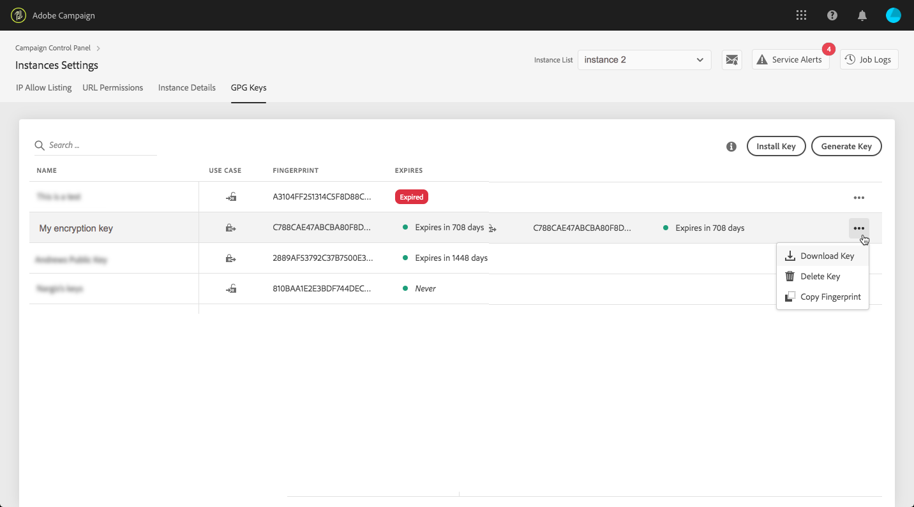
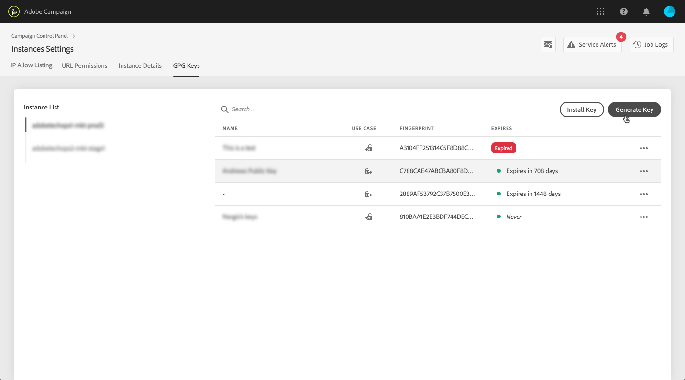
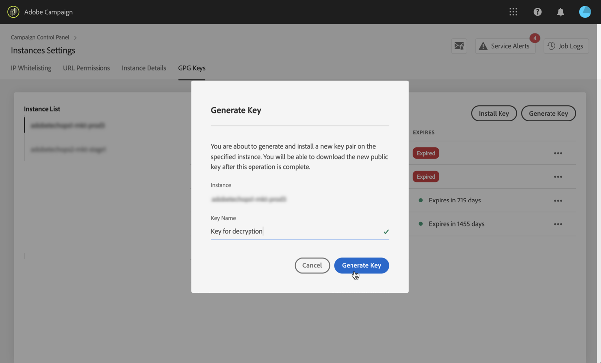
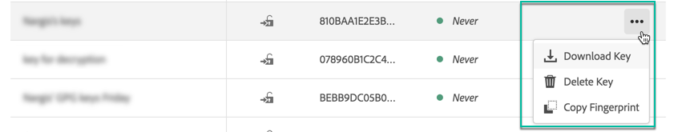
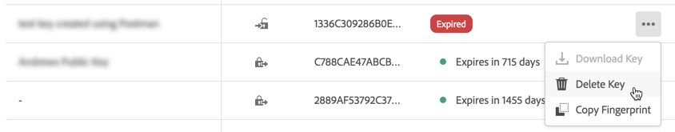

# Hantera GPG-nycklar {#gpg-keys-management}

>[!CONTEXTUALHELP]
>id="cp_instancesettings_gpg_management"
>title="Om GPG-tangenter"
>abstract="På den här fliken kan du installera och/eller generera GPG-nycklar på en marknadsinstans för att kryptera data som skickas från Campaign och dekryptera inkommande data."
>additional-url="https://experienceleague.adobe.com/docs/control-panel/using/performance-monitoring/about-performance-monitoring.html?lang=sv" text="Om prestandaövervakning"

## Om GPG-kryptering {#about-gpg-encryption}

GPG-kryptering gör att du kan skydda dina data med hjälp av ett system med offentlig-privata nyckelpar som följer efter [OpenPGP](https://www.openpgp.org/about/standard/) -specifikation.

När den är implementerad kan du kryptera inkommande och utgående data innan överföringen görs, så att ingen kan komma åt dem utan ett giltigt matchande nyckelpar.

För att GPG-kryptering ska kunna implementeras i Campaign måste GPG-nycklar installeras och/eller genereras på en marknadsföringsinstans av en administratörsanvändare direkt på kontrollpanelen.

Då kan du:

* **Kryptera skickade data**: Adobe Campaign skickar data när de har krypterats med den installerade offentliga nyckeln.

* **Dekryptera inkommande data**: Adobe Campaign tar emot data som har krypterats utanför ett externt system med en offentlig nyckel som hämtats från Kontrollpanelen. Adobe Campaign dekrypterar data med en privat nyckel som genereras från Kontrollpanelen.

## Kryptera data {#encrypting-data}

Med kontrollpanelen kan du kryptera data som kommer från instansen i Adobe Campaign.

För att göra detta måste du generera ett GPG-nyckelpar från ett PGP-krypteringsverktyg och sedan installera den offentliga nyckeln på Kontrollpanelen. Du kan sedan kryptera data innan du skickar dem från din instans. Följ stegen nedan för att göra detta.

>[!NOTE]
>
>Du kan installera upp till 60 GPG-tangenter på Kontrollpanelen.

[ Upptäck den här funktionen i en video](#video)

1. Skapa ett nyckelpar för offentlig/privat nyckel med ett PGP-krypteringsverktyg som följer [OpenPGP-specifikation](https://www.openpgp.org/about/standard/). Installera ett GPG-verktyg eller GNuGP-program om du vill göra det.

   >[!NOTE]
   >
   >Kostnadsfri programvara med öppen källkod för att generera nycklar finns tillgänglig. Se dock till att du följer riktlinjerna från din organisation och använder GPG-verktyget som rekommenderas av din IT/säkerhetsorganisation.

1. När verktyget är installerat kör du kommandot nedan i Mac Terminal eller Windows.

   `gpg --full-generate-key`

1. Ange önskade parametrar för nyckeln när du uppmanas till detta. Obligatoriska parametrar är:

   * **tangenttyp**: RSA
   * **nyckellängd**: 3072 - 4 096 bitar
   * **riktigt namn** och **e-postadress**: Används för att spåra vem som skapade nyckelparet. Ange ett namn och en e-postadress som är länkad till din organisation eller avdelning.
   * **kommentar**: om du lägger till en etikett i kommentarsfältet blir det lättare att identifiera nyckeln som du kan använda för att kryptera dina data.
     >[!IMPORTANT]
     >
     >Se till att fältet inte är tomt och att en kommentar är ifylld.

   * **förfallodatum**: Datum eller &quot;0&quot; för inget förfallodatum.
   * **lösenfras**

   

1. När skriptet har bekräftats genereras en nyckel med tillhörande fingeravtryck som du kan exportera till en fil eller klistra in direkt i kontrollpanelen. Om du vill exportera filen kör du det här kommandot följt av fingeravtrycket för nyckeln som du skapade.

   `gpg -a --export <fingerprint>`

1. Om du vill installera den offentliga nyckeln på Kontrollpanelen öppnar du **[!UICONTROL Instance settings]** och väljer **[!UICONTROL GPG keys]** och den önskade instansen.

1. Klicka på knappen **[!UICONTROL Install Key]**.

   

1. Klistra in den offentliga nyckeln som har genererats från PGP-krypteringsverktyget. Du kan också dra och släppa den offentliga nyckelfil som du exporterade direkt.

   >[!NOTE]
   >
   >Den offentliga nyckeln ska vara i OpenPGP-format.

   

1. Klicka på knappen **[!UICONTROL Install Key]**.

När den offentliga nyckeln har installerats visas den i listan. Du kan använda **...** för att ladda ned den eller kopiera dess fingeravtryck.

Nyckeln kan sedan användas i Adobe Campaign arbetsflöden. Du kan använda den för att kryptera data när du använder dataextraheringsaktiviteter.

[ Upptäck den här funktionen i en video](#video)

Mer information om detta finns i Adobe Campaign-dokumentationen:

**Campaign v7/v8:**

* [Zippa eller kryptera en fil](https://experienceleague.adobe.com/docs/campaign-classic/using/getting-started/importing-and-exporting-data/managing-data-encryption-compression/zip-encrypt.html)
* [Användningsfall: Kryptera och exportera data med en tangent som är installerad på Kontrollpanelen](https://experienceleague.adobe.com/docs/campaign-standard/using/managing-processes-and-data/importing-and-exporting-data/managing-encrypted-data.html#use-case-gpg-encrypt)

**Campaign Standard:**

* [Hantera krypterade data](https://experienceleague.adobe.com/docs/campaign-standard/using/managing-processes-and-data/importing-and-exporting-data/managing-encrypted-data.html)
* [Användningsfall: Kryptera och exportera data med en tangent som är installerad på Kontrollpanelen](https://experienceleague.adobe.com/docs/campaign-classic/using/getting-started/importing-and-exporting-data/managing-data-encryption-compression/zip-encrypt.html#use-case-gpg-encrypt)

## Dekryptera data {#decrypting-data}

Med Kontrollpanelen kan du dekryptera externa data som kommer in i dina Adobe Campaign-instanser.

För att göra detta måste du generera ett GPG-nyckelpar direkt från kontrollpanelen.

* The **publik nyckel** delas med det externa systemet, som kommer att använda det för att kryptera data som ska skickas till Campaign.
* The **privat nyckel** kommer att användas av Campaign för att dekryptera inkommande krypterade data.

[ Upptäck den här funktionen i en video](#video)

Så här genererar du ett nyckelpar på Kontrollpanelen:

1. Öppna **[!UICONTROL Instance settings]** och väljer **[!UICONTROL GPG keys]** och den önskade Adobe Campaign-instansen.

1. Klicka på knappen **[!UICONTROL Generate Key]**.

   

1. Ange namnet på nyckeln och klicka sedan på **[!UICONTROL Generate Key]**. Det här namnet hjälper dig att identifiera nyckeln som ska användas för dekryptering i kampanjarbetsflöden

   

När nyckelparet har skapats visas den offentliga nyckeln i listan. Observera att dekrypteringsnyckelpar genereras utan förfallodatum.

Du kan använda **...** om du vill hämta den offentliga nyckeln eller kopiera dess fingeravtryck.

Den offentliga nyckeln är sedan tillgänglig för delning med valfritt externt system. Adobe Campaign kan använda den privata nyckeln för datainläsningsaktiviteter för att dekryptera data som har krypterats med den offentliga nyckeln.

Mer information finns i Adobe Campaign-dokumentationen:

**Campaign v7 och v8:**

* [Packa upp eller dekryptera en fil före bearbetning](https://experienceleague.adobe.com/docs/campaign-classic/using/getting-started/importing-and-exporting-data/managing-data-encryption-compression/unzip-decrypt.html)
* [Användningsfall: Importera data som krypterats med en nyckel som genererats av Kontrollpanelen](https://experienceleague.adobe.com/docs/campaign-classic/using/getting-started/importing-and-exporting-data/managing-data-encryption-compression/unzip-decrypt.html#use-case-gpg-decrypt)

**Campaign Standard:**

* [Hantera krypterade data](https://experienceleague.adobe.com/docs/campaign-standard/using/managing-processes-and-data/importing-and-exporting-data/managing-encrypted-data.html)
* [Användningsfall: Importera data som krypterats med en nyckel som genererats av Kontrollpanelen](https://experienceleague.adobe.com/docs/campaign-standard/using/managing-processes-and-data/importing-and-exporting-data/managing-encrypted-data.html#use-case-gpg-decrypt)

## Övervaka GPG-nycklar

Om du vill komma åt GPG-nycklar som är installerade och genererade för dina instanser öppnar du **[!UICONTROL Instance settings]** och väljer **[!UICONTROL GPG keys]** -fliken.

I listan visas alla GPG-nycklar för kryptering och dekryptering som har installerats och genererats för dina instanser med detaljerad information om varje nyckel:

* **[!UICONTROL Name]**: Namnet som har definierats när nyckeln installeras eller genereras.
* **[!UICONTROL Use case]**: Den här kolumnen anger nyckelns användningsfall:

  : Nyckeln har installerats för datakryptering.

  : Nyckeln har genererats för att tillåta datadekryptering.

* **[!UICONTROL Fingerprint]**: nyckelns fingeravtryck.
* **[!UICONTROL Expires]**: Nyckelns förfallodatum. Observera att Kontrollpanelen kommer att ge visuella indikationer när nyckeln närmar sig förfallodatumet:

   * Urgent (red) visas 30 dagar tidigare.
   * Varning (gul) visas 60 dagar före.
   * En&quot;utgången&quot; röd banderoll visas när en tangent har gått ut.

  >[!NOTE]
  >
  >Observera att inga e-postmeddelanden skickas från Kontrollpanelen.

Vi rekommenderar att du tar bort alla tangenter som du inte längre behöver. Klicka på **...** knapp och markera **[!UICONTROL Delete Key].**.

>[!IMPORTANT]
>
>Innan du tar bort en tangent bör du kontrollera att den inte används i något Adobe Campaign-arbetsflöde för att förhindra att den misslyckas.

## Självstudievideo {#video}

I videon nedan visas hur du genererar och installerar GPG-nycklar för datakryptering.

Fler instruktionsvideor om hantering av GPG-nycklar finns i  [Campaign v7/v8](https://experienceleague.adobe.com/docs/campaign-standard-learn/control-panel/instance-settings/gpg-key-management/gpg-key-management-overview.html#instance-settings) och [Campaign Standard](https://experienceleague.adobe.com/docs/campaign-classic-learn/control-panel/instance-settings/gpg-key-management/gpg-key-management-overview.html#instance-settings) självstudiekurser på sidor.

>[!VIDEO](https://video.tv.adobe.com/v/36386?quality=12)
