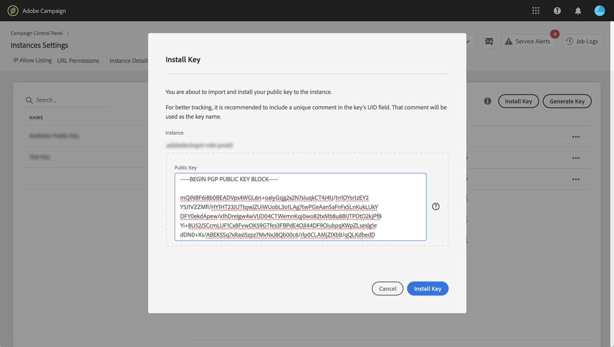

# Hantering av GPG-nycklar {#gpg-keys-management}

## Om GPG-kryptering {#about-gpg-encryption}

GPG-kryptering gör att du kan skydda dina data med hjälp av ett system med offentlig-privata nyckelpar som följer [OpenPGP](https://www.openpgp.org/about/standard/) -specifikationen.

När den är implementerad kan du kryptera inkommande och utgående data innan överföringen görs, så att ingen kan komma åt dem utan ett giltigt matchande nyckelpar.

För att implementera GPG-kryptering med Campaign måste GPG-nycklar installeras och/eller genereras på en marknadsföringsinstans av en administratörsanvändare direkt från Kontrollpanelen.

Då kan du:

* **Kryptera skickade data**: Adobe Campaign skickar data när de har krypterats med den installerade offentliga nyckeln.

* **Dekryptera inkommande data**: Adobe Campaign tar emot data som har krypterats utanför ett externt system med hjälp av en offentlig nyckel som hämtats från Kontrollpanelen. Adobe Campaign dekrypterar data med en privat nyckel som genereras från Kontrollpanelen.

## Kryptera data {#encrypting-data}

Med Kontrollpanelen kan du kryptera data som kommer ut från din Adobe Campaign-instans.

För att göra detta måste du generera ett GPG-nyckelpar från ett PGP-krypteringsverktyg och sedan installera den offentliga nyckeln på Kontrollpanelen. Du kan sedan kryptera data innan du skickar dem från din instans. Gör så här:

1. Skapa ett nyckelpar för offentlig/privat nyckel med ett GPG-krypteringsverktyg som följer [OpenPGP-specifikationen](https://www.openpgp.org/about/standard/). Installera ett GPG-verktyg eller GNuGP-program om du vill göra det.

   >[!NOTE]
   >
   >Kostnadsfri programvara med öppen källkod för att generera nycklar finns tillgänglig. Se dock till att du följer riktlinjerna från din organisation och använder GPG-verktyget som rekommenderas av din IT/säkerhetsorganisation.

1. När verktyget är installerat kör du kommandot nedan i Mac Terminal eller Windows.

   `gpg --full-generate-key`

1. Ange önskade parametrar för nyckeln när du uppmanas till detta. Nödvändiga parametrar är:

   * **nyckeltyp**: RSA
   * **nyckellängd**: 1024 - 4096 bitar
   * **riktigt namn** och **e-postadress**: Låter spåra vem som skapade nyckelparet. Ange ett namn och en e-postadress som är länkad till din organisation eller avdelning.
   * **kommentar**: Om du lägger till en etikett i kommentarfältet kan du enkelt identifiera tangenten i knapplistan på kontrollpanelen.
   * **förfallodatum**: Datum eller 0 om du inte vill ha något förfallodatum.
   * **lösenfras**
   

1. När skriptet har bekräftats genereras en nyckel som du kan exportera till en fil eller klistra in direkt i kontrollpanelen. Om du vill exportera filen kör du det här kommandot följt av fingeravtrycket för nyckeln som du skapade.

   `gpg -a --export <fingerprint>`

1. Om du vill installera den offentliga nyckeln i Kontrollpanelen öppnar du **[!UICONTROL Instance settings]** kortet och väljer sedan **[!UICONTROL GPG keys]** fliken och den önskade instansen.

1. Klicka på **[!UICONTROL Install Key]** knappen.

   

1. Klistra in den offentliga nyckeln som har genererats från PGP-krypteringsverktyget. Du kan också dra och släppa filen med den offentliga nyckeln direkt.

   >[!NOTE]
   >
   >Den offentliga nyckeln ska vara i OpenPGP-format.

   

1. Klicka på **[!UICONTROL Install Key]** knappen.

När den offentliga nyckeln har installerats visas den i listan. Du kan använda **..** för att ladda ned den eller kopiera dess fingeravtryck.

Nyckeln kan sedan användas i Adobe Campaign-arbetsflöden. Du kan använda den för att kryptera data när du använder dataextraheringsaktiviteter.

Mer information finns i dokumentationen för Adobe Campaign:

**Campaign Classic:**

* [Zippa eller kryptera en fil](https://docs.adobe.com/content/help/en/campaign-classic/using/automating-with-workflows/general-operation/how-to-use-workflow-data.html#zipping-or-encrypting-a-file)
* [Aktivitet för dataextrahering (fil)](https://docs.adobe.com/content/help/en/campaign-classic/using/automating-with-workflows/action-activities/extraction--file-.html)

**Campaign Standard:**

* [Hantera krypterade data](https://docs.adobe.com/content/help/en/campaign-standard/using/managing-processes-and-data/workflow-general-operation/importing-data.html#managing-encrypted-data)
* [Filaktivitet för Extract](https://docs.adobe.com/content/help/en/campaign-standard/using/managing-processes-and-data/data-management-activities/extract-file.html)

## Dekrypterar data {#decrypting-data}

Med Kontrollpanelen kan ni dekryptera externa data som kommer in i era Adobe Campaign-instanser.

För att göra detta måste du generera ett GPG-nyckelpar direkt från kontrollpanelen.

* Den **offentliga nyckeln** delas med det externa systemet, som kommer att använda den för att kryptera data som ska skickas till Campaign.
* Den **privata nyckeln** används av Campaign för att dekryptera inkommande krypterade data.

Så här genererar du ett nyckelpar på Kontrollpanelen:

1. Öppna **[!UICONTROL Instance settings]** kortet och välj sedan **[!UICONTROL GPG keys]** fliken och den önskade Adobe Campaign-instansen.

1. Klicka på **[!UICONTROL Generate Key]** knappen.

   

1. Ange namnet på nyckeln och klicka sedan på **!UICONTROL Generate Key]**. Det här namnet hjälper dig att identifiera nyckeln som ska användas för dekryptering i Campaign-arbetsflöden

   

När nyckelparet har skapats visas den offentliga nyckeln i listan. Observera att dekrypteringsnyckelpar genereras utan förfallodatum.

Du kan använda **..** för att hämta den offentliga nyckeln eller kopiera dess fingeravtryck.

Den offentliga nyckeln är sedan tillgänglig för delning med valfritt externt system. Adobe Campaign kan använda den privata nyckeln för datainläsningsaktiviteter för att dekryptera data som har krypterats med den offentliga nyckeln.

Mer information finns i dokumentationen för Adobe Campaign:

**Campaign Classic:**

* [Zippa upp eller dekryptera en fil före bearbetning](https://docs.adobe.com/content/help/en/campaign-classic/using/automating-with-workflows/general-operation/importing-data.html#unzipping-or-decrypting-a-file-before-processing)
* [Aktivitet för inläsning av data (fil)](https://docs.adobe.com/content/help/en/campaign-classic/using/automating-with-workflows/action-activities/data-loading--file-.html)

**Campaign Standard:**

* [Hantera krypterade data](https://docs.adobe.com/content/help/en/campaign-standard/using/managing-processes-and-data/workflow-general-operation/importing-data.html#managing-encrypted-data)
* [Läs in filaktivitet](https://docs.adobe.com/content/help/en/campaign-standard/using/managing-processes-and-data/data-management-activities/load-file.html)

## Övervaka GPG-nycklar

Om du vill få åtkomst till GPG-nycklar som är installerade och genererade för dina instanser öppnar du **[!UICONTROL Instance settings]** kortet och väljer sedan **[!UICONTROL GPG keys]** fliken.

I listan visas alla GPG-nycklar för kryptering och dekryptering som har installerats och genererats för dina instanser med detaljerad information om varje nyckel:

* **[!UICONTROL Name]**: Namnet som har definierats när nyckeln installeras eller genereras.
* **[!UICONTROL Use case]**: Den här kolumnen anger nyckelns användningsfall:

   : Nyckeln har installerats för datakryptering.

   : Nyckeln har genererats för att tillåta datadekryptering.

* **[!UICONTROL Fingerprint]**: Nyckelns fingeravtryck.
* **[!UICONTROL Expires]**: Nyckelns förfallodatum. Observera att Kontrollpanelen kommer att ge visuella indikationer när nyckeln närmar sig förfallodatumet:

   * Urgent (red) visas 30 dagar tidigare.
   * Varning (gul) visas 60 dagar före.
   * En&quot;utgången&quot; röd banderoll visas när en tangent har gått ut.
   >[!NOTE]
   >
   >Observera att inga e-postmeddelanden skickas från Kontrollpanelen.

Vi rekommenderar att du tar bort alla tangenter som du inte längre behöver. Om du vill göra det klickar du på **..** och sedan markera **[!UICONTROL Delete Key].**.

>[!IMPORTANT]
>
>Innan du tar bort en nyckel bör du kontrollera att den inte används i något Adobe Campaign-arbetsflöde för att förhindra att de misslyckas.
