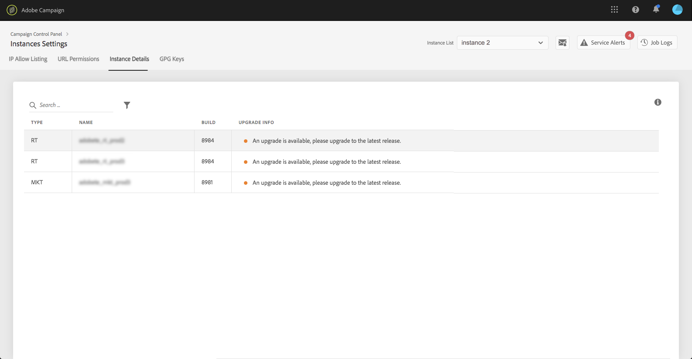

# Instansinformation {#instance-details}

>[!CONTEXTUALHELP]
>id="cp_instancesettings_instancedetails"
>title="Om instansinformation"
>abstract="Se informationen om instanserna i Adobe Campaign: typer, namn, build-information och möjliga rekommendationer gällande uppgraderingar."
>additional-url="https://docs.adobe.com/content/help/sv-SE/campaign-classic/using/release-notes/latest-release.html" text="Versionsinformation om Campaign Classic"
>additional-url="https://docs.adobe.com/content/help/sv-SE/campaign-standard/using/release-notes/release-notes.html" text="Versionsinformation om Campaign Standard"

>[!IMPORTANT]
>
>Den här funktionen är endast tillgänglig för instanser i Campaign Classic.

## Om instansinformation {#about-instance-details}

Instansarkitekturen i Adobe Campaign Classic kan innehålla flera servrar för att möjliggöra flexibilitet i marknadsföringsaktiviteter. Du kan t.ex. ha servrar för marknadsföring, realtid (eller meddelandecenter) samt mid-sourcing som har stöd för din instans.

Funktionaliteten i Instansinformationen låter dig se instansens platta arkitektur. Förutom serverinformation får du även reda på om instansens build är aktuell eller inte samt rekommendationer om uppgraderingar när det behövs.

>[!NOTE]
>
>Vi rekommenderar att du uppgraderar dina instanser minst en gång per år för att undvika prestandaförsämringar. På så sätt kan du även utnyttja de senaste funktionerna och korrigeringarna som Adobe Campaign Classic har att erbjuda.

**Relaterade ämnen:**

* [Utföra en uppgradering av din build](https://docs.campaign.adobe.com/doc/AC/getting_started/EN/buildUpgrade.html)
* [Uppdatera Adobe Campaign](https://docs.campaign.adobe.com/doc/AC/en/PRO_Updating_Adobe_Campaign_Introduction.html)

## Hämta information om dina instanser {#retrieving-information-about-instances}

Följ dessa steg för att få information om servrarna som är anslutna till dina instanser:

1. Öppna **[!UICONTROL Instances Settings]**-kortet för att öppna fliken **[!UICONTROL Instance Details]**.

   >[!NOTE]
   >
   >Om instansinställningskortet inte visas på kontrollpanelens hemsida innebär det att ditt IMS-organisations-ID inte är kopplat till några Adobe Campaign Classic-instanser

1. Välj den önskade instansen i Campaign Classic i det vänstra fönstret.

   >[!NOTE]
   >
   >Alla instanser i Campaign visas i listan i det vänstra fönstret. Eftersom funktionen Instansinformation endast är avsedd för instanser i Campaign Classic visas meddelandet ”Ej tillämpbar instans” om du väljer en instans i Campaign Standard.

1. Servrarna som är anslutna till instansen visas.

   

Tillgänglig information är:

* **[!UICONTROL Type]**: servertypen. Möjliga värden är MKT (marknadsföring), MID (mid-sourcing) och RT (meddelandecenter/realtidsmeddelanden).
* **[!UICONTROL Name]**: serverns namn.
* **[!UICONTROL Build:]** den version som är installerad på servern.
* **[!UICONTROL Upgrade info]**: den här kolumnen informerar dig om eventuell uppdatering som krävs för servern.
   * Grön: din server är aktuell och ingen uppgradering krävs.
   * Gul: du bör överväga att uppgradera. Du saknar de senaste funktionerna och korrigeringarna.
   * Röd: uppgradera så snart som möjligt. Du saknar nya funktioner och serverprestandan kanske inte är optimal.

Om någon av dina servrar behöver uppgraderas finns mer information om hur du fortsätter i [den här dokumentationen](https://docs.campaign.adobe.com/doc/AC/getting_started/EN/buildUpgrade.html).

## Vanliga frågor {#common-questions}

**Jag kan inte se MID-servern i min instansarkitektur. Betyder detta att mina instanser inte fungerar som de ska? Behöver jag RT-instansen för något jag inte kan göra idag?**

Din egen instans kan se väldigt annorlunda ut. Den kanske inte har alla typer av servrar eller kan den ha flera av samma server. Även om du inte har en typ av server kan du fortfarande skicka ett realtidsmeddelande eller utföra andra typer av aktiviteter. Du kan begära ytterligare serverkapacitet. Ytterligare avgifter tillkommer i detta fall.

Kontakta Kundtjänst om du tror att vissa servrar inte visas på sidan Instansinformation. Inkludera den instansens specifika URL i meddelandet.
