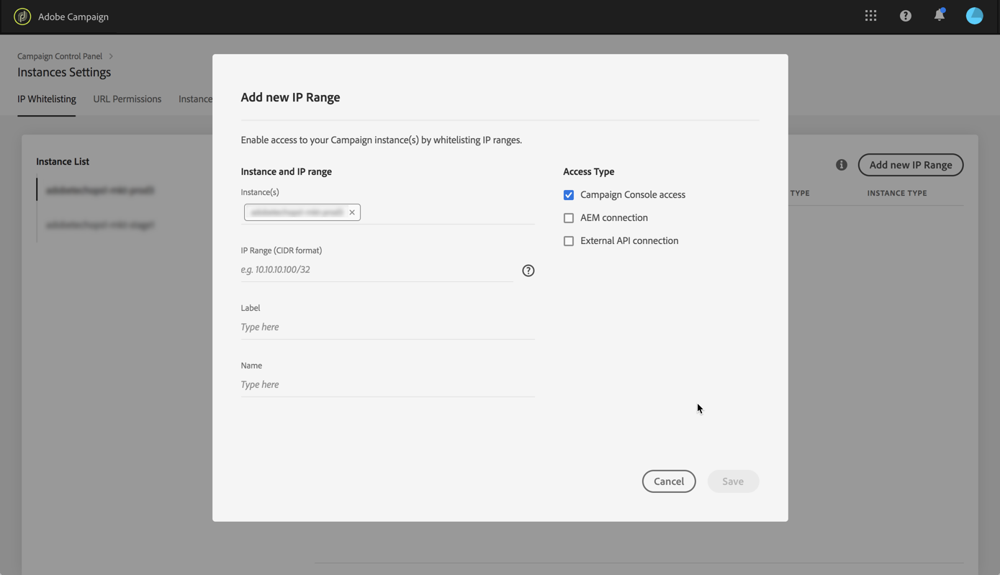
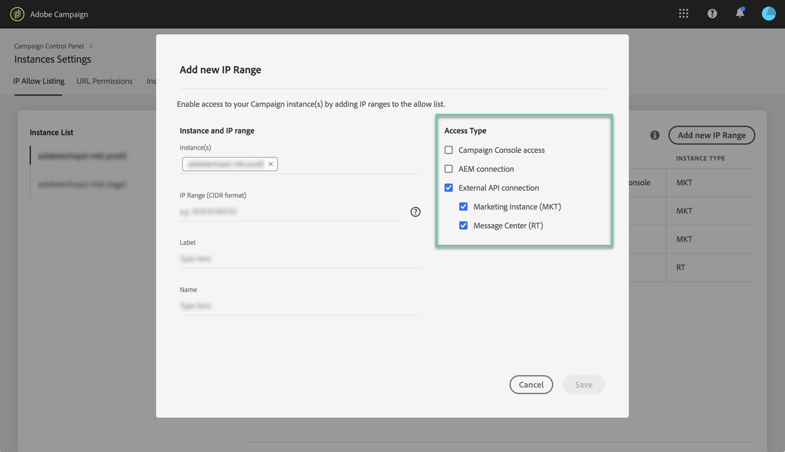

# Tillåtelselista med IP-adresser {#ip-allow-listing}

>[!CONTEXTUALHELP]
>id="cp_instancesettings_iprange"
>title="Om tillåtelselista med IP-adresser"
>abstract="Lägg till IP-adresser i tillåtelselistan för att komma åt dina instanser."
>additional-url="https://images-tv.adobe.com/mpcv3/045cac99-f948-478e-ae04-f8c161dcb9e2_1568132508.1920x1080at3000_h264.mp4" text="Se demovideon"

## Om tillåtelselista med IP-adresser {#about-ip-allow-listing}

>[!IMPORTANT]
>
>Den här funktionen är endast tillgänglig för instanser av Campaign Classic v7 och Campaign v8.

Som standard är din instans i Adobe Campaign endast tillgänglig från specifika IP-adresser.

Du måste lägga till din IP-adress i tillåtelselistan för att kunna logga in på instansen från den här adressen. Den specifika IP-adressen för instansen måste ha lagts till i tillåtelselistan för att ansluta ett API till ditt meddelandecenter eller din marknadsföringsinstans.

Med kontrollpanelen kan du konfigurera nya anslutningar till dina instanser genom att lägga till IP-adressintervall till tillåtelselistan. Följ stegen nedan för att göra detta.

När IP-adresserna finns i tillåtelselistan kan du skapa och länka Campaign-operatörer till dem för att användarna ska få åtkomst till instansen.

 [Upptäck den här funktionen i en video](https://experienceleague.adobe.com/docs/campaign-classic-learn/control-panel/instance-settings/ip-allow-listing.html?lang=en#instance-settings)

## Bästa praxis {#best-practices}

Se till att du följer rekommendationerna och begränsningarna nedan när du lägger till IP-adresser i tillåtelselistan i Kontrollpanelen.

* **Aktivera endast IP-åtkomst till alla åtkomsttyper** om du har för avsikt att ansluta IP-adressen till dina RT-servrar eller din AEM-säkerhetszon.
* **Om du tillfälligt har aktiverat åtkomst till din instans för en viss IP-adress** bör du se till att ta bort IP-adresserna från tillåtelselistan när du inte längre behöver ansluta till instansen.
* **Vi rekommenderar att man inte lägger till IP-adresser för offentliga platser i tillåtelselistan** (flygplatser och hotell osv.). Använd företagets VPN-adress för att alltid skydda din instans.

## Lägga till IP-adresser i tillåtelselistan för åtkomst till instansen {#adding-ip-addresses-allow-list}

>[!CONTEXTUALHELP]
>id="cp_instancesettings_iprange_add"
>title="Lägga till ett nytt IP-intervall"
>abstract="Definiera IP-intervallet som du vill lägga till i tillåtelselistan för att ansluta till instansen."

Följ dessa steg för att lägga till IP-adresser i tillåtelselistan:

1. Öppna **[!UICONTROL Instances Settings card]** för att öppna fliken IP-tillåtelselista och klicka sedan på **[!UICONTROL Add new IP Range]**.

   >[!NOTE]
   >
   >Om instansinställningskortet inte visas på kontrollpanelens startsida innebär det att ditt IMS-organisations-ID inte är kopplat till några Adobe Campaign Classic-instanser

   

1. Fyll i informationen gällande IP-intervallet som du vill lägga till i tillåtelselistan enligt beskrivningen nedan.

   

   * **[!UICONTROL Instance(s)]**: de instanser som IP-adresserna kan ansluta till. Flera instanser kan ändras samtidigt. Du kan till exempel skapa en IP-tillåtelselista för både produktions- och mellanlagringsinstanser i samma steg.
   * **[!UICONTROL IP Range]**: det IP-intervall som du vill lägga till i tillåtelselistan i CIDR-formatet. Observera att ett IP-intervall inte kan överlappa ett befintligt intervall på tillåtelselistan. I detta fall måste du först ta bort det intervall som innehåller den överlappande IP-adressen.

   >[!NOTE]
   >
   >CIDR (Classless Inter-Domain Routing) är det format som stöds när ett IP-intervall läggs till via Kontrollpanelens gränssnitt. Syntaxen består av en IP-adress följd av tecknet / och ett decimaltal. Fullständig information för formatet och dess syntax finns i [den här artikeln](https://whatismyipaddress.com/cidr).
   >
   >Du kan söka på internet efter kostnadsfria verktyg online som hjälper dig att konvertera det aktuella IP-intervallet till ett CIDR-format.

   * **[!UICONTROL Label]**: etiketten som ska visas i tillåtelselistan.
   * **[!UICONTROL Name]**: namnet måste vara unikt för åtkomsttypen, instansen (vid extern API-anslutning) samt IP-adressen.

1. Ange typen av åtkomst du vill bevilja IP-adresserna:

   * **[!UICONTROL Campaign Console Access]**: IP-adresserna kan ansluta till Campaign Client Console. Observera att åtkomst till konsolen endast är aktiverad för marknadsföringsinstanser. Observera att åtkomst till MID- och RT-instanser inte är tillåten och därför inte aktiverad.
   * **[!UICONTROL AEM connection]**: de angivna IP-adresserna till AEM kan ansluta till marknadsföringsinstansen.
   * **[!UICONTROL External API connection]**: Externa API:er med de angivna IP-adresserna kan ansluta till instansen för marknadsföring och/eller meddelandecenter (RT). Observera att anslutningen till konsolen i RT-instanser är inaktiverad.

   

1. Klicka på knappen **[!UICONTROL Save]**. IP-intervallet läggs till i tillåtelselistan.

   

Ta bort IP-intervall från tillåtelselistan genom att markerar dem och sedan klicka på knappen **[!UICONTROL Delete IP range]**.

**Relaterat ämne:**

* [Länka en säkerhetszon till en operatör](https://docs.campaign.adobe.com/doc/AC/en/INS_Additional_configurations_Configuring_Campaign_server.html#Linking_a_security_zone_to_an_operator)
