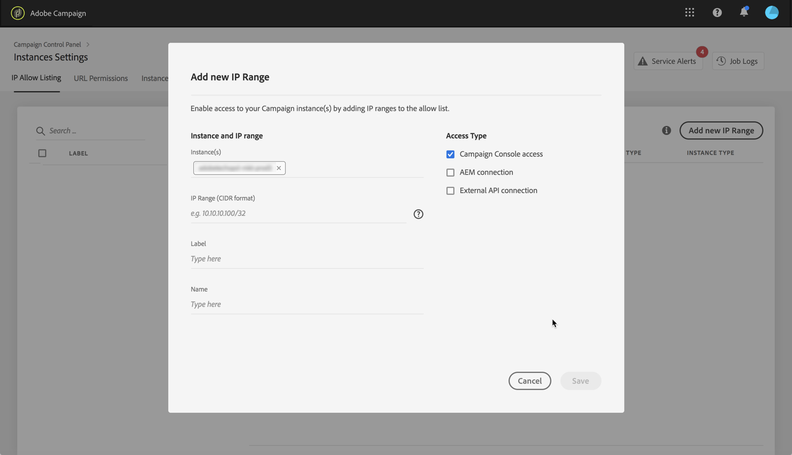

# Lista över tillåtna IP-adresser {#ip-allow-listing}

>[!CONTEXTUALHELP]
>id="cp_instancesettings_iprange"
>title="Om listning av tillåtna IP-adresser"
>abstract="Lägg till IP-adresser i tillåtelselista för att komma åt dina instanser."
>additional-url="https://images-tv.adobe.com/mpcv3/045cac99-f948-478e-ae04-f8c161dcb9e2_1568132508.1920x1080at3000_h264.mp4" text="Se filmen"

>[!IMPORTANT]
>
>Den här funktionen är endast tillgänglig för instanser i Campaign Classic.

## Om listning av tillåtna IP-adresser {#about-ip-allow-listing}

Som standard är din Adobe Campaign Classic-instans inte tillgänglig från olika IP-adresser.

Om din IP-adress inte har lagts till i tillåtelselista kan du inte logga in i instansen från den här adressen. På samma sätt kanske du inte kan ansluta ett API till ditt meddelandecenter eller din Marketing-instans om IP-adressen inte har lagts till i tillåtelselista med instansen explicit.

Med kontrollpanelen kan du konfigurera nya anslutningar till dina instanser genom att lägga till IP-adressintervall till tillåtelselista. Följ stegen nedan för att göra detta.

När IP-adresserna finns på tillåtelselista kan du skapa och länka kampanjoperatorer till dem så att användarna kan komma åt instansen.

## God praxis {#best-practices}

Se till att du följer rekommendationerna och begränsningarna nedan när du lägger till IP-adresser till tillåtelselista på Kontrollpanelen.

* **Aktivera inte IP-åtkomst till alla åtkomsttyper** om du inte har för avsikt att ansluta IP-adressen till dina RT-servrar, eller AEM-säkerhetszon.
* **Om du tillfälligt har aktiverat åtkomst till din instans för en IP-adress** måste du ta bort IP-adresserna från tillåtelselista när du inte längre behöver ansluta till instansen.
* **Vi rekommenderar inte att man lägger till IP-adresser för offentliga platser i tillåtelselista** (flygplatser, hotell osv.). Använd företagets VPN-adress för att alltid skydda din instans.

## Lägga till IP-adresser i tillåtelselista för instansåtkomst {#adding-ip-addresses-allow-list}

>[!CONTEXTUALHELP]
>id="cp_instancesettings_iprange_add"
>title="Lägg till nytt IP-intervall"
>abstract="Definiera IP-intervallet som du vill lägga till i tillåtelselista för att ansluta till instansen."

Så här lägger du till IP-adresser i tillåtelselista:

1. Open the **[!UICONTROL Instances Settings card]** to access the IP allow listing tab, then click **[!UICONTROL Add new IP Range]**.

   >[!NOTE]
   >
   >Om instansinställningskortet inte visas på kontrollpanelens hemsida innebär det att ditt IMS-organisations-ID inte är kopplat till några Adobe Campaign Classic-instanser

   

1. Fyll i informationen för IP-intervallet som du vill lägga till i tillåtelselista enligt beskrivningen nedan.

   

   * **[!UICONTROL Instance(s)]**: De instanser som IP-adresserna kan ansluta till. Flera instanser kan ändras samtidigt. Du kan till exempel göra en lista över tillåtna IP-adresser för både Production- och Stage-instanser i samma steg.
   * **[!UICONTROL IP Range]**: Det IP-intervall som du vill lägga till i tillåtelselista, i CIDR-format. Observera att ett IP-intervall inte kan överlappa ett befintligt intervall på tillåtelselista. I så fall tar du först bort det intervall som innehåller den överlappande IP-adressen.

   >[!NOTE]
   >
   >CIDR (Classless Inter-Domain Routing) är det format som stöds när du lägger till IP-intervall med kontrollpanelens gränssnitt. Syntaxen består av en IP-adress, följt av tecknet &#39;/&#39; och ett decimaltal. Formatet och syntaxen för det finns detaljerad information i [den här artikeln](https://whatismyipaddress.com/cidr).
   >
   >Du kan söka på Internet efter kostnadsfria onlineverktyg som hjälper dig att konvertera det aktuella IP-intervallet till CIDR-format.

   * **[!UICONTROL Label]**: Etiketten som ska visas i tillåtelselista.
   * **[!UICONTROL Name]**: Namnet måste vara unikt för åtkomsttypen, instansen (vid extern API-anslutning) samt IP-adressen.

1. Ange vilken typ av åtkomst du vill ge IP-adresserna:

   * **[!UICONTROL Campaign Console Access]**: IP-adresserna kan ansluta till Campaign Classic Console. Observera att konsolåtkomst endast är aktiverat för Marketing-instanser. Åtkomst till MID- och RT-instanser är inte tillåten och därför inte aktiverad.
   * **[!UICONTROL AEM connection]**: De angivna AEM IP-adresserna kan ansluta till Marketing-instansen.
   * **[!UICONTROL External API connection]**: Externa API:er med de angivna IP-adresserna kommer att kunna ansluta till instansen Marketing och/eller Message Center (RT). Observera att anslutning till RT-konsolen inte är aktiverad.

   

1. Klicka på **[!UICONTROL Save]** knappen. IP-intervallet läggs till tillåtelselista.

   

Om du vill ta bort IP-intervall från tillåtelselista markerar du dem och klickar sedan på **[!UICONTROL Delete IP range]** .

**Relaterade ämnen:**
* [Lista över tillåtna IP-adresser (självstudievideo)](https://docs.adobe.com/content/help/en/campaign-learn/campaign-classic-tutorials/administrating/control-panel-acc/ip-allow-listing.html)
* [Länka en säkerhetszon till en operatör](https://docs.campaign.adobe.com/doc/AC/en/INS_Additional_configurations_Configuring_Campaign_server.html#Linking_a_security_zone_to_an_operator)
