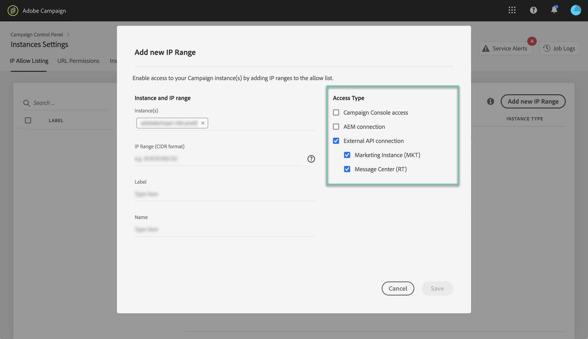

# IP-vitlista {#ip-whitelisting}

>[!CONTEXTUALHELP]
>id="cp_instancesettings_iprange"
>title="Om vitlistning för IP"
>abstract="Hantera vitlistning av IP för att komma åt dina instanser."
>additional-url="https://images-tv.adobe.com/mpcv3/045cac99-f948-478e-ae04-f8c161dcb9e2_1568132508.1920x1080at3000_h264.mp4" text="Se filmen"

>[!IMPORTANT]
>
>Den här funktionen är endast tillgänglig för Campaign Classic-instanser.

## Om vitlistning för IP {#about-ip-whitelisting}

Som standard är Adobe Campaign Classic-instansen inte tillgänglig från olika IP-adresser.

Om din IP-adress inte har vitlistats kan du inte logga in på instansen från den här adressen. På samma sätt kanske du inte kan ansluta ett API till ditt meddelandecenter eller din Marketing-instans om IP-adressen inte har vitlistats med instansen explicit.

Med kontrollpanelen kan du konfigurera nya anslutningar till dina instanser genom att vitlista IP-adressintervall. Följ stegen nedan för att göra detta.

När IP-adresserna vitlistas kan ni skapa och länka kampanjoperatorer till dem så att användarna kan komma åt instansen.

## God praxis {#best-practices}

Se till att du följer rekommendationerna och begränsningarna nedan när du vitlistar IP-adresser på Kontrollpanelen.

* **Aktivera inte IP-åtkomst till alla åtkomsttyper** om du inte har för avsikt att ansluta IP-adressen till dina RT-servrar, eller AEM-säkerhetszon.
* **Om du tillfälligt har aktiverat åtkomst till din instans för en IP-adress** måste du ta bort IP-adresserna från de vitlistade IP-adresserna när du inte längre behöver ansluta till instansen.
* **Vi rekommenderar inte vitlistning av IP-adresser för offentliga platser** (flygplatser, hotell osv.). Använd företagets VPN-adress för att alltid skydda din instans.

## Vitlista IP-adresser för instansåtkomst {#whistelisting-ip-addresses}

>[!CONTEXTUALHELP]
>id="cp_instancesettings_iprange_add"
>title="Lägg till nytt IP-intervall"
>abstract="Definiera IP-intervallet som du vill vitlista för att ansluta till instansen."

Så här vitlistar du IP-adresser:

1. Öppna **[!UICONTROL Instances Settings card]** för att öppna fliken IP-vitlista och klicka sedan på **[!UICONTROL Add new IP Range]**.

   >[!NOTE]
   >
   >Om instansinställningskortet inte visas på kontrollpanelens startsida innebär det att ditt IMS-ORG-ID inte är kopplat till några Adobe Campaign Classic-instanser

   

1. Fyll i informationen för IP-intervallet som du vill vitlista enligt nedan.

   

   * **[!UICONTROL Instance(s)]**: De instanser som IP-adresserna kan ansluta till. Flera instanser kan ändras samtidigt. IP-vitlistning kan till exempel utföras på både Production- och Stage-instanser i samma steg.
   * **[!UICONTROL IP Range]**: Det IP-intervall som du vill vitlista, i CIDR-format. Observera att ett IP-intervall inte kan överlappa ett befintligt tomt intervall. I så fall tar du först bort det intervall som innehåller den överlappande IP-adressen.
   >[!NOTE]
   >
   >CIDR (Classless Inter-Domain Routing) är det format som stöds när du lägger till IP-intervall med kontrollpanelens gränssnitt. Syntaxen består av en IP-adress, följt av tecknet &#39;/&#39; och ett decimaltal. Formatet och syntaxen för det finns detaljerad information i [den här artikeln](https://whatismyipaddress.com/cidr).
   >
   >Du kan söka på Internet efter kostnadsfria onlineverktyg som hjälper dig att konvertera det aktuella IP-intervallet till CIDR-format.

   * **[!UICONTROL Label]**: Etiketten som ska visas i listan över vitlistade IP-adresser.
   * **[!UICONTROL Name]**: Namnet måste vara unikt för åtkomsttypen, instansen (vid extern API-anslutning) samt IP-adressen.

1. Ange vilken typ av åtkomst du vill ge IP-adresserna:

   * **[!UICONTROL Campaign Console Access]**: IP-adresserna kan ansluta till Campaign Classic-konsolen. Observera att konsolåtkomst endast är aktiverat för Marketing-instanser. Åtkomst till MID- och RT-instanser är inte tillåten och därför inte aktiverad.
   * **[!UICONTROL AEM connection]**: De angivna AEM IP-adresserna kan ansluta till Marketing-instansen.
   * **[!UICONTROL External API connection]**: Externa API:er med de angivna IP-adresserna kommer att kunna ansluta till instansen Marketing och/eller Message Center (RT). Observera att anslutning till RT-konsolen inte är aktiverad.
   

1. Klicka på **[!UICONTROL Save]** knappen. IP-intervallet läggs till i listan över godkända IP-adresser.

   

Om du vill ta bort godkända IP-intervall markerar du dem och klickar sedan på **[!UICONTROL Delete IP range]** .

**Relaterade ämnen:**
* [Vitlista för IP (självstudievideo)](https://docs.adobe.com/content/help/en/campaign-learn/campaign-classic-tutorials/administrating/control-panel-acc/ip-whitelisting.html)
* [Länka en säkerhetszon till en operatör](https://docs.campaign.adobe.com/doc/AC/en/INS_Additional_configurations_Configuring_Campaign_server.html#Linking_a_security_zone_to_an_operator)
