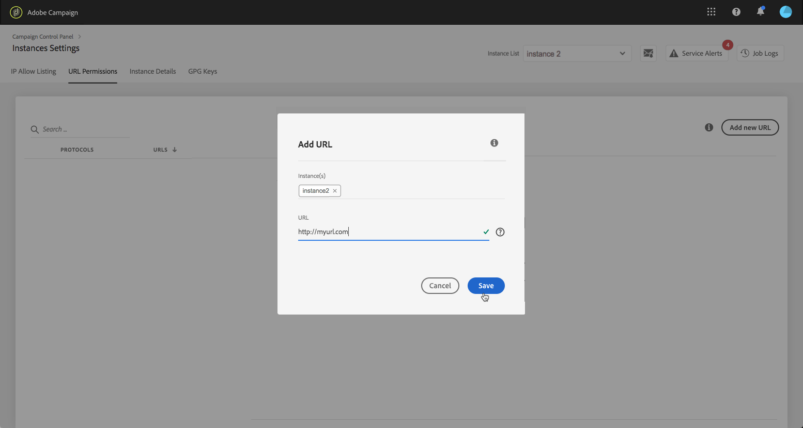

# URL-behörigheter {#url-permissions}

>[!CONTEXTUALHELP]
>id="cp_instancesettings_urlpermissions"
>title="Om URL-behörigheter"
>abstract="Hantera de URL:er som instanserna i Adobe Campaign kan ansluta till."
>additional-url="https://images-tv.adobe.com/mpcv3/91206a19-d9af-4b6a-8197-0d2810a78941_1563488165.1920x1080at3000_h264.mp4" text="Se demovideon"

## Om URL-behörigheter {#about-url-permissions}

>[!IMPORTANT]
>
>Den här funktionen är endast tillgänglig för instanser i Campaign Classic från build 8850. Om du använder en tidigare build måste du uppgradera för att kunna använda den här funktionen.

Standardlistan med URL:er som kan anropas av JavaScript-koder (arbetsflöden osv.) från dina instanser i Campaign Classic är begränsad. Dessa är URL:er som gör det möjligt för dina instanser att fungerar korrekt.

Som standard tillåts instanser endast att ansluta till interna URL:er. Via Kontrollpanelen kan du lägga till externa URL:er i listan över auktoriserade URL:er. Detta låter instansen ansluta till dem. Detta gör det möjligt för dig att ansluta instanserna i Campaign till externa system såsom SFTP-servrar eller webbplatser för att möjliggöra fil- och/eller dataöverföring.

När en URL har lagts till refereras den i instansens konfigurationsfil (serverConf.xml).

 [Upptäck den här funktionen i en video](https://experienceleague.adobe.com/docs/campaign-classic-learn/control-panel/instance-settings/adding-url-permissions.html?lang=en#instance-settings)

**Relaterade ämnen:**

* [Konfigurera en Campaign-server](https://docs.campaign.adobe.com/doc/AC/en/INS_Additional_configurations_Configuring_Campaign_server.html)
* [Skydd för utgående anslutningar](https://docs.campaign.adobe.com/doc/AC/en/INS_Additional_configurations_Configuring_Campaign_server.html#Outgoing_connection_protection)

## God praxis {#best-practices}

* Anslut instansen i Campaign endast till webbplatser/servrar som du vill ansluta till.
* Ta bort URL:er som du inte längre arbetar med. Tänk på att andra delar av företaget endast kan ansluta till de URL:er som finns i listan med auktoriserade URL:er.
* Kontrollpanelen har stöd för protokollen **http**, **https** och **sftp** . Fel uppstår om du anger ogiltiga URL:er eller protokoll.

## Hantera URL-behörigheter {#managing-url-permissions}

>[!CONTEXTUALHELP]
>id="cp_instancesettings_url_add"
>title="Lägga till ny URL"
>abstract="Lägg till URL:er för att tillåta anslutningar till din instans i Campaign."

Följ dessa steg för att lägga till en URL som instansen kan ansluta till:

1. Öppna **[!UICONTROL Instances Settings]**-kortet för att öppna fliken **[!UICONTROL URL Permissions]**.

   >[!NOTE]
   >
   >Om instansinställningskortet inte visas på kontrollpanelens startsida innebär det att ditt IMS-organisations-ID inte är kopplat till några Adobe Campaign Classic-instanser
   >
   >På fliken <b>URL-behörigheter</b> listas alla externa URL:er som din instans kan ansluta till. Den här listan innehåller inte URL:er som krävs för att Campaign ska fungera (t.ex. anslutningar mellan infrastrukturenheter).

1. Välj den önskade instansen i det vänstra fönstret och klicka sedan på knappen **[!UICONTROL Add new URL]**.

   

   >[!NOTE]
   >
   >Alla instanser i Campaign visas i listan i det vänstra fönstret.
   >
   >Eftersom hanteringen av URL-behörigheter endast är avsedd för instanser i Campaign Classic visas meddelandet ”Ej tillämpbar instans” om du väljer en instans i Campaign Standard.

1. Ange den URL som ska auktoriseras med tillhörande protokoll (http, https eller sftp).

   >[!NOTE]
   >
   >Det går att auktorisera flera instanser att ansluta till URL:en. Lägg till dem direkt från fältet Instanser genom att ange deras första bokstav.

   

1. URL:en läggs till i listan och du kan nu ansluta till den.

   >[!NOTE]
   >
   >Tecknen /.* läggs automatiskt till i slutet av den URL som du anger efter att den har validerats. Detta görs för att täcka alla undersidor till den angivna sidan.

   

Du kan när som helst ta bort en URL genom att välja den och klicka på **[!UICONTROL Delete URL]**.

Tänk på att om en URL tas bort kan instansen inte anropa den igen.

## Vanliga frågor {#common-questions}

**Jag lade till en ny URL men min instans kan fortfarande inte ansluta till den URL:en. Varför händer detta?**

I vissa fall krävs att URL:er som du försöker ansluta till finns med på en tillåtelselista men även lösenordsinmatning eller någon annan form av autentisering. Kontrollpanelen hanterar inte ytterligare autentisering.
