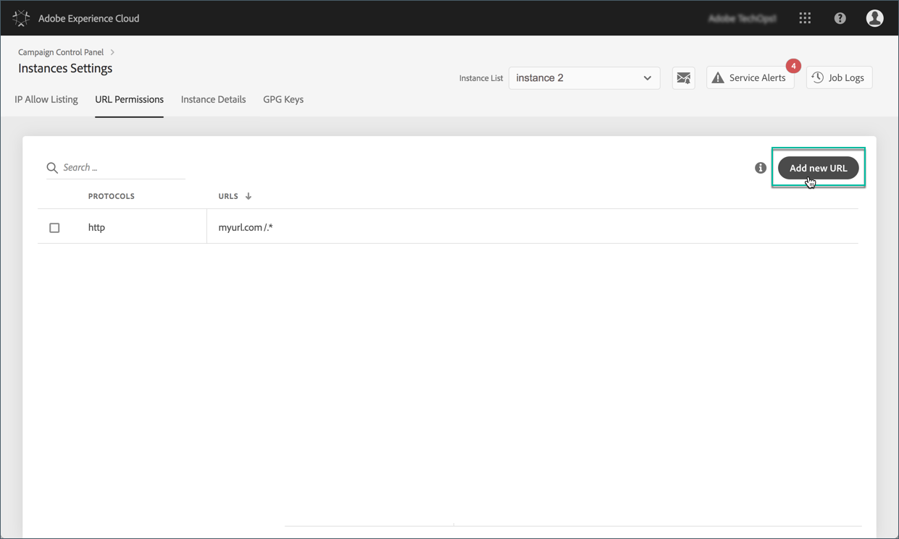
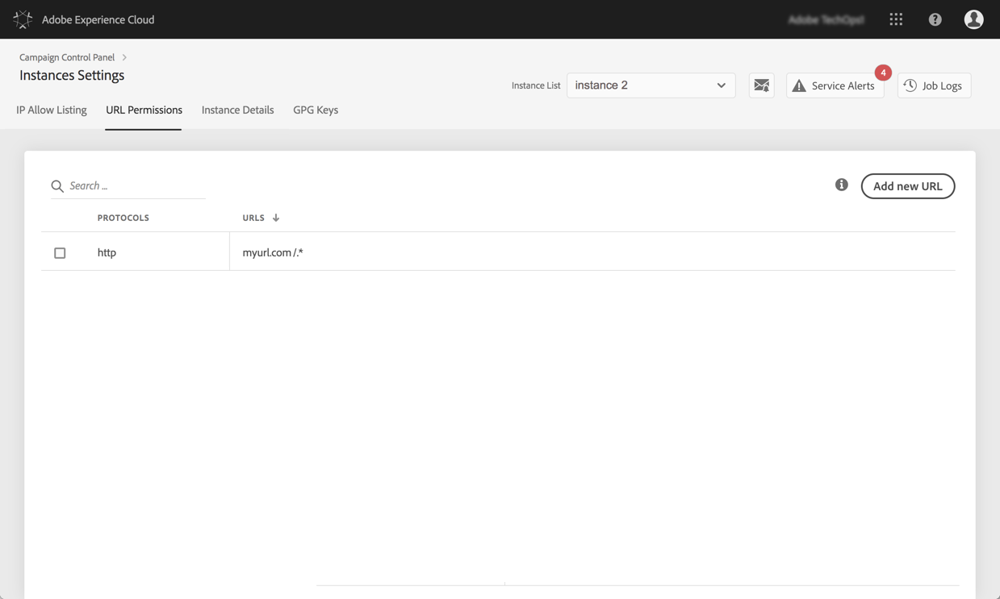

# URL-behörigheter {#url-permissions}

>[!CONTEXTUALHELP]
>id="cp_instancesettings_urlpermissions"
>title="Om URL-behörigheter"
>abstract="Hantera de URL:er som era Adobe Campaign-instanser kan ansluta till."
>additional-url="https://images-tv.adobe.com/mpcv3/91206a19-d9af-4b6a-8197-0d2810a78941_1563488165.1920x1080at3000_h264.mp4" text="Se filmen"

>[!IMPORTANT]
>
>Den här funktionen är endast tillgänglig för Campaign Classic-instanser.

## Om URL-behörigheter {#about-url-permissions}

Standardlistan med URL:er som kan anropas av JavaScript-koder (arbetsflöden osv.) antalet Campaign Classic-instanser är begränsat. Det här är URL:er som gör att dina instanser fungerar som de ska.

Som standard tillåts inte instanser att ansluta till externa URL:er. På Kontrollpanelen kan du lägga till externa URL:er i listan över auktoriserade URL:er, så att instansen kan ansluta till dem. På så sätt kan ni koppla era Campaign-instanser till externa system, som till exempel SFTP-servrar eller webbplatser, för att möjliggöra fil- och/eller dataöverföring.

När en URL har lagts till refereras den till i instansens konfigurationsfil (serverConf.xml).

**Relaterade ämnen:**

* [Konfigurerar Campaign-server](https://docs.campaign.adobe.com/doc/AC/en/INS_Additional_configurations_Configuring_Campaign_server.html)
* [Skydd mot utgående anslutning](https://docs.campaign.adobe.com/doc/AC/en/INS_Additional_configurations_Configuring_Campaign_server.html#Outgoing_connection_protection)
* [Lägga till URL-behörigheter (självstudievideo)](https://docs.adobe.com/content/help/en/campaign-learn/campaign-classic-tutorials/administrating/control-panel-acc/adding-url-permissions.html)

## God praxis {#best-practices}

* Anslut inte Campaign-instansen till webbplatser/servrar som du inte tänker ansluta till.
* Ta bort URL:er som du inte längre arbetar med. Tänk dock på att om en annan del av företaget fortfarande ansluter till den URL som du tog bort, kommer ingen att kunna använda den igen.
* Kontrollpanelen stöder protokollen **http**, **https** och **sftp** . Om du anger ogiltiga URL:er eller protokoll blir det fel.

## Hantera URL-behörigheter {#managing-url-permissions}

>[!CONTEXTUALHELP]
>id="cp_instancesettings_url_add"
>title="Lägg till ny URL"
>abstract="Lägg till URL:er för att tillåta anslutningar till din Campaign-instans."

Så här lägger du till en URL som instansen kan ansluta till:

1. Öppna **[!UICONTROL Instances Settings]**-kortet för att öppna fliken **[!UICONTROL URL Permissions]**.

   >[!NOTE]
   >
   >Om instansinställningskortet inte visas på kontrollpanelens startsida innebär det att ditt IMS-ORG-ID inte är kopplat till några Adobe Campaign Classic-instanser
   >
   >På fliken <b>URL-behörigheter</b> visas alla externa URL:er som din instans kan ansluta till. Den här listan innehåller inte URL:er som krävs för att Campaign ska fungera (t.ex. anslutningar mellan infrastrukturenheter).

1. Markera den önskade instansen i den vänstra rutan och klicka sedan på **[!UICONTROL Add new URL]** knappen.

   

   >[!NOTE]
   >
   >Alla Campaign-instanser visas i listan i den vänstra rutan.
   >
   >Eftersom hantering av URL-behörigheter endast är dedikerad till Campaign Classic-instanser visas meddelandet&quot;Ej tillämpbar instans&quot; om du väljer en Campaign Standard-instans.

1. Ange den URL som ska auktoriseras, med tillhörande protokoll (http, https eller sftp).

   >[!NOTE]
   >
   >Det går att auktorisera flera instanser för att ansluta till URL:en. Det gör du genom att lägga till dem direkt från fältet Förekomster genom att skriva deras första bokstav.

   

1. URL:en läggs till i listan och du kan nu ansluta till den.

   >[!NOTE]
   >
   >&quot;/.*&quot; läggs tecken automatiskt till i slutet av den URL som du anger efter att den har validerats, så att de täcker alla undersidor till den angivna sidan.

   

Du kan när som helst ta bort en URL-adress genom att markera den och klicka på **[!UICONTROL Delete URL]** .

Tänk på att om du tar bort en URL kan instansen inte anropa den igen.

## Vanliga frågor {#common-questions}

**Jag lade till en ny URL, men min instans kan fortfarande inte ansluta till den URL:en. Varför det?**

I vissa fall kan URL-adresser som du försöker ansluta till kräva vitlista, lösenordsinmatning eller någon annan form av autentisering. Kontrollpanelen hanterar inte ytterligare autentisering.
