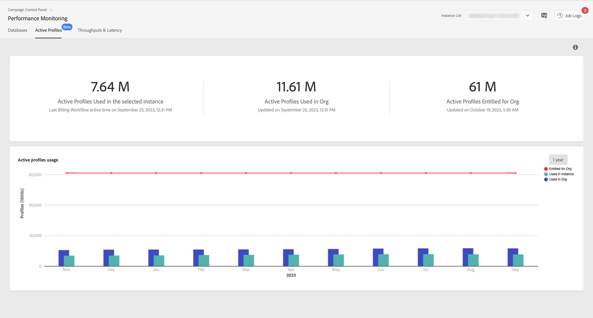

# Övervakning av aktiva profiler {#active-profiles-monitoring}

>[!IMPORTANT]
>
>Övervakning av aktiva profiler från Kontrollpanelen finns i betaversion och kan uppdateras ofta och ändras utan föregående meddelande.
>
>The feature is available to customers hosted on AWS from Campaign Standard 10368 build and Campaign Classic 8931 build. If you are using a previous build, you need to upgrade to use this feature.

## Om aktiva profiler {#about-active-profiles}

Enligt ert avtal har var och en av era Campaign-instanser en viss mängd aktiva profiler som räknas för faktureringsändamål. Se ditt senaste kontrakt för referens om antalet köpta aktiva profiler.

profil: ett register över information (t.ex.: en post i nmsRecipient-tabellen eller en extern tabell som innehåller ett cookie-ID, Kund-ID, mobilidentifierare eller annan information som är relevant för en viss kanal) som representerar en slutkund, potentiell kund eller lead.

Profiler anses vara aktiva om de har delats ut eller kommunicerats med via någon kanal under de senaste tolv månaderna.

>[!NOTE]
>
>Facebook- och Twitter-kanaler beaktas inte.

Mer information om aktiva profiler finns i [dokumentationen för Campaign Standard](https://docs.adobe.com/content/help/en/campaign-standard/using/profiles-and-audiences/managing-profiles/active-profiles.html) och [Campaign Classic](https://docs.adobe.com/content/help/en/campaign-classic/using/getting-started/profile-management/about-profiles.html#active-profiles) .

## Övervaka aktiva profiler {#monitoring-active-profiles}

På Kontrollpanelen kan du övervaka den aktiva profilanvändningen för var och en av dina Campaign-instanser.

Gör så här:

1. Öppna **[!UICONTROL Performance Monitoring]**-kortet och välj fliken **[!UICONTROL Active Profiles]**.

1. Markera önskad instans i **[!UICONTROL Instance List]**.

1. The number of active profiles used by the instance displays, as well as the last time the billing workflow was run on your instance.

>[!NOTE]
>
>Active profiles are counted based on dedicated technical workflows which run everyday on your instances:
>
>* Arbetsflödet [&quot;Fakturering&quot;](https://docs.adobe.com/help/en/campaign-standard/using/administrating/application-settings/technical-workflows.html) för Campaign Standard,
>* Arbetsflödet [&quot;Antal aktiva faktureringsprofiler&quot;](https://docs.adobe.com/content/help/en/campaign-classic/using/automating-with-workflows/technical-workflows/deliveries.html) för Campaign Classic.

I det nedre området visas de aktiva profilernas användning under de senaste 30 dagarna. Du kan ändra den tidsperiod som visas till 1 år med de tillgängliga filtren i det övre högra hörnet.

Om du hovrar över ett av diagramfälten kan du få det exakta antalet aktiva profiler som används för den valda perioden.
