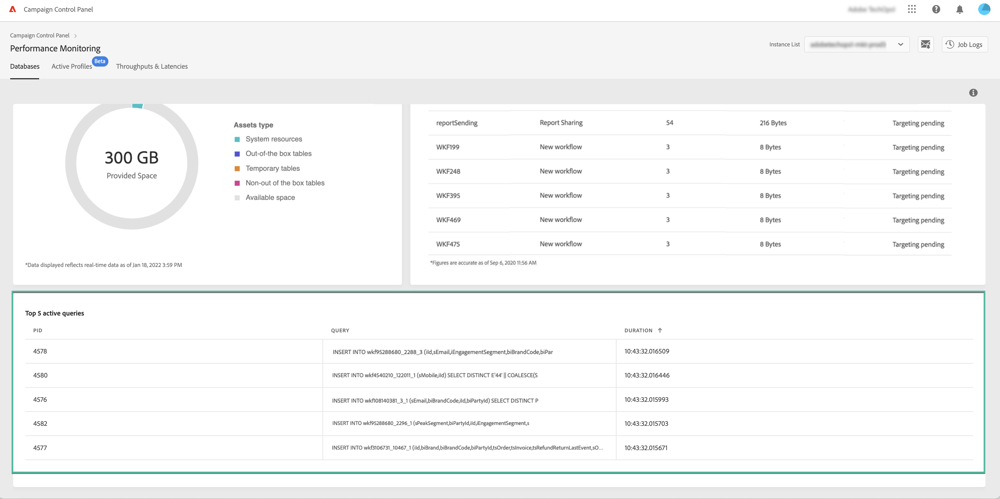

# Övervaka aktiva frågor {#long-running-queries}

Området **[!UICONTROL Active queries]** från fliken **[!UICONTROL Databases]** visar de fem frågor som har körts längst på den valda instansen.

Kolumnerna **[!UICONTROL Duration]** anger hur länge en fråga har körts på instansen. Längden visas i följande format: `hh:mm:ss.ms`.

>[!IMPORTANT]
>
>Om någon av frågorna har varit aktiv i mer än 24 timmar kan du kontakta kundtjänst så att de kan identifiera och lösa problemet. Du måste förse dem med värdet i kolumnen **[!UICONTROL PID]** som är en unik identifierare för frågan.
