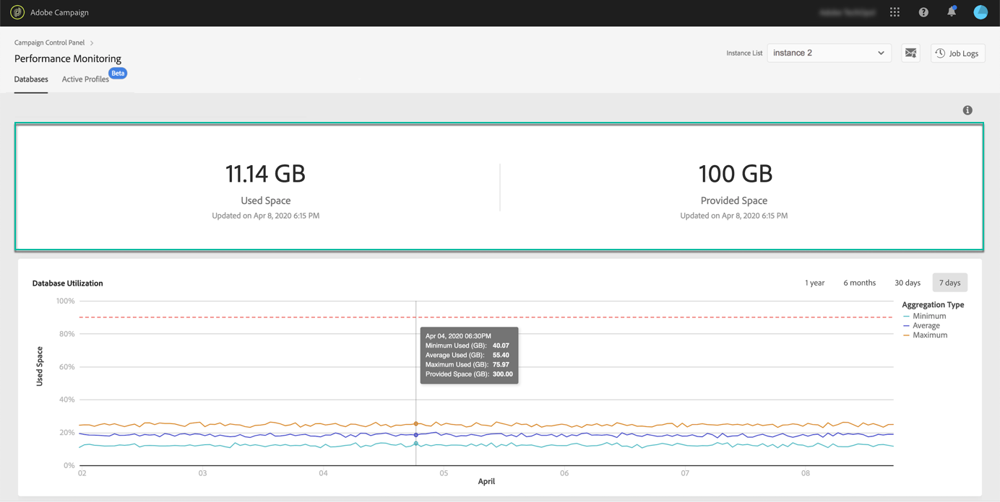

# Om databasövervakning {#database-monitoring}

## Om instansdatabaser {#about-instances-databases}

Enligt ditt avtal har var och en av era Campaign-instanser ett visst databasutrymme. Databaser innehåller alla **resurser**, **arbetsflöden** och **data** som lagras i Adobe Campaign.

Med tiden kan databaserna nå sin maximala kapacitet, särskilt om de lagrade resurserna aldrig tas bort från instansen eller om många arbetsflöden är i ett pausat läge.

En överfull instansdatabas kan leda till flera problem (oförmåga att logga in, skicka e-post osv.). Övervakning av instansens databaser är därför nödvändigt för att säkerställa optimala prestanda.

Om du prenumererar på [e-postavisering](../../performance-monitoring/using/email-alerting.md) får du meddelanden via e-post när en av instansens databaser har nått 80 % eller mer av sin kapacitet.

## Övervaka databasanvändning{#monitoring-database-usage}

>[!CONTEXTUALHELP]
>id="cp_performancemonitoring_database"
>title="Om databasövervakning"
>abstract="På den här fliken kan du få realtidsinformation om både den senaste och den historiska databasanvändningen samt utvecklingen för var och en av dina instanster i Campaign."
>additional-url="https://experienceleague.adobe.com/docs/control-panel/using/performance-monitoring/about-performance-monitoring.html?lang=sv" text="Om prestandaövervakning"

Kontrollpanelen låter dig övervaka användningen av databaser för var och en av instanserna i Campaign. Det gör du genom att öppna kortet **[!UICONTROL Performance Monitoring]** och sedan välja fliken **[!UICONTROL Databases]**.

Välj önskad instans i **[!UICONTROL Instance List]** om du vill visa information om instansens databaskapacitet och hur mycket utrymme som används.

>[!NOTE]
>
>Om mängden tillgängligt databasutrymme som visas på Kontrollpanelen inte motsvarar mängden som anges i ditt avtal ska du kontakta kundtjänst.

Data från den här instrumentpanelen uppdateras baserat på **[!UICONTROL Database cleanup technical workflow]** som körs på din Campaign-instans (se [Campaign Standard](https://experienceleague.adobe.com/docs/campaign-standard/using/administrating/application-settings/technical-workflows.html?lang=sv#list-of-technical-workflows) och [Campaign v7/v8](https://experienceleague.adobe.com/docs/campaign-classic/using/monitoring-campaign-classic/data-processing/database-cleanup-workflow.html?lang=sv)-dokumentationen). Du kan kontrollera den senaste gången arbetsflödet kördes under **[!UICONTROL Used Space]**- och **[!UICONTROL Provided Space]**-måtten. Observera att om arbetsflödet inte har körts sedan mer än tre dagar rekommenderar vi att du kontaktar kundtjänsten hos Adobe så att de undersöker varför arbetsflödet inte körs.

Det finns ytterligare mätvärden på den här kontrollpanelen som hjälper dig att analysera hur instansens databas används. De beskrivs i följande avsnitt:

* [Databasanvändning](../../performance-monitoring/using/database-utilization.md)
* [Lagringsöversikt](../../performance-monitoring/using/database-storage-overview.md)
* [De 10 viktigaste tillfälliga resurserna](../../performance-monitoring/using/database-top-ten-resources.md)
* [Aktiva frågor](../../performance-monitoring/using/database-active-queries.md)

 Upptäck denna funktion genom video med [Campaign v7/v8](https://experienceleague.adobe.com/docs/campaign-classic-learn/control-panel/performance-monitoring/monitoring-databases.html?lang=sv#performance-monitoring) eller [Campaign Standard](https://experienceleague.adobe.com/docs/campaign-standard-learn/control-panel/performance-monitoring/monitoring-databases.html?lang=sv#performance-monitoring)
