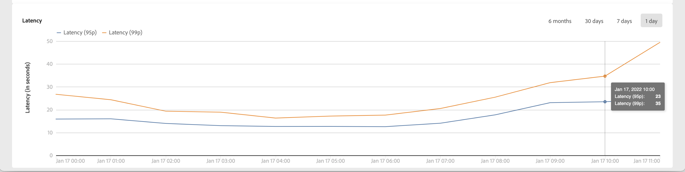

# Genomströmnings- och fördröjningsövervakning {#throughputs-latency-monitoring}

>[!CONTEXTUALHELP]
>id="cp_performancemonitoring_throughputslatencies"
>title="Om genomströmningar och fördröjningsövervakning "
>abstract="På den här fliken kan du övervaka hur leveransdataflöden och fördröjning trendar över en tidsperiod för dina instanser."

Det är viktigt att du känner till hur leveransflöden och fördröjningar hanteras under en viss tid för att du ska förstå hur instanserna används och se till att de fungerar bra.

Den här informationen är tillgänglig på Kontrollpanelen för var och en av era Campaign-instanser i **[!UICONTROL Performance Monitoring]** kort, **[!UICONTROL Throughputs & Latencies]** -fliken.

>[!NOTE]
>
>Alla siffror som presenteras på detta område är ungefärliga och endast i informationssyfte.

Som standard visas data för den aktuella dagen. Du kan ändra den tidsperiod som visas med **[!UICONTROL 6 months]**, **[!UICONTROL 30 days]** och **[!UICONTROL 7 days]** knappar.

The **[!UICONTROL Throughput]** -området innehåller information om antalet meddelanden som skickas per timme från den valda Campaign-instansen för alla kommunikationskanaler som du är berättigad till.

Du kan även visualisera den här informationen i ett tabellformat med sorterbara spalter i stället för i ett diagram. Om du vill göra det klickar du på **[!UICONTROL Visualization settings]** knapp och markera **[!UICONTROL Table]**.

The **[!UICONTROL Latency]** området innehåller information om fördröjningen som påträffas i den markerade instansen när transaktionsmeddelanden skickas i realtid. Latenser hämtas och visualiseras vid 95 och 99 percentiler, vilket innebär att 95 och 99 % av förfrågningarna ska vara snabbare än den angivna fördröjningen.

