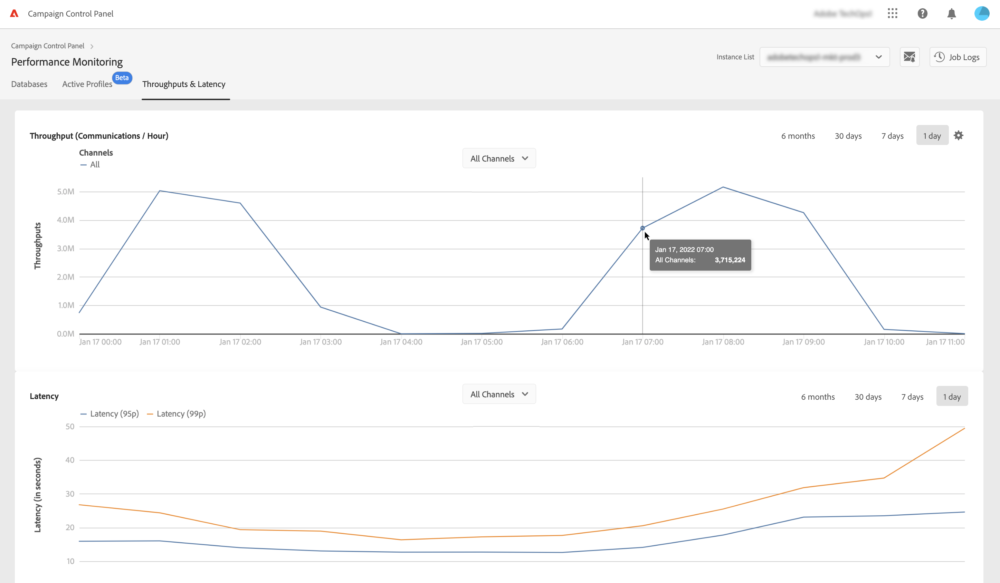

# Genomflöden och fördröjningsövervakning {#throughputs-latency-monitoring}

>[!CONTEXTUALHELP]
>id="cp_performancemonitoring_throughputslatencies"
>title="Om genomflöden och fördröjningsövervakning "
>abstract="På den här fliken kan du övervaka hur leveransgenomflöden och fördröjning trendar över en tidsperiod på dina instanser."

Det är viktigt att övervaka hur leveransgenomflöden och fördröjning trender över en tidsperiod för att förstå användningen av dina instanser och säkerställa att de presterar väl.

Den här informationen är tillgänglig på Kontrollpanelen för var och en av dina Campaign-instanser i kortet **[!UICONTROL Performance Monitoring]**, fliken **[!UICONTROL Throughputs & Latency]** (observera att det kan ta upp till en timme för Kontrollpanelen att visa siffrorna).

* Området **[!UICONTROL Throughput]** innehåller information om antalet meddelanden som skickas per timme från den valda Campaign-instansen för alla kommunikationskanaler som du är berättigad till.

* Området **[!UICONTROL Latency]** innehåller information om fördröjningen som påträffas i den markerade instansen när transaktionsmeddelanden skickas i realtid. Fördröjningar hämtas och visualiseras vid percentilerna 95 och 99, vilket innebär att 95 % och 99 % av förfrågningarna ska vara snabbare än den angivna fördröjningen.

>[!NOTE]
>
>Alla värden som presenteras i detta område är ungefärliga och endast i informationssyfte.

Som standard visas data för den aktuella dagen. Du kan ändra tidsperioden som visas genom att använda knapparna **[!UICONTROL 6 months]**, **[!UICONTROL 30 days]** och **[!UICONTROL 7 days]**.

Du kan också visa information i ett tabellformat med sorterbara kolumner i stället för i ett diagram. Du gör detta genom att klicka på knappen **[!UICONTROL Visualization settings]** och sedan välja **[!UICONTROL Table]**.

