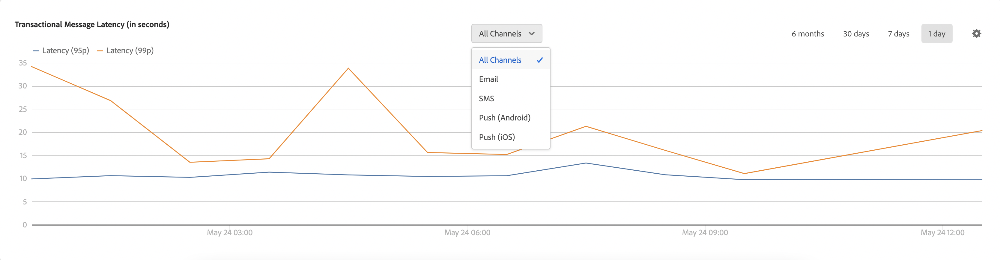

# Genomflöden och fördröjningsövervakning {#throughputs-latency-monitoring}

>[!CONTEXTUALHELP]
>id="cp_performancemonitoring_throughputslatencies"
>title="Om genomflöden och fördröjningsövervakning "
>abstract="På den här fliken kan du övervaka hur leveransgenomflöden och fördröjning trendar över en tidsperiod på dina instanser. Växla till tabellvyn om du vill ha information om leveranser som bidrar till genomflödet."

Med Kontrollpanelen kan du övervaka leveransgenomflöden och fördröjning för var och en av dina instanser.

>[!IMPORTANT]
>
>Den här funktionen är tillgänglig för alla Campaign Standard- och v8-kunder samt för Campaign V7-kunder med build-nummer 9032, 9330, 9346 eller 9349 som har [fristående](https://experienceleague.adobe.com/docs/campaign-classic/using/installing-campaign-classic/deployment-types-/standalone-deployment.html?lang=sv) distributioner (utan några mellaninstanser).

Det är viktigt att övervaka hur leveransgenomflöden och fördröjning trendar över en tidsperiod för att förstå användningen av dina instanser och säkerställa att de presterar väl.

Den här informationen är tillgänglig på Kontrollpanelen för var och en av dina Campaign-instanser i kortet **[!UICONTROL Performance Monitoring]**, fliken **[!UICONTROL Throughputs & Latency]** (observera att det kan ta upp till en timme för Kontrollpanelen att visa siffrorna).

>[!NOTE]
>
>Alla värden som presenteras i detta område är ungefärliga och endast i informationssyfte.

Som standard visas data för den aktuella dagen. Du kan ändra tidsperioden som visas genom att använda knapparna **[!UICONTROL 6 months]**, **[!UICONTROL 30 days]** och **[!UICONTROL 7 days]**. Data presenteras:
* varje timme i en vy med en dag och sju dagar
* varje sex timmar i en vy med 30 dagar
* dagligen i en vy med sex månaders.

Du kan också visa information i ett tabellformat med sorterbara kolumner i stället för i ett diagram. Du gör detta genom att klicka på knappen **[!UICONTROL Visualization settings]** och sedan välja **[!UICONTROL Table]**.

## Övervaka genomflöde {#throughput}

Området **[!UICONTROL Throughput]** innehåller information om antalet meddelanden som skickas per timme från den valda Campaign-instansen för alla kommunikationskanaler som du är berättigad till.

>[!NOTE]
>
>För Campaign v7/v8 är genomflödesnumret som visas genomflödet som uppnås från MID (mid sourcing)-instanser. För fristående marknadsföringsdistributioner (MKT) (utan någon MID-instans) visas i stället genomflödet från MKT-instansen.

Dessutom kan du via Kontrollpanelen identifiera ID:n för de fem vanligaste leveranserna som bidrar till genomflödet för den valda tidsperioden. Den här informationen finns endast i tabellvyn:

## Övervaka fördröjning {#latency}

Området **[!UICONTROL Latency]** innehåller information om fördröjningen som påträffas i den valda instansen när transaktionsmeddelanden skickas i realtid.

>[!NOTE]
>
>Observera att information om **Profilfördröjning** också är tillgänglig endast för [!DNL Campaign Standard]-instanser.

Fördröjningar hämtas och visualiseras vid percentilerna 95 och 99, vilket innebär att 95 % och 99 % av förfrågningarna ska vara snabbare än den angivna fördröjningen.

Som standard visas fördröjningen för alla kanaler. Du kan visualisera fördröjningen för en viss kanal med hjälp av rullgardinsmenyn.

>[!NOTE]
>
>Kanalfiltrering är endast tillgänglig för Campaign Classic v7/v8-instanser.
