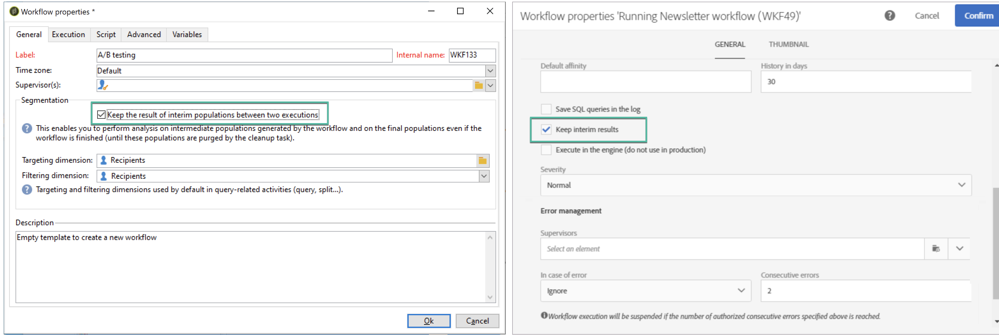
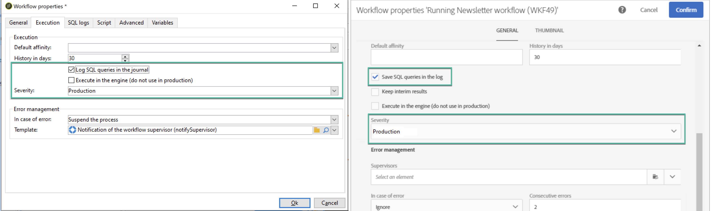

# Övervaka arbetsflöden {#monitor-workflows}

<!-- Clean paused and completed workflows

When [!DNL Adobe Campaign] workflows are paused or completed, they leave temporary tables on your instances database that consume space and can lead to performance issues.

Control Panel allows you to identify those workflows and clean the temporary resources generated on your instances.

>[!NOTE]
>
>Technically, this operation executes the **[!UICONTROL Database cleanup technical workflow]** that runs on your Campaign instance everyday (see [Campaign Standard](https://experienceleague.adobe.com/docs/campaign-standard/using/administrating/application-settings/technical-workflows.html#list-of-technical-workflows) and [Campaign Classic](https://experienceleague.adobe.com/docs/campaign-classic/using/monitoring-campaign-classic/data-processing/database-cleanup-workflow.html) documentation). 

To clean paused and completed workflows, follow these steps:

1. Navigate to the **[!UICONTROL Performance monitoring]** card.

1. In the **[!UICONTROL Databases]** tab, select the instance where you want to perform the operation.

1. Access the **[!UICONTROL Storage overview]** details, then filter the list on **[!UICONTROL Temporary tables]**. Learn more on **[!UICONTROL Storage overview]** in [this page](database-storage-overview.md).

    

1. All temporary tables generated on your instances by workflows and deliveries display. Click the **[!UICONTROL Clean now]** button to delete the resources generated by paused and completed workflows.

    

1. Once the operation is confirmed, you can track the estimated remaining time in the **[!UICONTROL Storage overview]** list.

    

Monitor workflow parameters -->

I Adobe Campaign kan vissa arbetsflödesparametrar behöva åtgärdas för att undvika problem i dina instanser. I Kontrollpanelen **[!UICONTROL Storage overview]** kan du kontrollera om några av dessa alternativ är aktiverade för dina arbetsflöden.

## **[!UICONTROL Keep interim results]** {#keep-results}

När det här alternativet är aktiverat (värde ”1”) sparas resultatet av övergångarna mellan de olika aktiviteterna i ett arbetsflöde. Läs mer i dokumentationen om [Campaign Standard](https://experienceleague.adobe.com/docs/campaign-standard/using/managing-processes-and-data/executing-a-workflow/managing-execution-options.html?lang=sv) och [Campaign Classic](https://experienceleague.adobe.com/docs/campaign-classic/using/automating-with-workflows/introduction/workflow-best-practices.html?lang=sv#logs).

>[!IMPORTANT]
>
>Det här alternativet får aldrig kontrolleras i ett produktionsarbetsflöde. Det används för analys- och testningsändamål och får därför endast användas i utvecklings- eller testmiljöer. Vi rekommenderar att du inaktiverar det i Campaign.

## **[!UICONTROL Show SQL log]** {#sql}

När det här alternativet är aktiverat visas de SQL-frågor som skickas till databasen under arbetsflödeskörningen i Adobe Campaign. Läs mer i dokumentationen om [Campaign Standard](https://experienceleague.corp.adobe.com/docs/campaign-standard/using/managing-processes-and-data/executing-a-workflow/managing-execution-options.html?lang=sv) och [Campaign Classic](https://experienceleague.adobe.com/docs/campaign-classic/using/automating-with-workflows/advanced-management/workflow-properties.html?lang=sv#execution).

Värdet ”1” anger att arbetsflödet har fältet **Svårighetsgrad** inställt på ”Produktion” och att alternativet SQL-frågelogg är aktiverat.

>[!IMPORTANT]
>
>Om du aktiverar det här alternativet kan prestanda påverkas och loggfilerna på servern fylls i. Det ska endast användas för analys och diagnostik.

## **[!UICONTROL Supervisors]** {#supervisors}

I det här fältet kan du tilldela en operatör till ett arbetsflöde. Om arbetsflödet misslyckas får den associerade operatören ett varningsmeddelande. Läs mer i dokumentationen om [Campaign Standard](https://experienceleague.corp.adobe.com/docs/campaign-standard/using/managing-processes-and-data/executing-a-workflow/monitoring-workflow-execution.html?lang=sv#error-management) och [Campaign Classic](https://experienceleague.adobe.com/docs/campaign-classic/using/automating-with-workflows/advanced-management/workflow-properties.html?lang=sv#error-management).

Värdet ”1” anger att arbetsflödet har fältet **Svårighetsgrad** inställt på ”Produktion” och ingen arbetsflödestillsynsgrupp har tilldelats.

