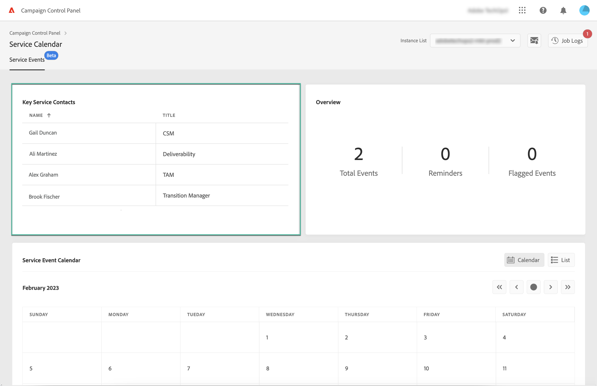
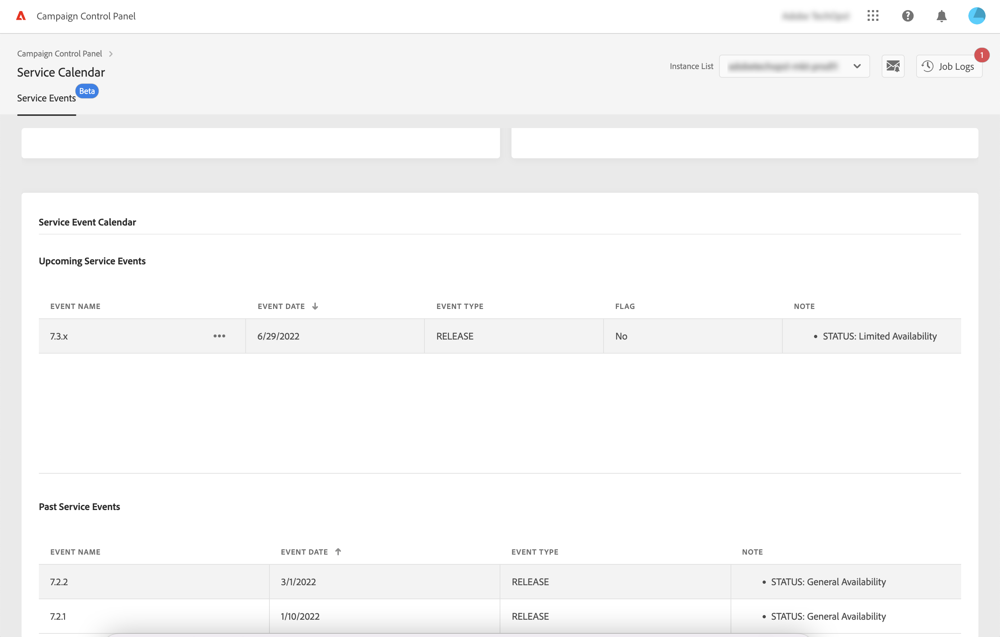

# Övervaka viktiga kontakter och händelser {#keycontacts-events}

>[!CONTEXTUALHELP]
>id="cp_servicecalendar_serviceevents"
>title="Servicekalender"
>abstract="Avsnittet Viktiga kontakter listar de personer hos Adobe som du kan kontakta för alla förfrågningar eller problem i instanserna. I avsnittet Servicehändelsekalender kan du identifiera versioner och servicegranskningar för den valda instansen och ställa in påminnelser för kommande händelser."

>[!IMPORTANT]
>
>Servicekalendern är tillgänglig i betaversion, och uppdateras och ändras frekvent utan föregående meddelande.

Det är viktigt att identifiera händelser som planeras i instanserna för att kunna övervaka Campaign-instanserna.

Med Kontrollpanelen kan du övervaka versioner och servicegranskningar som inträffar i instanserna och få tillgång till en lista över viktiga kontakter på Adobe för alla förfrågningar och problem.

Denna information är tillgänglig från **[!UICONTROL Service Calendar]**-kortet på kontrollpanelens hemsida.

## Viktiga kontakter {#key-contacts}

Avsnittet **[!UICONTROL Key contacts]** listar de personer hos Adobe som du kan kontakta för alla förfrågningar eller problem i instanserna.

>[!NOTE]
>
>I det här avsnittet visas endast information för Managed Service-konton.

Viktiga kontakter omfattar följande roller:

* **[!UICONTROL TAM]**: Technical Account Manager,
* **[!UICONTROL CSM]**: Customer Success Manager,
* **[!UICONTROL Deliverability]**: kontaktpunkt för levererbarhetsåtgärder,
* **[!UICONTROL Transition Manager]**: Managed Services Transition Manager (endast Managed Services-konto),
* **[!UICONTROL On-boarding Specialist]**: Specialist som tilldelats kontot för att hjälpa dig att komma igång med Campaign Classic (endast Managed Services-konto).

## Händelser {#events}

### Övervaka händelser {#monitor-events}

Avsnittet **[!UICONTROL Service Event Calendar]** visar alla tidigare och kommande versioner och servicegranskningar för den valda instansen.

Kolumnen **[!UICONTROL Note]** innehåller information om statusen för varje version:

* **[!UICONTROL General availability]**: Senaste stabila versionen som är tillgänglig.
* **[!UICONTROL Limited availability]**: Endast distribution på begäran.
* **[!UICONTROL Release candidate]**: Ingenjörsgodkänd. Väntar på produktionskorrektur.
* **[!UICONTROL Pre release]**: Tidigare tillgänglighet för specifika kundbehov.
* **[!UICONTROL No longer available]**: Det finns inga större fel i versionen, men en ny version är tillgänglig med ytterligare felkorrigeringar. En uppgradering krävs.
* **[!UICONTROL Deprecated]**: Kända regressioner med inbäddning av versioner.
Det finns inte längre stöd för versionen. En uppgradering krävs.

Du kan tilldela en flagga till en eller flera kommande händelser för att hålla reda på dem. Detta gör du genom att klicka på ellipsknappen bredvid händelsenamnet.

### Ställ in påminnelser {#reminders}

Med Servicekalendern kan du ställa in påminnelser så att de kan meddelas via e-post innan en händelse inträffar.

>[!NOTE]
>
>Om du vill få meddelanden om kommande händelser kontrollerar du att du prenumererar på e-postaviseringar på Kontrollpanelen. [Läs mer](../performance-monitoring/using/email-alerting.md)

Följ dessa steg för att ställa in en varning:

1. Klicka på ellipsknappen intill händelsen som du vill bli påmind om och välj sedan **[!UICONTROL Set Reminder]**.

1. Ge påminnelsen en rubrik och välj sedan det datum då du vill bli meddelad innan händelsen inträffar.

   

   >[!NOTE]
   >
   >Om du inte prenumererar på Kontrollpanelsaviseringar visas ett meddelande som gör att du kan registrera dig för att få e-postmeddelanden.

1. Påminnelsen ställs nu in för den valda händelsen. Du kan hovra över den när som helst för att visa dess rubrik.

   

   >[!NOTE]
   >
   >Du kan ställa in upp till två påminnelser för samma händelse.

1. På det datum som anges i påminnelsen skickas ett e-postmeddelande som meddelar dig om det kommande evenemanget och påminnelsen tas automatiskt bort från **[!UICONTROL Reminders]** antalet i Servicekalendermenyn.
