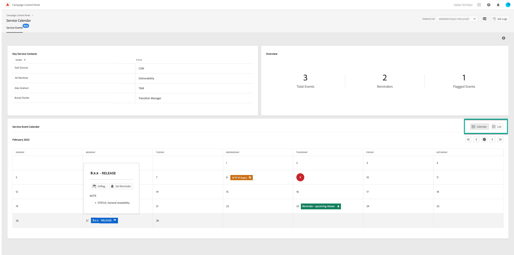

# Identifiera viktiga kontakter och händelser {#keycontacts-events}

>[!CONTEXTUALHELP]
>id="cp_servicecalendar_serviceevents"
>title="Servicekalender"
>abstract="Avsnittet Viktiga kontakter listar de personer hos Adobe som du kan kontakta för alla förfrågningar eller problem i instanserna. I avsnittet Servicehändelsekalender kan du identifiera tidigare/kommande versioner och aviseringar för den valda instansen samt ställa in påminnelser för en viss händelse."

>[!IMPORTANT]
>
>Servicekalendern är tillgänglig i betaversion, och uppdateras och ändras frekvent utan föregående meddelande.

För att effektivt kunna övervaka dina Campaign-instanser är det viktigt att hålla reda på viktiga händelser som kan påverka dina instanser. På Kontrollpanelen kan du identifiera händelser som nya versioner, uppgraderingar, korrigeringar, snabbkorrigeringar osv. och innehåller en lista över viktiga Adobe-kontakter för eventuella förfrågningar eller problem.

Denna information är tillgänglig från kortet **[!UICONTROL Service Calendar]** på startsidan för Kontrollpanelen.

## Viktiga kontakter {#key-contacts}

Avsnittet **[!UICONTROL Key contacts]** listar de personer hos Adobe som du kan kontakta för alla förfrågningar eller problem i instanserna.

>[!NOTE]
>
>I det här avsnittet visas endast information om Managed Service-konton.

Viktiga kontakter omfattar följande roller:

* **[!UICONTROL TAM]**: Technical Account Manager,
* **[!UICONTROL CSM]**: Customer Success Manager,
* **[!UICONTROL Deliverability]**: kontaktpunkt för levererbarhetsåtgärder,
* **[!UICONTROL Transition Manager]**: Managed Services Transition Manager (endast Managed Services-konto),
* **[!UICONTROL On-boarding Specialist]**: Specialist som tilldelats kontot för att hjälpa dig att komma igång med Campaign Classic (endast Managed Services-konto).

## Håll koll på viktiga händelser {#events}

Avsnittet **[!UICONTROL Service Event Calendar]** visar alla tidigare och kommande versioner, liksom aviseringar som användare prenumererar på i e-postaviseringar på Kontrollpanelen. Med Kontrollpanelen kan användare dessutom ange påminnelser och flagga relevanta händelser för den valda instansen så att de är bättre organiserade och effektiva.

Händelser visas antingen i en kalender eller i en lista. Du kan växla mellan de två vyerna med hjälp av knapparna **[!UICONTROL Calendar]** och **[!UICONTROL List]** i avsnittets övre högra hörn.

<table><tr style="border: 0;">
<td>
</td><td>I kalendervyn är navigeringsknapparna tillgängliga i det övre högra hörnet så att du lättare kan bläddra mellan händelserna. Använd <b>dubbelpilarna</b> för att gå till den första händelsen som inträffar efter/före den valda månaden, och <b>enkelpilarna</b> för att gå från en månad till en annan. Klicka på den <b>cirkelformade knappen</b> för att gå tillbaka till dagens vy.</td>
</tr></table>

Tre typer av händelser visas:

* **Påminnelser** anges av användare för att meddelas innan en händelse inträffar. Dessa visas i grönt i kalendervyn. [Läs mer om hur du ställer in påminnelser](#reminders)
* **Varningar** skickas via e-post av Kontrollpanelen för att meddela användare om problem som uppstått i deras instanser, som lagringsöverbelastning eller SSL-certifikatets förfallodatum. Dessa visas i orange i kalendervyn. Händelsebeskrivningen anger om varningen skickas till den inloggade användaren, beroende på prenumerationen på e-postvarningar. [Läs mer om varningsfunktioner via e-post på Kontrollpanelen](../performance-monitoring/using/email-alerting.md)

* **Versioner** visar både tidigare och kommande distributioner till instansen, vilket visas i grått respektive blått i kalendervyn. Händelseinformationen anger vilken typ av version som är kopplad till varje distribution:

   * **[!UICONTROL General availability]**: Senaste stabila versionen som är tillgänglig.
   * **[!UICONTROL Limited availability]**: Endast distribution på begäran.
   * **[!UICONTROL Release candidate]**: Ingenjörsgodkänd. Väntar på produktionskorrektur.
   * **[!UICONTROL Pre release]**: Tidigare tillgänglighet för specifika kundbehov.
   * **[!UICONTROL No longer available]**: Det finns inga större fel i versionen, men en ny version är tillgänglig med ytterligare felkorrigeringar. En uppgradering krävs.
   * **[!UICONTROL Deprecated]**: Kända regressioner med inbäddning av versioner. Det finns inte längre stöd för versionen. En uppgradering krävs.

Du kan tilldela en flagga till en eller flera kommande händelser för att hålla reda på dem. Klicka på ellipsknappen bredvid händelsenamnet för att göra detta.

## Ställ in påminnelser {#reminders}

Med Servicekalendern kan du ställa in påminnelser så att de kan meddelas via e-post innan en händelse inträffar.

>[!NOTE]
>
>Om du vill få meddelanden om kommande händelser kontrollerar du att du prenumererar på e-postaviseringar på Kontrollpanelen. [Läs mer](../performance-monitoring/using/email-alerting.md)

Följ dessa steg för att ställa in en varning:

1. Håll muspekaren över den händelse som du vill bli påmind om eller klicka på ellipsknappen i listvyn och klicka sedan på **[!UICONTROL Set Reminder]**.

1. Ge påminnelsen en rubrik och välj sedan det datum då du vill bli meddelad innan händelsen inträffar.

   

   >[!NOTE]
   >
   >Om du inte prenumererar på Kontrollpanelsvarningar visas ett meddelande och låter dig registrera dig för att få e-postmeddelanden.

1. Påminnelsen ställs nu in för den valda händelsen. Du kan hovra över den när som helst för att visa dess rubrik.

   

   >[!NOTE]
   >
   >Du kan ställa in upp till två påminnelser för samma händelse.

1. På det datum som anges i påminnelsen skickas ett e-postmeddelande som meddelar dig om det kommande evenemanget och påminnelsen tas automatiskt bort från **[!UICONTROL Reminders]** antalet i Servicekalendermenyn.
