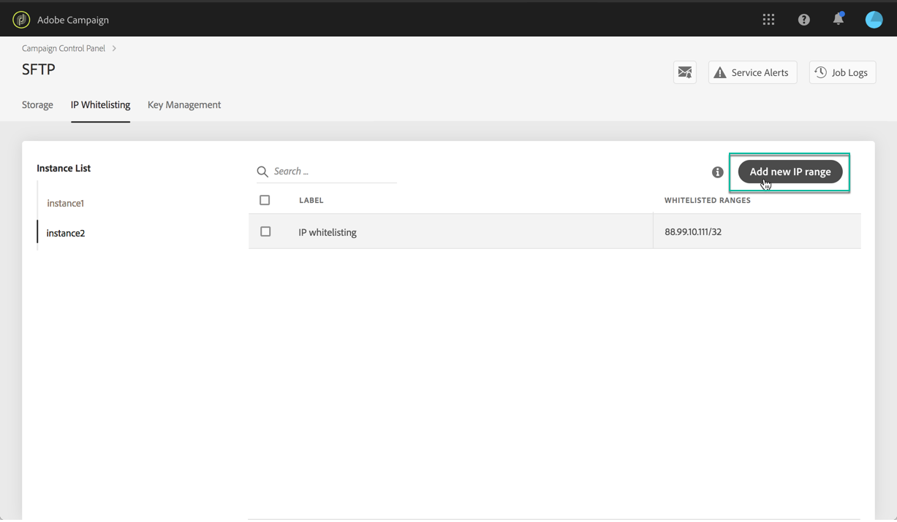

# Tillåtelselista med IP-intervall {#ip-range-allow-listing}

>[!CONTEXTUALHELP]
>id="cp_ip_whitelist"
>title="Om att tillåtelselista med IP-adresser"
>abstract="På den här fliken kan du lägga till IP-intervall till tillåtelselistan för att upprätta en anslutning till SFTP-servrarna. Endast SFTP-servrar som du har åtkomst till visas här. Kontakta din administratör för att begära åtkomst till andra SFTP-servrar."
>additional-url="https://images-tv.adobe.com/mpcv3/8a977e03-d76c-44d3-853c-95d0b799c870_1560205338.1920x1080at3000_h264.mp4#t=98" text="Se demovideon"

SFTP-servrar är skyddade. För att få åtkomst till dem för att kunna se filer eller skriva nya måste du lägga till den offentliga IP-adressen i tillåtelselistan för det system eller den klient som kommer åt servrarna.

 Upptäck den här funktionen i video med  [Campaign ](https://experienceleague.adobe.com/docs/campaign-classic-learn/control-panel/sftp-management/adding-ip-range-to-allow-list.html?lang=en#sftp-management) Classic  [Campaign Standard](https://experienceleague.adobe.com/docs/campaign-standard-learn/control-panel/sftp-management/adding-ip-range-to-allow-list.html?lang=en#sftp-management)

## Om CIDR-formatet {#about-cidr-format}

CIDR (Classless Inter-Domain Routing) är det format som stöds när ett IP-intervall läggs till via Kontrollpanelens gränssnitt.

Syntaxen består av en IP-adress följt av tecknet / och ett decimaltal. Fullständig information för formatet och dess syntax finns i [den här artikeln](https://whatismyipaddress.com/cidr).

Du kan söka på internet efter kostnadsfria verktyg online som hjälper dig att konvertera det aktuella IP-intervallet till ett CIDR-format.

## God praxis {#best-practices}

Se till att du följer rekommendationerna och begränsningarna nedan när du lägger till IP-adresser i tillåtelselistan i Kontrollpanelen.

* **Lägg till IP-intervall i tillåtelselistan** i stället för enskilda IP-adresser. För att lägga till en enda IP-adress till tillåtelselista ska du lägga till /32 för att ange att intervallet bara innehåller en enda IP-adress.
* **Lägg inte till väldigt stora intervall i tillåtelselistan** såsom > 265 IP-adresser. Kontrollpanelen avvisar alla CIDR-formatintervall som är mellan /0 och /23.
* Endast **offentliga IP-adresser** kan läggas till i tillåtelselistan.
* Se till att du **regelbundet tar bort IP-adresser** från tillåtelselistan som inte längre behövs.

## Lägga till IP-adresser i tillåtelselistan {#adding-ip-addresses-allow-list}

>[!CONTEXTUALHELP]
>id="cp_sftp_iprange_add"
>title="Lägg till ett nytt IP-intervall"
>abstract="Definiera de IP-intervall som du vill lägga till i tillåtelselistan för att ansluta till dina SFTP-serverar."

Följ dessa steg för att lägga till ett IP-intervall i tillåtelselistan:

1. Öppna **[!UICONTROL SFTP]**-kortet och välj fliken **[!UICONTROL IP Allow Listing]**.
1. Listan med IP-adresser i tillåtelselistan visas för varje instans. Välj önskad instans i den vänstra listan och klicka sedan på **[!UICONTROL Add new IP range]**.

   

1. Definiera IP-intervallet som du vill lägga till i tillåtelselista i CIDR-formatet och definiera sedan etiketten som ska visas i listan.

   >[!NOTE]
   >
   >Dessa specialtecken är tillåtna i fältet Etikett:
   > `. _ - : / ( ) # , @ [ ] + = & ; { } ! $`

   

   >[!IMPORTANT]
   >
   >Ett IP-intervall får inte överlappa ett befintligt intervall på tillåtelselistan. I detta fall måste du först ta bort det intervall som innehåller den överlappande IP-adressen.
   >
   >Det går att lägga till ett intervall i tillåtelselistan för flera instanser. Gör detta genom att trycka på nedpilen eller ange de första bokstäverna i den önskade instansen och sedan markera den i listan över förslag.

   

1. Klicka på knappen **[!UICONTROL Save]**. IP-tillägg till tillåtelselista visas som VÄNTANDE tills begäran har behandlats klart. Detta tar bara några sekunder.

Ta bort IP-intervall från tillåtelselistan genom att markerar dem och sedan klicka på knappen **[!UICONTROL Delete IP range]**.

>[!NOTE]
>
>Det går för närvarande inte att redigera ett intervall i tillåtelselistan. Ändra ett IP-intervall genom att ta bort det och sedan skapa ett som passar dina behov.

## Övervaka ändringar {#monitoring-changes}

**[!UICONTROL Job Logs]** på Kontrollpanelens startsida låter dig övervaka alla ändringar som har gjorts i IP-adresser i tillåtelselistan.

Se [det här avsnittet](../../discover/using/discovering-the-interface.md) för mer information om kontrollpanelens gränssnitt.

