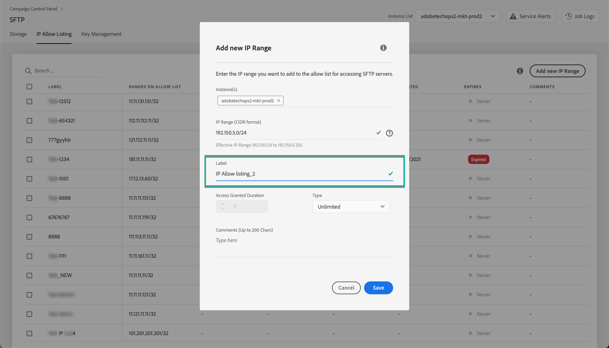

# Tillåtelselista med IP-intervall {#ip-range-allow-listing}

>[!CONTEXTUALHELP]
>id="cp_ip_whitelist"
>title="Om att tillåtelselista med IP-adresser"
>abstract="På den här fliken kan du lägga till IP-intervall till tillåtelselistan för att upprätta en anslutning till SFTP-servrarna. Endast SFTP-servrar som du har åtkomst till visas här. Kontakta din administratör för att begära åtkomst till andra SFTP-servrar."
>additional-url="https://images-tv.adobe.com/mpcv3/8a977e03-d76c-44d3-853c-95d0b799c870_1560205338.1920x1080at3000_h264.mp4#t=98" text="Se demovideon"

SFTP-servrar är skyddade. För att kunna komma åt dem för att visa filer eller skriva nya måste du lägga till den offentliga IP-adressen för det system eller den klient som kommer åt servrarna till tillåtelselista.

 Upptäck den här funktionen via video med [Campaign Classic](https://experienceleague.adobe.com/docs/campaign-classic-learn/control-panel/sftp-management/adding-ip-range-to-allow-list.html#sftp-management) eller [Campaign Standard](https://experienceleague.adobe.com/docs/campaign-standard-learn/control-panel/sftp-management/adding-ip-range-to-allow-list.html#sftp-management)

## Om CIDR-formatet {#about-cidr-format}

CIDR (Classless Inter-Domain Routing) är det format som stöds när ett IP-intervall läggs till via Kontrollpanelens gränssnitt.

Syntaxen består av en IP-adress följt av tecknet / och ett decimaltal. Formatet och dess syntax beskrivs ingående i [den här artikeln](https://whatismyipaddress.com/cidr){target=&quot;_blank&quot;}.

Du kan söka på Internet efter kostnadsfria onlineverktyg som hjälper dig att konvertera det aktuella IP-intervallet till CIDR-format.

## Bästa praxis {#best-practices}

Se till att du följer rekommendationerna och begränsningarna nedan när du lägger till IP-adresser i tillåtelselistan i Kontrollpanelen.

* **Lägg till IP-intervall i tillåtelselistan** i stället för enskilda IP-adresser. För att lägga till en enda IP-adress till tillåtelselista ska du lägga till /32 för att ange att intervallet bara innehåller en enda IP-adress.
* **Lägg inte till väldigt stora intervall i tillåtelselistan** såsom > 265 IP-adresser. Kontrollpanelen avvisar alla CIDR-formatintervall som är mellan /0 och /23.
* Endast **offentliga IP-adresser** kan läggas till i tillåtelselistan.
* Se till att **ta bort IP-adresser regelbundet** som du inte behöver längre från tillåtelselista.

## Lägga till IP-adresser i tillåtelselistan {#adding-ip-addresses-allow-list}

>[!CONTEXTUALHELP]
>id="cp_sftp_iprange_add"
>title="IP-intervallkonfiguration"
>abstract="Definiera de IP-intervall som du vill lägga till i tillåtelselistan för att ansluta till dina SFTP-serverar."

Följ dessa steg för att lägga till ett IP-intervall i tillåtelselistan:

1. Öppna **[!UICONTROL SFTP]**-kortet och välj fliken **[!UICONTROL IP Allow Listing]**.
1. Listan med IP-adresser i tillåtelselistan visas för varje instans. Välj önskad instans i den vänstra listan och klicka sedan på **[!UICONTROL Add new IP range]**.

   

1. Definiera IP-intervallet som du vill lägga till i tillåtelselista. Det här fältet accepterar endast IP-intervall i CIDR-format, som *192.150.5.0/24*.

   

   >[!IMPORTANT]
   >
   >Ett IP-intervall får inte överlappa ett befintligt intervall på tillåtelselistan. I detta fall måste du först ta bort det intervall som innehåller den överlappande IP-adressen.

1. Det går att lägga till ett intervall i tillåtelselista för flera instanser. Gör detta genom att trycka på nedpilen eller ange de första bokstäverna i den önskade instansen och sedan markera den i listan över förslag.

   

1. Definiera etiketten som ska visas för det här IP-intervallet i listan.

   

   >[!NOTE]
   >
   >Följande specialtecken är tillåtna i **[!UICONTROL Label]** fält:
   > `. _ - : / ( ) # , @ [ ] + = & ; { } ! $`

1. Om du vill hantera IP-tillåtelselista bättre kan du ange en längd för tillgängligheten för varje IP-intervall. Välj en enhet i **[!UICONTROL Type]** och definiera en varaktighet i motsvarande fält. Mer information om IP-intervallets förfallodatum finns på [det här avsnittet](#expiry).

   

   >[!NOTE]
   >
   >Som standard är **[!UICONTROL Type]** fältet är inställt på **[!UICONTROL Unlimited]**, vilket betyder att IP-intervallet aldrig upphör att gälla.

1. I **[!UICONTROL Comment]** kan du ange en orsak till att detta IP-intervall tillåts (varför, för vem, osv.).

1. Klicka på knappen **[!UICONTROL Save]**. IP-intervallet som läggs till tillåtelselista visas som **[!UICONTROL Pending]** tills begäran har behandlats fullständigt, vilket bör ta några sekunder.

   

>[!IMPORTANT]
>
>Om du försöker ansluta dina SFTP-servrar till ett nytt system, och därmed lägger till nya IP-intervall till tillåtelselista, kan du behöva ange nya offentliga nycklar för att slutföra anslutningen. Mer information finns i [det här avsnittet](key-management.md).

## Hantera IP-intervall {#managing-ip-ranges}

IP-intervallen som du skapar visas i **[!UICONTROL IP Allow Listing]** -fliken.

Du kan sortera objekten baserat på skapandedatum eller utgåvedatum, på den användare som skapade eller redigerade dem och på IP-intervallets förfallodatum.

Du kan också söka efter ett IP-intervall genom att börja skriva en etikett, ett intervall, ett namn eller en kommentar.

Information om hur du redigerar ett eller flera IP-intervall finns i [det här avsnittet](#editing-ip-ranges).

Om du vill ta bort ett eller flera IP-intervall från tillåtelselista markerar du dem och klickar sedan på knappen **[!UICONTROL Delete IP range]** -knappen.

### Förfaller {#expiry}

The **[!UICONTROL Expires]** kolumn visar hur många dagar som återstår tills IP-intervallet upphör att gälla.

Om du prenumererar på [e-postavisering](../../performance-monitoring/using/email-alerting.md)får du meddelanden via e-post 10 dagar och 5 dagar innan ett IP-intervall upphör att gälla och samma dag som det upphör att gälla. När du fått en varning kan du [redigera IP-intervallet](#editing-ip-ranges) vid behov förlänga giltighetsperioden.

Ett IP-intervall som har gått ut tas bort automatiskt efter 7 dagar. Det visas som **[!UICONTROL Expired]** i **[!UICONTROL Expires]** kolumn. Inom denna 7-dagarsperiod:

* Ett IP-intervall som har gått ut kan inte längre användas för att komma åt SFTP-servrarna.

* Du kan inte skapa ett annat IP-intervall som överlappar ett intervall som har gått ut. Du måste först ta bort det utgångna IP-intervallet innan du skapar det nya.

* Du kan [redigera](#editing-ip-ranges) ett IP-intervall som gått ut och uppdatera dess varaktighet för att göra det tillgängligt igen.

* Du kan ta bort den från tillåtelselista.

## Redigera IP-intervall {#editing-ip-ranges}

>[!CONTEXTUALHELP]
>id="cp_sftp_iprange_update"
>title="Uppdatera IP-intervall"
>abstract="Uppdatera de valda IP-intervallen som tillåts ansluta till SFTP-servern."

Följ stegen nedan om du vill redigera IP-intervall.

>[!NOTE]
>
>Du kan bara redigera IP-intervall som har skapats sedan Kontrollpanelen i oktober 2021-versionen.

<!--Edition is not available for IP ranges that have been created before the Control Panel October 2021 release.-->

1. Välj ett eller flera IP-intervall från **[!UICONTROL IP Allow Listing]** lista.

1. Klicka på knappen **[!UICONTROL Update IP range]**.

   

1. Du kan bara redigera IP-intervallets förfallodatum och/eller lägga till en ny kommentar.

   >[!NOTE]
   >
   >Om du vill ändra CIDR-formatet, dess etikett eller redigera de relaterade instanserna måste du först ta bort IP-intervallet och skapa ett nytt som passar dina behov.

   

1. Spara ändringarna.

## Övervaka ändringar {#monitoring-changes}

The **[!UICONTROL Job Logs]** på kontrollpanelens startsida kan du spåra och övervaka alla ändringar som har gjorts i IP-adresser på tillåtelselista.

Se [det här avsnittet](../../discover/using/discovering-the-interface.md) för mer information om kontrollpanelens gränssnitt.

