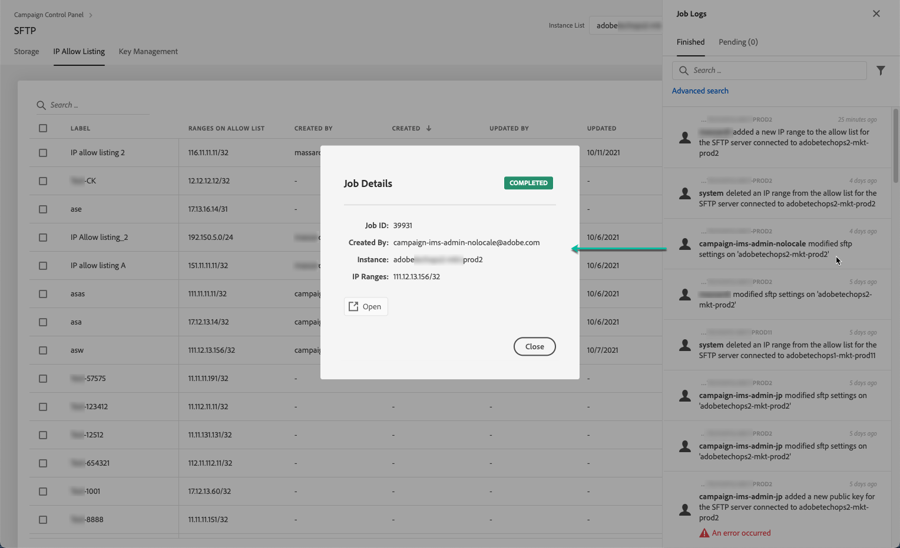

# Vitlista för IP-intervall {#ip-range-whitelisting}

>[!CONTEXTUALHELP]
>id="cp_ip_whitelist"
>title="Om vitlistning för IP"
>abstract="På den här fliken kan du vitlista IP-intervall för att upprätta en anslutning till dina SFTP-servrar. Endast SFTP-servrar som du har åtkomst till visas här. Kontakta administratören för att begära åtkomst till andra SFTP-servrar."
>additional-url="https://images-tv.adobe.com/mpcv3/8a977e03-d76c-44d3-853c-95d0b799c870_1560205338.1920x1080at3000_h264.mp4#t=98" text="Se filmen"

SFTP-servrar är skyddade. För att kunna komma åt dem för att kunna visa filer eller skriva nya måste du vitlista den offentliga IP-adressen för det system eller den klient som kommer åt servrarna.

## Om CIDR-formatet {#about-cidr-format}

CIDR (Classless Inter-Domain Routing) är det format som stöds när du lägger till IP-intervall med kontrollpanelens gränssnitt.

Syntaxen består av en IP-adress, följt av tecknet &#39;/&#39; och ett decimaltal. Formatet och syntaxen för det finns detaljerad information i [den här artikeln](https://whatismyipaddress.com/cidr).

Du kan söka på Internet efter kostnadsfria onlineverktyg som hjälper dig att konvertera det aktuella IP-intervallet till CIDR-format.

## God praxis {#best-practices}

Se till att du följer rekommendationerna och begränsningarna nedan när du vitlistar IP-adresser på Kontrollpanelen.

* **Vitlista IP-intervall** i stället för enstaka IP-adresser. Om du vill vitlista en enskild IP-adress lägger du till en &#39;/32&#39; i den för att ange att intervallet bara innehåller en enda IP-adress.
* **Vitlista inte mycket breda intervall**, t.ex. > 265 IP-adresser. Kontrollpanelen ignorerar alla CIDR-formatintervall som är mellan /0 och /23.
* Endast **offentliga IP-adresser** kan vitlistas.
* Se till att du **regelbundet tar bort IP-adresser** som du inte längre behöver.

## Vitlista IP-adresser {#whitelisting-ip-addresses}

>[!CONTEXTUALHELP]
>id="cp_sftp_iprange_add"
>title="Lägg till nytt IP-intervall"
>abstract="Definiera de IP-intervall som du vill vitlista för att ansluta till dina SFTP-servrar."

Så här vitlistar du ett IP-intervall:

1. Öppna **[!UICONTROL SFTP]**-kortet och välj fliken **[!UICONTROL IP Whistelisting]**.
1. Listan med vitlistade IP-adresser visas för varje instans. Markera önskad instans i den vänstra listan och klicka sedan på **[!UICONTROL Add new IP range]** .

   

1. Definiera det IP-intervall som du vill vitlista, i CIDR-format, och definiera sedan etiketten som ska visas i listan.

   >[!NOTE]
   >
   >Dessa specialtecken är tillåtna i fältet Etikett:
   > `. _ - : / ( ) # , @ [ ] + = & ; { } ! $`

   

   >[!IMPORTANT]
   >
   >Ett IP-intervall kan inte överlappa ett befintligt tomt intervall. I så fall tar du först bort det intervall som innehåller den överlappande IP-adressen.
   >
   >Det går att vitlista ett intervall för flera instanser. Det gör du genom att trycka på nedpilen eller skriva de första bokstäverna i den önskade instansen och sedan markera den i listan med förslag.

   

1. Klicka på **[!UICONTROL Save]** knappen. Tillägg av IP-vitlista visas som VÄNTANDE tills begäran har bearbetats helt. Detta tar bara några sekunder.

Om du vill ta bort godkända IP-intervall markerar du dem och klickar sedan på **[!UICONTROL Delete IP range]** .

>[!NOTE]
>
>Det går för närvarande inte att redigera ett område i listan över godkända områden. Om du vill ändra ett IP-intervall tar du bort det och skapar sedan ett som passar dina behov.

## Övervaka ändringar {#monitoring-changes}

På kontrollpanelens startsida kan du övervaka alla ändringar som har gjorts i vitlistade IP-adresser. **[!UICONTROL Job Logs]**

Mer information om gränssnittet på Kontrollpanelen finns i [det här avsnittet](../../discover/using/discovering-the-interface.md).

