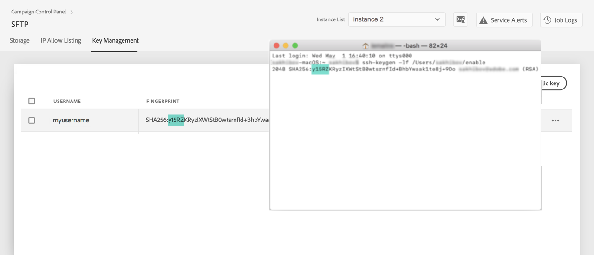

# Nyckelhantering {#key-management}

>[!CONTEXTUALHELP]
>id="cp_key_management"
>title="Om hantering av offentlig nyckel"
>abstract="Skapa, hantera och redigera dina offentliga nycklar på den här fliken."
>additional-url="https://images-tv.adobe.com/mpcv3/8a977e03-d76c-44d3-853c-95d0b799c870_1560205338.1920x1080at3000_h264.mp4#t=166" text="Se demovideon"

Adobe rekommenderar att alla kunder upprättar anslutningar till sina SFTP-servrar med ett **nyckelpar med offentlig och privat nyckel**.

Nedan kan du se stegen för att generera en offentlig SSH-nyckel och lägga till den för att få åtkomst till SFTP-servern samt rekommendationer om autentisering.

Konfigurera först åtkomsten till servern men kom ihåg att **lägga till IP-adresserna som kräver åtkomst till servern i tillåtelselistan** så att du kan ansluta till den. Se [det här avsnittet](../../instances-settings/using/ip-allow-listing-instance-access.md) för mer information om detta.

 Upptäck denna funktion genom video med [Campaign v7/v8](https://experienceleague.adobe.com/docs/campaign-classic-learn/control-panel/sftp-management/generate-ssh-key.html#sftp-management) eller [Campaign Standard](https://experienceleague.adobe.com/docs/campaign-standard-learn/control-panel/sftp-management/generate-ssh-key.html#sftp-management)

## Bästa praxis {#best-practices}

**Om den offentliga SSH-nyckeln**

Se till att du alltid använder samma autentisering för att ansluta till servern och att du använder ett format som nyckeln har stöd för.

**API-integrering med användarnamn och lösenord**

I mycket sällsynta fall aktiveras lösenordsbaserad autentisering på vissa SFTP-servrar. Adobe rekommenderar att du använder nyckelbaserad autentisering eftersom den här metoden är mer effektiv och säker. Du kan begära att få byta till nyckelbaserad autentisering genom att kontakta Kundtjänst.

>[!IMPORTANT]
>
>Om ditt lösenord förfaller kan du inte logga in på dina SFTP-konton även om nycklar finns installerade på systemet.

## Installera SSH-nyckeln {#installing-ssh-key}

>[!CONTEXTUALHELP]
>id="cp_sftp_publickey_add"
>title="Tillägg för offentlig nyckel"
>abstract="Generera en offentlig SSH-nyckel för en instans och lägg till den på Kontrollpanelen för att komma åt SFTP-servern."

>[!IMPORTANT]
>
>Du måste alltid följa riktlinjerna för din organisation när det gäller SSH-nycklar. Stegen nedan är bara ett exempel på hur SSH-nyckelgenerering kan göras och de kan fungera som en bra referenspunkt för att kommunicera krav till ditt team eller din interna nätverksgrupp.

1. Navigera till fliken **[!UICONTROL Key Management]** och klicka sedan på knappen **[!UICONTROL Add new public key]**.

   

1. I dialogrutan som öppnas ska du välja det användarnamn som du vill skapa den offentliga nyckeln för och den server du vill aktivera nyckeln för.

   

   >[!NOTE]
   >
   >Kontrollpanelen kontrollerar om ett visst användarnamn är aktivt för en viss instans och aktiverar nyckeln för en eller flera instanser.
   >
   >En eller flera offentliga SSH-nycklar kan läggas till för varje användare.

1. Om du vill hantera dina offentliga nycklar bättre kan du ange en varaktighet för tillgängligheten för varje nyckel. Välj en enhet i **[!UICONTROL Type]** och definiera en varaktighet i motsvarande fält. Mer information om publika nycklar finns på [det här avsnittet](#expiry).

   

   >[!NOTE]
   >
   >Som standard är **[!UICONTROL Type]** fältet är inställt på **[!UICONTROL Unlimited]**, vilket betyder att den offentliga nyckeln aldrig upphör att gälla.

1. I **[!UICONTROL Comment]** kan du ange en anledning till att du lägger till den här offentliga nyckeln (varför, för vem, osv.).

1. För att kunna fylla i **[!UICONTROL Public Key]** måste du generera en offentlig SSH-nyckel. Följ stegen nedan enligt ditt operativsystem.

   **Linux och Mac:**

   Använd terminalen för att generera ett nyckelpar med en offentlig och privat nyckel:
   1. Ange det här kommandot: `ssh-keygen -m pem -t rsa -b 2048 -C "your_email@example.com"`.
   1. Ge nyckeln ett namn när du så uppmanas. Om .ssh-katalogen inte finns skapar systemet en åt dig.
   1. Ange en lösenfras och ange sedan samma igen när du så uppmanas. Den kan också lämnas tom.
   1. Ett nyckelpar som heter ”namn” och ”namn.pub” skapas av systemet. Sök efter filen ”namn.pub” och öppna den. Den ska ha en alfanumerisk sträng som slutar med den e-postadress du angav.

   **Windows:**

   Du kan behöva installera ett verktyg från tredje part som hjälper dig att generera nyckelpar för privat/offentlig nyckel i samma format, &quot;name.pub&quot;.

1. Öppna .pub-filen och kopiera och klistra sedan in hela strängen med börjar med ”ssh …” i Kontrollpanelen.

   

   >[!NOTE]
   >
   >The **[!UICONTROL Public Key]** Endast OpenSSH-formatet accepteras i fältet. Storleken på den offentliga SSH-nyckeln ska vara **2 048 bitar**.

1. Klicka på knappen **[!UICONTROL Save]** för att skapa nyckeln. Kontrollpanelen sparar den offentliga nyckeln och tillhörande fingeravtryck, som är krypterat med SHA256-formatet.

>[!IMPORTANT]
>
>Om nyckeln som du skapade används för att upprätta en anslutning till ett system som aldrig har anslutits till den valda SFTP-servern tidigare, måste du lägga till en offentlig IP-adress för det systemet i tillåtelselista innan du kan använda det här systemet med SFTP-servern. Se [det här avsnittet](ip-range-allow-listing.md).

Du kan använda fingeravtryck för att matcha privata nycklar som har sparats på datorn med motsvarande offentliga nycklar som har sparats på Kontrollpanelen.

Med knappen ”**…**” kan du ta bort en befintlig nyckel eller kopiera tillhörande fingeravtryck till Urklipp.

## Hantera offentliga nycklar {#managing-public-keys}

De offentliga nycklarna som du skapar visas i **[!UICONTROL Key Management]** -fliken.

Du kan sortera objekten baserat på skapandedatum eller utgåvedatum, på den användare som skapade eller redigerade dem och på IP-intervallets förfallodatum.

Du kan också söka efter en offentlig nyckel genom att börja skriva ett namn eller en kommentar.

Om du vill redigera ett eller flera IP-intervall läser du [det här avsnittet](#editing-public-keys).

Om du vill ta bort en eller flera offentliga nycklar från listan markerar du dem och klickar sedan på knappen **[!UICONTROL Delete public key]** -knappen.

### Förfaller {#expiry}

The **[!UICONTROL Expires]** visas hur många dagar som återstår tills den offentliga nyckeln upphör att gälla.

Om du prenumererar på [e-postavisering](../../performance-monitoring/using/email-alerting.md)får du meddelanden via e-post 10 dagar och 5 dagar innan en offentlig nyckel upphör att gälla och den dag då den upphör att gälla. När du fått en varning kan du [redigera den offentliga nyckeln](#editing-public-keys) vid behov förlänga giltighetsperioden.

En utgången offentlig nyckel tas automatiskt bort efter 7 dagar. Det visas som **[!UICONTROL Expired]** i **[!UICONTROL Expires]** kolumn. Inom denna 7-dagarsperiod:

* Det går inte längre att använda en utgången offentlig nyckel för att ansluta till SFTP-servern.

* Du kan [redigera](#editing-public-keys) en utgången offentlig nyckel och uppdatera dess varaktighet så att den blir tillgänglig igen.

* Du kan ta bort den från listan.

## Redigera offentliga nycklar {#editing-public-keys}

>[!CONTEXTUALHELP]
>id="cp_sftp_publickey_update"
>title="Redigera offentliga nycklar"
>abstract="Uppdatera de valda publika nycklarna för att komma åt SFTP-servern."

Följ stegen nedan om du vill redigera offentliga nycklar.

>[!NOTE]
>
>Du kan bara redigera offentliga nycklar som har skapats sedan Kontrollpanelen i oktober 2021-versionen.

1. Markera ett eller flera objekt i dialogrutan **[!UICONTROL Key Management]** lista.
1. Klicka på knappen **[!UICONTROL Update public key]**.

   

1. Du kan bara redigera utgångsdatumet för den offentliga nyckeln och/eller lägga till en ny kommentar.

   >[!NOTE]
   >
   >Om du vill ändra användarnamn, instans och offentlig nyckel i OpenSSH-format tar du bort den offentliga nyckeln och skapar en ny som passar dina behov.

1. Spara ändringarna.
