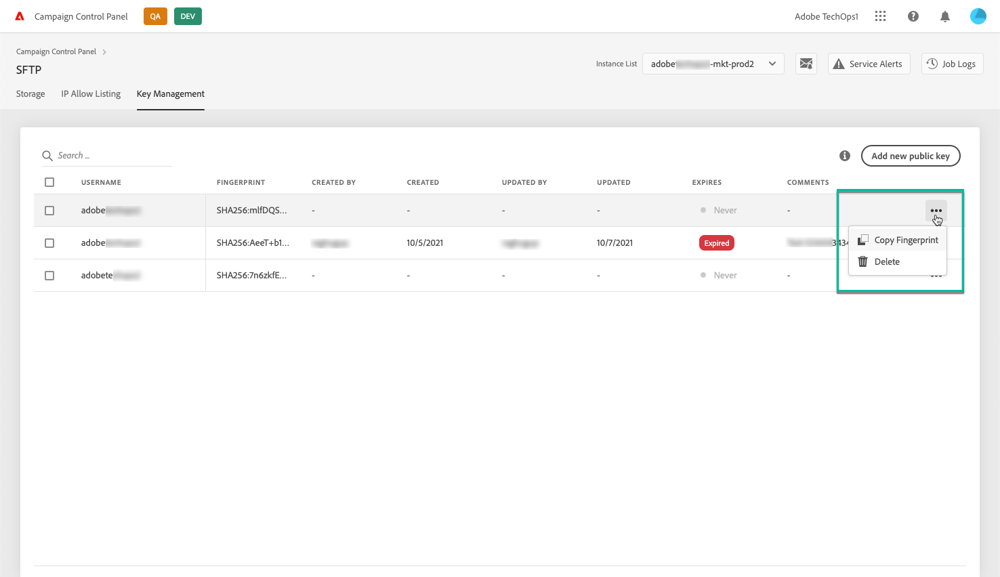

# Hantera nycklar {#key-management}

>[!CONTEXTUALHELP]
>id="cp_key_management"
>title="Om att hantera nycklar"
>abstract="Du kan hantera dina offentliga nycklar på den här fliken."
>additional-url="https://images-tv.adobe.com/mpcv3/8a977e03-d76c-44d3-853c-95d0b799c870_1560205338.1920x1080at3000_h264.mp4#t=166" text="Se demovideon"

Adobe rekommenderar att alla kunder upprättar anslutningar till sina SFTP-servrar med ett **nyckelpar med offentlig och privat nyckel**.

Nedan kan du se stegen för att generera en offentlig SSH-nyckel och lägga till den för att få åtkomst till SFTP-servern samt rekommendationer om autentisering.

Konfigurera först åtkomsten till servern men kom ihåg att **lägga till IP-adresserna som kräver åtkomst till servern i tillåtelselistan** så att du kan ansluta till den. Se [det här avsnittet](../../instances-settings/using/ip-allow-listing-instance-access.md) för mer information om detta.

>[!NOTE]
>
>Det går för närvarande inte att ta bort en offentlig SSH-nyckel.

 Upptäck den här funktionen i video med  [Campaign ](https://experienceleague.adobe.com/docs/campaign-classic-learn/control-panel/sftp-management/generate-ssh-key.html?lang=en#sftp-management) Classic  [Campaign Standard](https://experienceleague.adobe.com/docs/campaign-standard-learn/control-panel/sftp-management/generate-ssh-key.html?lang=en#sftp-management)

## God praxis {#best-practices}

**Om den offentliga SSH-nyckeln**

Se till att du alltid använder samma autentisering för att ansluta till servern och att du använder ett format som nyckeln har stöd för.

**API-integrering med användarnamn och lösenord**

I mycket sällsynta fall möjliggörs lösenordsbaserad autentisering på vissa SFTP-servrar. Adobe rekommenderar att du använder nyckelbaserad autentisering eftersom den här metoden är mer effektiv och säker. Kontakta Kundtjänst för att begära om att få byta till nyckelbaserad autentisering.

>[!IMPORTANT]
>
>Om ditt lösenord förfaller kan du inte logga in på dina SFTP-konton även om nycklar finns installerade på systemet.

## Installera SSH-nyckeln {#installing-ssh-key}

>[!CONTEXTUALHELP]
>id="cp_sftp_publickey_add"
>title="Lägga till ny offentlig nyckel"
>abstract="Lägg till en ny offentlig nyckel till en instans."

>[!IMPORTANT]
>
>Stegen nedan ger endast ett exempel på hur du skapar SSH-nycklar. Följ riktlinjerna från din organisation när det gäller SSH-nycklar. Exemplet nedan är bara ett exempel på hur detta kan göras och fungerar som en bra referenspunkt för att kommunicera krav till ditt team eller din interna nätverksgrupp.

1. Navigera till fliken **[!UICONTROL Key Management]** och klicka sedan på knappen **[!UICONTROL Add new public key]**.

   

1. I dialogrutan som öppnas ska du välja det användarnamn som du vill skapa den offentliga nyckeln för och den server du vill aktivera nyckeln för.

   >[!NOTE]
   >
   >Gränssnittet kontrollerar om ett visst användarnamn är aktivt för en viss instans och ger dig möjligheten att aktivera nyckeln för en eller flera instanser.
   >
   >En eller flera offentliga SSH-nycklar kan läggas till för varje användare.

   

1. Kopiera och klistra in den offentliga SSH-nyckeln. Följ stegen nedan för ditt operativsystem för att generera en offentlig nyckel:

   >[!NOTE]
   >
   >Storleken på den offentliga SSH-nyckeln ska vara **2 048 bitar**.

   **Linux och Mac:**

   Använd terminalen för att generera ett nyckelpar med en offentlig och privat nyckel:
   1. Ange det här kommandot: `ssh-keygen -m pem -t rsa -b 2048 -C "your_email@example.com"`.
   1. Ge nyckeln ett namn när du så uppmanas. Om .ssh-katalogen inte finns skapar systemet en åt dig.
   1. Ange en lösenfras och ange sedan samma igen när du så uppmanas. Den kan också lämnas tom.
   1. Ett nyckelpar som heter ”namn” och ”namn.pub” skapas av systemet. Sök efter filen ”namn.pub” och öppna den. Den ska ha en alfanumerisk sträng som slutar med den e-postadress du angav.

   **Windows:**

   Du kan behöva installera ett tredjepartsverktyg som hjälper dig att generera nyckelpar med privata och offentliga nycklar i samma format, ”namn.pub”.

1. Öppna .pub-filen och kopiera och klistra sedan in hela strängen med börjar med ”ssh …” i Kontrollpanelen.

   

1. Klicka på knappen **[!UICONTROL Save]** för att skapa nyckeln. Kontrollpanelen sparar den offentliga nyckeln och tillhörande fingeravtryck som är krypterat med SHA256-formatet.

Du kan använda fingeravtryck för att matcha privata nycklar som har sparats på datorn med motsvarande offentliga nycklar som har sparats i Kontrollpanelen.

Med knappen ”**…**” kan du ta bort en befintlig nyckel eller kopiera tillhörande fingeravtryck till Urklipp.

