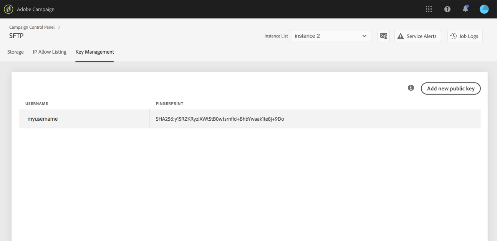

# Logga in på SFTP-servern {#logging-into-sft-server}

Stegen nedan visar hur du ansluter en SFTP-server via ditt SFTP-klientprogram.

 Upptäck den här funktionen i [video](https://video.tv.adobe.com/v/27263?quality=12)

Innan du loggar in på servern bör du kontrollera att:

* SFTP-servern är **värd för Adobe**.
* Ditt **användarnamn** har konfigurerats för servern. Du kan kontrollera den här informationen direkt på Kontrollpanelen på fliken **Nyckelhantering** från SFTP-kortet.
* Du har ett **privat och offentligt nyckelpar** som du kan logga in på SFTP-servern med. Mer information om hur du lägger till SSH-nyckeln finns i [det här avsnittet](../../sftp/using/key-management.md).
* Din **offentliga IP-adress har lagts till i tillåtelselista** på SFTP-servern. Om inte, se [det här avsnittet](../../sftp/using/ip-range-allow-listing.md) för mer information om hur du lägger till ditt IP-intervall i tillåtelselista.
* Du har åtkomst till en **SFTP-klientprogramvara**. Du kan kontakta din IT-avdelning för SFTP-klientprogram som de rekommenderar att använda, eller söka efter ett på Internet om det är tillåtet enligt din företagspolicy.

Så här ansluter du till SFTP-servern:

1. Starta Kontrollpanelen och välj sedan fliken **[!UICONTROL Key Management]** från kortet **[!UICONTROL SFTP]**.

   

1. Starta SFTP-klientprogrammet och kopiera och klistra sedan in serveradressen från Kontrollpanelen, följt av&quot;campaign.adobe.com&quot;, och fyll sedan i ditt användarnamn.

   

1. I fältet **[!UICONTROL SSH Private Key]** väljer du den privata nyckelfil som lagras på datorn. Den motsvarar en textfil som har samma namn som den offentliga nyckeln, utan tillägget&quot;.pub&quot; (t.ex.&quot;enable&quot;).

   

   Fältet **[!UICONTROL Password]** fylls i automatiskt med den privata nyckeln från filen.

   

   Du kan kontrollera att nyckeln som du försöker använda sparas på Kontrollpanelen genom att jämföra fingeravtrycket för den privata eller offentliga nyckeln med fingeravtrycket för tangenterna som visas på fliken Nyckelhantering på SFTP-kortet.

   

   >[!NOTE]
   >
   >Om du använder en Mac-dator kan du visa fingeravtrycket för den privata nyckel som finns på datorn genom att köra följande kommando:
   >
   >`ssh-keygen -lf <path of the privatekey>`

1. När all information är ifylld klickar du på **[!UICONTROL Connect]** för att logga in på SFTP-servern.

   
