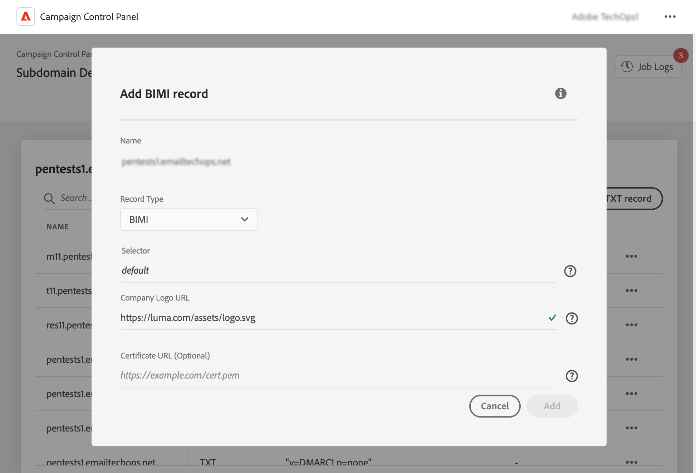

# Lägg till BIMI-poster {#dmarc}

## Om BIMI-poster {#about}

Varumärkesindikatorer för BIMI (Message Identification) är en branschstandard som gör att en godkänd logotyp kan visas bredvid en avsändares e-postadress i postlådeleverantörens inkorgar för att förbättra varumärkesigenkänningen och förtroendet. Det förebygger e-postförfalskning och nätfiske genom att verifiera avsändarens identitet via DMARC-autentisering, vilket gör det svårare för oseriösa aktörer att personifiera legitima varumärken i e-postmeddelanden.

Detaljerad information om BIMI-implementering finns i [Adobe Deliverability Best Practice Guide](https://experienceleague.adobe.com/docs/deliverability-learn/deliverability-best-practice-guide/additional-resources/technotes/implement-bimi.html)

{width="70%" align="center"}

## Begränsningar och krav {#limitations}

* SPF-, DKIM- och DMARC-poster är nödvändiga för att du ska kunna skapa en BIMI-post.
* BIMI-poster kan bara läggas till för underdomäner med fullständig underdomändelegering. [Läs mer om konfigurationsmetoder för underdomäner](subdomains-branding.md#subdomain-delegation-methods)
* Krav för DMARC-post:

   * Postprinciptypen för underdomänen måste anges till &quot;Karantän&quot; eller &quot;Avvisa&quot;. Det går inte att skapa BIMI-poster med DMARC-principtypen inställd på Ingen.
   * Procentandelen e-postmeddelanden som DMARC-policyn tillämpas på måste vara 100 %. BIMI stöder inte DMARC-profiler där procentandelen är mindre än 100 %.

[Lär dig konfigurera DMARC-poster](dmarc.md)

## Lägga till en BIMI-post för en underdomän {#add}

Så här lägger du till en BIMI-post för en underdomän:

1. Klicka på ellipsknappen bredvid önskad underdomän i listan över underdomäner och välj **[!UICONTROL Subdomain details]**.

1. Klicka på **[!UICONTROL Add TXT record]** knapp och sedan välja **[!UICONTROL BIMI]** från **[!UICONTROL Record type]** listruta.

   

1. I **[!UICONTROL Company Logo URL]** anger du URL-adressen till den SVG-fil som innehåller logotypen.

1. Tjock **[!UICONTROL Certificate URL]** är valfritt, behövs för vissa postlådeleverantörer som Gmail och Apple som täcker 80 % av postlådemarknaden. Därför rekommenderar vi att du skaffar ett Verified Mark Certificate (VMC) för att verkligen utnyttja BIMI.

   +++Hur skaffar jag en VMC?

   De viktigaste stegen för att hämta en VMC är följande:

   1. Registrera er logotyp som ett varumärke på ett immaterialrättskontor som godkänts av VMC-utfärdare. Om du har ett juristteam rekommenderar vi att du arbetar med dem för att få din logotyp varumärkesskyddad eller verifiera att den redan är varumärkesskyddad.

   1. När du har verifierat att logotypen är varumärkesskyddad kontaktar du DigiCert eller Entrust certificate Authority (CA) för att begära en VMC.

   1. När din VMC har godkänts får du en PEM-fil (Privacy Enhanced Mail) för entitetscertifikatet. Lägg till eventuella andra mellanliggande certifikat som du får från certifikatutfärdaren till den här PEM-filen. Överför PEM-filen (tillsammans med bifogade filer) till den offentliga webbservern och notera PEM-filens URL. Du kommer att använda URL:en i BIMI TXT-posten.

   1. När BIMI-posten visas på sidan med information om underdomäner för en viss underdomän kan du använda BIMI Inspector [här](https://bimigroup.org/bimi-generator/) för att kontrollera om BIMI-posten fungerar som den ska.

   Detaljerad information om BIMI-implementering finns i [Standarddokumentation för BIMI](https://bimigroup.org/implementation-guide/)
+++

1. Klicka **[!UICONTROL Add]** för att bekräfta att BIMI-posten har skapats.

När BIMI-postgenereringen har bearbetats (ungefär 5 minuter) visas den på informationsskärmen i underdomänerna. [Lär dig övervaka TXT-poster för dina underdomäner](gs-txt-records.md#monitor)
