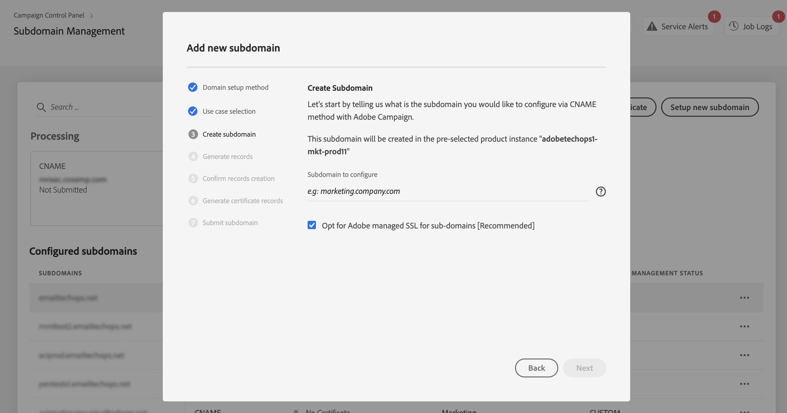
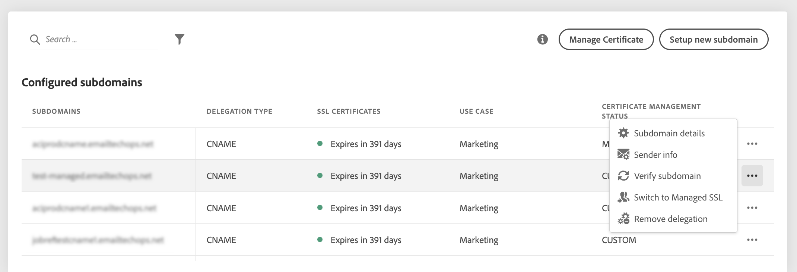

# Delegera underdomäners SSL-certifikat till Adobe {#delegate-ssl-certificates}

>[!CONTEXTUALHELP]
>id="cp_managed_ssl"
>title="Delegera underdomäners SSL-certifikat till Adobe"
>abstract="Kontrollpanelen låter dig hantera dina underdomäners SSL-certifikat av Adobe. Om du använder CNAME:er för att konfigurera din underdomän, kommer certifikatposter att genereras automatiskt och tillhandahållas för att generera ett certifikat till din värdlösning."

Vi rekommenderar att du delegerar hanteringen av dina underdomäners SSL-certifikat till Adobe, eftersom Adobe automatiskt skapar certifikatet och förnyar det varje år innan certifikatet upphör att gälla.

Om du använder CNAME:er för att konfigurera en delegering av underdomäner, kommer Adobe att tillhandahålla certifikatposter som kan användas i din värdlösning för domäner för att generera ditt certifikat.

SSL-certifikatdelegering till Adobe kan utföras när du konfigurerar en ny underdomän eller för redan delegerade underdomäner.

>[!NOTE]
>
>SSL som hanteras av Adobe är en kostnadsfri funktion som är tillgänglig för användare utan kostnad. Att delegera en underdomäns certifikat till Adobe är genomskinligt och påverkar inte dina kampanjer och levererbarheten. [Läs mer om hantering av SSL-certifikat](monitoring-ssl-certificates.md#management)

## Delegera SSL-certifikat för nya underdomäner {#new}

Om du vill delegera SSL-certifikat när du konfigurerar en ny underdomän aktiverar du alternativet **[!UICONTROL Opt for Adobe managed SSL for sub-domains]** i konfigurationsguiden för underdomäner. Certifikatposter som ska kopieras till din värdlösning tillhandahålls senare i konfigurationsguiden. Detaljerade steg beskrivs i [det här avsnittet](setting-up-new-subdomain.md).

{width="70%" align="left"}

## Delegera SSL-certifikat för redan delegerade underdomäner {#delegated}

Om du vill delegera SSL-certifikat för en redan delegerad underdomän klickar du på ellipsknappen bredvid önskad underdomän och klickar sedan på **[!UICONTROL Switch to Managed SSL]**.

{width="70%" align="left"}

En dialogruta visas med de certifikatposter som har genererats automatiskt av Adobe. Kopiera de här posterna, antingen en efter en eller genom att hämta en CSV-fil, och gå sedan till din värdlösning för domänen för att generera matchande certifikat.

Se till att alla certifikatposter har genererats i domänens värdlösning. Om allt är korrekt konfigurerat bekräftar du att posterna har skapats och klickar sedan på **[!UICONTROL Submit]**.

{width="70%" align="left"}
