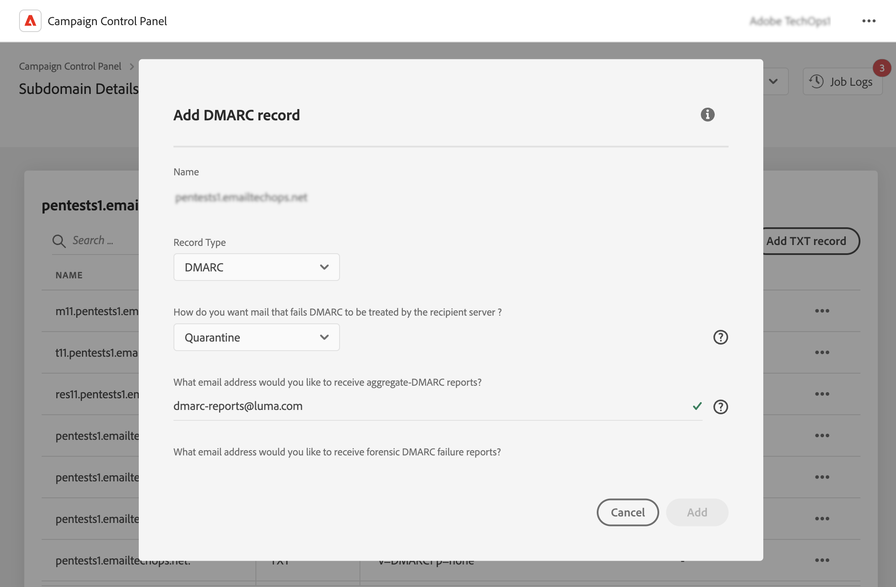

# Lägga till DMARC-poster {#dmarc}

## Om DMARC-poster {#about}

Domänbaserad Message Authentication, Reporting and Conformance (DMARC) är en protokollstandard för e-postautentisering som hjälper organisationer att skydda sina e-postdomäner från nätfiskeattacker och bedrägeri. Detta gör att du kan bestämma hur en e-postleverantör ska hantera e-postmeddelanden som inte godkänns vid SPF- och DKIM-kontroller, vilket ger ett sätt att autentisera avsändarens domän och förhindra obehörig användning av domänen i skadliga syften.

Detaljerad information om DMARC-implementering finns i [Användarhandbok om bästa levererbarhetspraxis i Adobe](https://experienceleague.adobe.com/docs/deliverability-learn/deliverability-best-practice-guide/additional-resources/technotes/implement-dmarc.html?lang=sv)

## Begränsningar och förhandskrav {#limitations}

* SPF- och DKIM-poster är nödvändiga för att skapa en DMARC-post.
* DMARC-poster kan bara läggas till för underdomäner med fullständig underdomändelegering. [Läs mer om konfigurationsmetoder för underdomäner](subdomains-branding.md#subdomain-delegation-methods)
* Om det finns både DMARC- och BIMI-poster för en underdomän:
   * DMARC-poster kan inte tas bort. Om du vill ta bort en DMARC-post tar du bort BIMI-posten först.
   * DMARC-poster kan redigeras, men nedgradering av DMARC-principen till &quot;Ingen&quot; är inte tillåtet och procentvärdet måste anges till &quot;100&quot;.

## Lägg till en DMARC-post för en underdomän {#add}

Följ de här stegen för att lägga till en DMARC-post för en underdomän:

1. Klicka på ellipsknappen bredvid önskad underdomän i listan över underdomäner och välj **[!UICONTROL Subdomain details]**.

1. Klicka på knappen **[!UICONTROL Add TXT record]** och välj sedan **[!UICONTROL DMARC]** från rullgardinsmenyn **[!UICONTROL Record Type]**.

   

1. Välj **[!UICONTROL Policy Type]** som mottagarservern bör följa när ett av dina e-postmeddelanden inte skickas. Tillgängliga principtyper är:

   * **[!UICONTROL None]**,
   * **[!UICONTROL Quarantine]** (placering av skräppostmapp),
   * **[!UICONTROL Reject]** (blockera e-postmeddelandet).

   Som bästa praxis rekommenderas att långsamt införa DMARC-implementering genom att eskalera din DMARC-princip från p=none till p=quarantine, till p=reject när du får DMARC-förståelse för DMARC:s potentiella påverkan.

   * **Steg 1:** analysera den feedback du får och använd (p=none), som instruerar mottagaren att inte utföra några åtgärder mot meddelanden som inte kan autentiseras, men ändå skicka e-postrapporter till avsändaren. Granska och åtgärda även problem med SPF/DKIM om giltiga meddelanden inte kan autentiseras.

   * **Steg 2:** kontrollera om SPF och DKIM är justerade och skickar autentisering för alla giltiga e-postmeddelanden, och flytta sedan principen till (p=quarantine), vilket anger att den mottagande e-postservern ska placera e-postmeddelanden som inte kan autentiseras i karantän (detta innebär vanligtvis att meddelandena placeras i skräppostmappen). Om principen är inställd på att sätta det i karantän rekommenderar vi att du börjar med en liten andel av dina e-postmeddelanden.

   * **Steg 3:** justera princip till (p=reject). Obs! Använd den här principen med försiktighet och kontrollera om den passar din organisation. Principen p=reject om att avvisa innebär att mottagaren helt nekar (studsar) alla e-postmeddelanden för domänen som inte kan autentiseras. När den här principen är aktiverad är det bara e-postmeddelanden som verifieras som 100 % autentiserade av din domän som har en chans att skickas till Inkorgen.

   >[!NOTE]
   >
   > Det går inte att skapa BIMI-poster med principtypen Ingen för DMARC-post.

1. Fyll i de e-postadresser som ska ta emot DMARC-posterna. Du kan lägga till flera e-postadresser, avgränsade med kommatecken. När ett av dina e-postmeddelanden misslyckas skickas DMARC-poster automatiskt till den e-postadress du väljer:

   * DMARC-aggregatrapporter ger information på högnivå, t.ex. antalet e-postmeddelanden som misslyckades under en viss period.
   * Forensiska DMARC-felrapporter ger detaljerad information, till exempel vilken IP-adress som det misslyckade e-postmeddelandet kommer från.

1. Om DMARC-principen är inställd på Ingen anger du ett procentvärde som gäller för 100 % av e-postmeddelandena.

   Om profilen är inställd på Avvisa eller Karantän rekommenderar vi att du börjar med en liten andel av dina e-postmeddelanden. I takt med att fler e-postmeddelanden från domänen autentiseras med mottagande servrar kan du uppdatera posten långsamt med en högre procentandel.

   >[!NOTE]
   >
   >Om din domän använder BIMI måste din DMARC-princip ha ett procentvärde på 100 %. BIMI stöder inte DMARC-principer där värdet är mindre än 100 %.

   

1. DMARC-rapporter skickas var 24:e timme. Du kan ändra rapportens sändningsfrekvens i fältet **[!UICONTROL Reporting Interval]**. Minsta tillåtna intervall är en timme, medan högsta tillåtna värde är 2 190 timmar (dvs. tre månader).

1. I fälten **SPF** och **[!UICONTROL DKIM Identifier Alignment]** ska du ange hur strikt mottagarservrarna ska vara när du kontrollerar SPF- och DKIM-autentiseringar för ett e-postmeddelande.

   * **[!UICONTROL Relaxed]**-läge: servern accepterar autentisering även om e-postmeddelandet skickas från en underdomän,
   * **[!UICONTROL Strict]**-läget accepterar autentisering endast när avsändardomänen matchar exakt med en SPF- och DKIM-domän.

   Säg att vi jobbar med domänen `http://www.luma.com`. I läget Avslappnat autentiseras e-postmeddelanden som kommer från underdomänen `marketing.luma.com` av servern, medan de avvisas i läget Strikt.

1. Klicka på **[!UICONTROL Add]** för att bekräfta att du vill skapa DMARC-posten.

När skapandet av DMARC-posten har bearbetats (ungefär 5 minuter) visas den på informationsskärmen i underdomänerna. [Läs mer om att övervaka TXT-poster för dina underdomäner](gs-txt-records.md#monitor)
