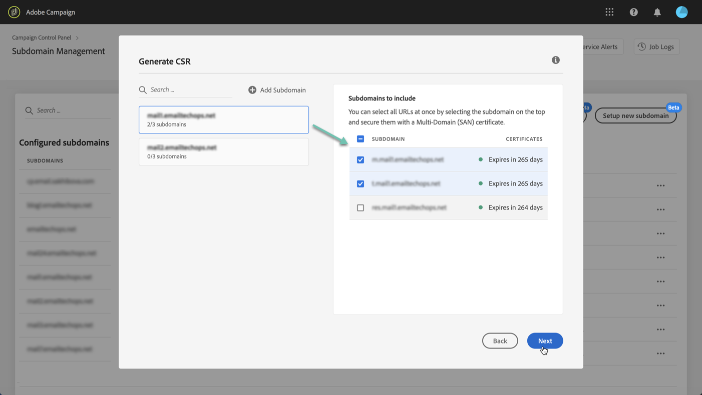

# Generera en CSR {#generating-csr}

>[!CONTEXTUALHELP]
>id="cp_generate_csr"
>title="CSR-generering"
>abstract="Begäran om certifikatsignering måste genereras för den instans och de underdomäner som du planerar att skydda innan du köper ett certifikat."

>[!CONTEXTUALHELP]
>id="cp_select_subdomains"
>title="Välj underdomänerna för din begäran om certifikatsignering"
>abstract="Du kan välja att inkludera alla eller endast vissa underdomäner i din begäran om certifikatsignering. Endast valda underdomäner certifieras via inköpt SSL-certifikat."
>additional-url="https://experienceleague.adobe.com/docs/control-panel/using/subdomains-and-certificates/subdomains-branding.html?lang=sv" text="Om att märka underdomäner"

## Generera CSR {#generate}

Följ dessa steg för att skapa en begäran om certifikatsignering:

1. Markera den önskade instansen på **[!UICONTROL Subdomains & Certificates]**-kortet och klicka sedan på knappen **[!UICONTROL Manage Certificate]**.

   

1. Välj **[!UICONTROL 1 - Generate a CSR]** och klicka sedan på **[!UICONTROL Next]** för att starta guiden som leder dig genom genereringsprocessen till din begäran om certifikatsignering.

   

1. Ett formulär visas med all information som krävs för att generera din begäran om certifikatsignering.

   Se till att du fyller i den begärda informationen på ett fullständigt och korrekt sätt. I annat fall kanske inte certifikatet förnyas (kontakta vid behov ditt interna team samt säkerhets- och IT-team). Klicka sedan på **[!UICONTROL Next]**.

   * **[!UICONTROL Organization]**: officiellt organisationsnamn.
   * **[!UICONTROL Organization Unit]**: enhet som är länkad till underdomänen (exempel: marknadsföring och IT).
   * **[!UICONTROL Instance]** (förfylld): URL till Campaign-instansen som är associerad med underdomänen.
   * **[!UICONTROL Common name]**: Om det vanliga namnet är markerat som standard kan du välja en av underdomänerna om det behövs.

   

1. Välj underdomäner som ska ingå i din begäran om certifikatsignering och klicka sedan på **[!UICONTROL OK]**.

   

1. De valda underdomänerna visas i listan. För var och en av dem ska du välja de underdomäner som ska inkluderas och sedan klicka på **[!UICONTROL Next]**.

   

1. En sammanfattning av de underdomäner som ska inkluderas i din begäran om certifikatsignering visas. Klicka på **[!UICONTROL Submit]** för att bekräfta din begäran.

   

   >[!NOTE]
   >
   >The **[!UICONTROL Copy CSR content]** Med kan du kopiera all information som rör CSR (Org ID, instans, organisationsnamn, eget namn, inkluderade underdomäner osv.)

1. Filen med filnamnstillägget .csr som motsvarar ditt val genereras och hämtas automatiskt. Du kan nu använda den för att köpa SSL-certifikatet från den certifikatutfärdare som ditt företag har godkänt. Om du behöver ladda ned CSR igen följer du stegen som beskrivs i [det här avsnittet](#download).

När CSR har skapats och laddats ned kan du använda den för att köpa ett SSL-certifikat från en certifikatutfärdare som har godkänts av organisationen.

När SSL-certifikatet har köpts kan du installera det på din instans för att skydda din underdomän. [Läs mer](install-ssl-certificate.md)

## Hämta CSR {#download}

För att kunna köpa ett SSL-certifikat måste du först hämta certifikatsigneringsbegäran. CSR hämtas automatiskt när den har skapats. Du kan också ladda ned den igen när som helst från jobbloggarna:

1. I **[!UICONTROL Job Logs]** väljer du **[!UICONTROL Finished]** filtrera sedan listan för att visa jobb som är relaterade till hantering av underdomäner.

   

1. Öppna jobbet som motsvarar CSR-genereringen och klicka sedan på **[!UICONTROL Downbload]** för att hämta csr-filen.

   
