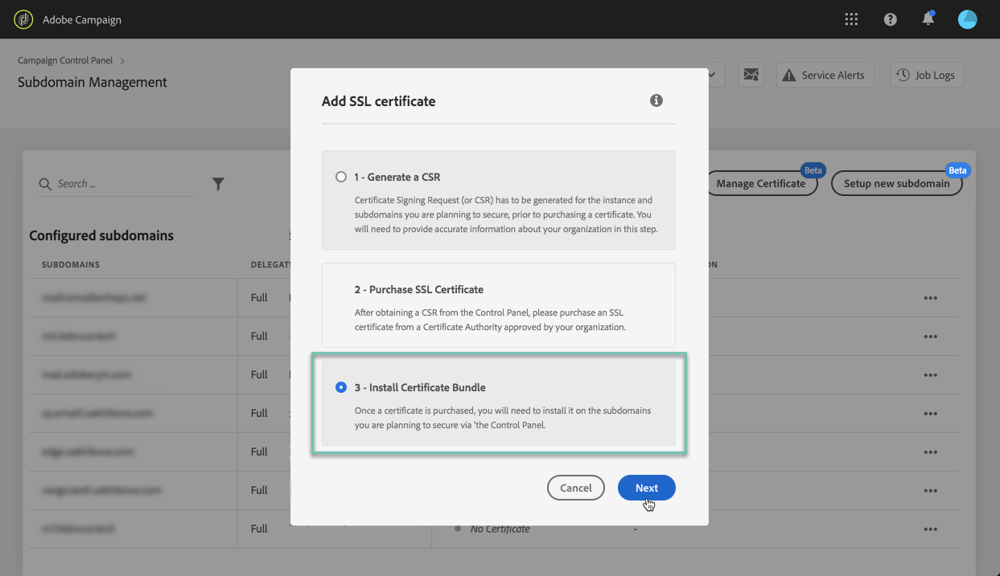

# Installera SSL-certifikatet {#installing-ssl-certificate}

>[!CONTEXTUALHELP]
>id="cp_install_ssl_certificate"
>title="Installation av SSL-certifikat"
>abstract="Installera SSL-certifikatet som du har köpt från den certifikatutfärdare som har godkänts av din organisation."
>additional-url="https://experienceleague.adobe.com/docs/control-panel/using/subdomains-and-certificates/subdomains-branding.html?lang=sv" text="Om att märka underdomäner"

När ett SSL-certifikat har köpts kan du installera det på din instans. Innan du fortsätter ska du se till att du är medveten om förutsättningarna nedan:

* Din begäran om certifikatsignering måste ha genererats från Kontrollpanelen. I annat fall kan du inte installera certifikatet från Kontrollpanelen.
* CSR (Certificate Signing Request) ska matcha den underdomän som har konfigurerats för att fungera med Adobe. Den kan till exempel inte innehålla fler underdomäner än den som har konfigurerats.
* Certifikatet ska ha dagens datum. Det går inte att installera certifikat med datum i framtiden och de får inte ha förfallit (dvs. giltiga start- och slutdatum).
* Certifikatet måste utfärdas av en betrodd certifikatutfärdare (CA) såsom Comodo, DigiCert eller GoDaddy osv.
* Certifikatets storlek ska vara 2 048 bitar och algoritmen RSA.
* Certifikatet ska vara i formatet X.509 PEM.
* SAN-certifikat stöds.
* Wildcard-certifikat stöds inte.
* ZIP-filen eller certifikatet får inte vara lösenordsskyddade.
* ZIP-filen ska endast innehålla följande och helst i enskilda filer:
   * Slutenhetscertifikat.
   * Mellanliggande certifikatkedja (i rätt ordning).
   * Rotcertifikat (valfritt).

Följ dessa steg för att installera certifikatet:

1. Markera den önskade instansen på **[!UICONTROL Subdomains & Certificates]**-kortet och klicka sedan på knappen **[!UICONTROL Manage Certificate]**.

   

1. Välj **[!UICONTROL 3 - Install Certificate Bundle]** och klicka sedan på **[!UICONTROL Next]** för att starta guiden som leder dig genom certifikatets installationsprocess.

   

1. Välj .zip-filen som innehåller det certifikat som ska installeras och klicka sedan på **[!UICONTROL Submit]**.

   

>[!NOTE]
>
>Certifikatet installeras på alla domäner/underdomäner som ingår i din begäran om certifikatsignering. Eventuella ytterligare domäner/underdomäner i certifikatet beaktas inte.

När SSL-certifikatet har installerats uppdateras certifikatets giltighetsdatum och statusikon i enlighet med detta.
