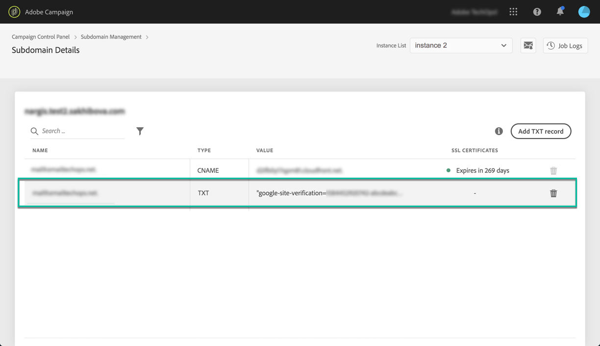

# Hantera TXT-poster {#managing-txt-records}

>[!CONTEXTUALHELP]
>id="cp_siteverification_add"
>title="Hantera TXT-poster"
>abstract="Vissa tjänster såsom Google kräver att du lägger till en TXT-post i domäninställningarna för att verifiera att du äger domänen."

## Om TXT-poster {#about-txt-records}

TXT-poster är en typ av DNS-poster som används för att tillhandahålla textinformation om en domän som kan läsas av externa källor.

För att säkerställa ett stort antal verkliga e-postmeddelanden och ett lågt antal skräppostmeddelanden kräver vissa tjänster såsom Google att du lägger till en TXT-post i domäninställningarna för att verifiera att du faktiskt äger domänen.

Gmail är för närvarande en av de populäraste e-postadressleverantörerna. För att säkerställa en god levererbarhet och framgångsrik leverans av e-post till Gmail-adresser kan du med Adobe Campaign lägga till särskilda TXT-poster för Googles webbplatsverifiering i underdomänerna för att säkerställa att de verifieras.

 Upptäck den här funktionen i video med  [Campaign ](https://experienceleague.adobe.com/docs/campaign-classic-learn/control-panel/subdomains-and-certificates/google-txt-record-management.html?lang=en#subdomains-and-certificates) Classic  [Campaign Standard](https://experienceleague.adobe.com/docs/campaign-standard-learn/control-panel/subdomains-and-certificates/google-txt-record-management.html?lang=en#subdomains-and-certificates)

## Lägga till en Google TXT-post i en underdomän {#adding-a-google-txt-record}

Följ dessa steg för att lägga till en Google TXT-post i en underdomän som används för att skicka e-post via Gmail-adresser:

1. Navigera till **[!UICONTROL Subdomain and Certificates]**-kortet.

1. Välj instansen och öppna sedan informationen om den underdomän du vill lägga till en DNS-post i.

   

1. Klicka på knappen **[!UICONTROL Add TXT record]** och ange sedan det värde som genererades i G Suites administratörsverktyg. Se [hjälp för G Suite-administratörer](https://support.google.com/a/answer/183895) för mer information om detta.

   

1. Bekräfta genom att klicka på knappen **[!UICONTROL Add]**.

   

När TXT-posten har lagts till måste den verifieras av Google. Navigera till G Suites administratörsverktyg och starta sedan verifieringssteget för att utföra verifieringen (se [hjälp för G Suite-administratörer](https://support.google.com/a/answer/183895)).

För att ta bort en post markerar du den i postlistan och klickar sedan på knappen Ta bort.

>[!NOTE]
>
>Den enda post du kan ta bort från listan över DNS-poster är den som du tidigare har lagt till (i vårt fall Google TXT-posten).
