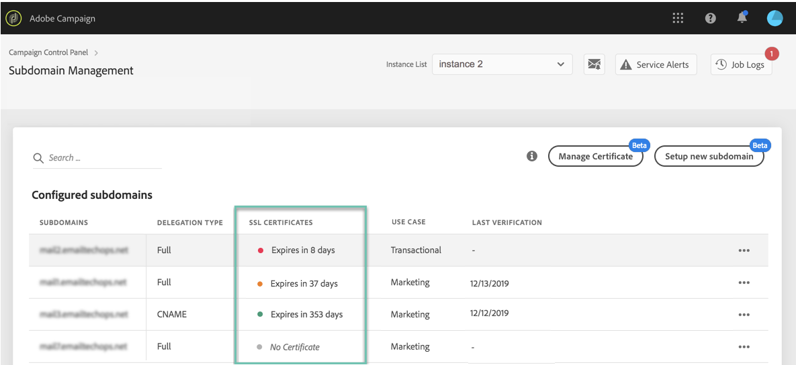

# Övervaka underdomäners SSL-certifikat {#monitoring-ssl-certificates}

## Om SSL-certifikat {#about-ssl-certificates}

Adobe Campaign rekommenderar att ni skyddar de underdomäner som är värd för era landningssidor, särskilt de som samlar in känslig information om era kunder.

**SSL-kryptering** (Secure Socket Layer) säkerställer att de underdomäner som du har delegerat till Adobe är säkra. När kunden fyller i ett webbformulär eller besöker en landningssida som Adobe Campaign är värd för, skickas informationen som standard via ett osäkert protokoll (HTTP). För att säkerställa ytterligare säkerhet måste du skydda skickad information med ett HTTPS-protokoll. Din &quot;http://info.mywebsite.com/&quot;-underdomänadress kommer nu att vara &quot;https://info.mywebsite.com/&quot;.

**SSL-certifikat installeras inte på de delegerade underdomänerna själva**. De installeras på associerade underdomäner, främst de som är värdar för landningssidor, resurssidor och andra.

**SSL-certifikat tillhandahålls för en viss tidsperiod** (1 år, 60 dagar osv.). När ett certifikat upphör att gälla kan du få problem med att komma åt landningssidorna eller använda resurser från underdomänen. För att förhindra detta kan du på Kontrollpanelen övervaka dina underdomäners SSL-certifikat samt starta förnyelseprocessen.

## Övervaka SSL-certifikat {#monitoring-certificates}

>[!CONTEXTUALHELP]
>id="cp_subdomain_details"
>title="Information om underdomän"
>abstract="Hämta information om dina underdomäner."

Statusen för dina underdomäners SSL-certifikat är tillgänglig direkt från listan över underdomäner när du väljer **[!UICONTROL Subdomains & Certificates]** kort.

Underdomäner ordnas efter det närmaste förfallodatumet för SSL-certifikatet, med visuell information om förfallodatumet, i dagar:

* **Grön**: underdomänen inte har något certifikat som upphör att gälla inom de närmaste 60 dagarna.
* **Orange**: en eller flera underdomäner har ett certifikat som upphör att gälla inom 60 dagar.
* **Röd**: en eller flera underdomäner har ett certifikat som upphör att gälla inom 30 dagar.
* **Grå**: inget certifikat har installerats för underdomänen.

To get more details on a subdomain, click the **[!UICONTROL Subdomain Details]** button.
Listan över alla relaterade underdomäner visas. Det omfattar vanligtvis underdomäner till landningssidor, resurssidor osv.

Fliken innehåller information om de konfigurerade inkorgarna (Avsändare, Svara till, E-post för fel). **[!UICONTROL Sender info]**

Om en av din underdomäns SSL-certifikat snart går ut kan du förnya det direkt från Kontrollpanelen. Mer information finns i följande avsnitt: [Förnya en underdomäns SSL-certifikat](../../subdomains-certificates/using/renewing-subdomain-certificate.md).

>[!IMPORTANT]
>
>Certifikatförnyelse från Kontrollpanelen kan fås som betaversion och kan ändras ofta utan föregående meddelande.

**Relaterade ämnen:**

* [Lägga till SSL-certifikat (självstudievideo)](https://docs.adobe.com/content/help/en/campaign-learn/campaign-standard-tutorials/administrating/control-panel/adding-ssl-certificates.html)
* [Förnya en underdomäns SSL-certifikat](../../subdomains-certificates/using/renewing-subdomain-certificate.md)
* [Märke för underdomäner](../../subdomains-certificates/using/subdomains-branding.md)
