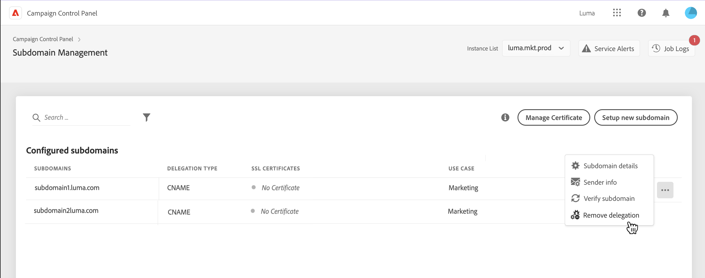
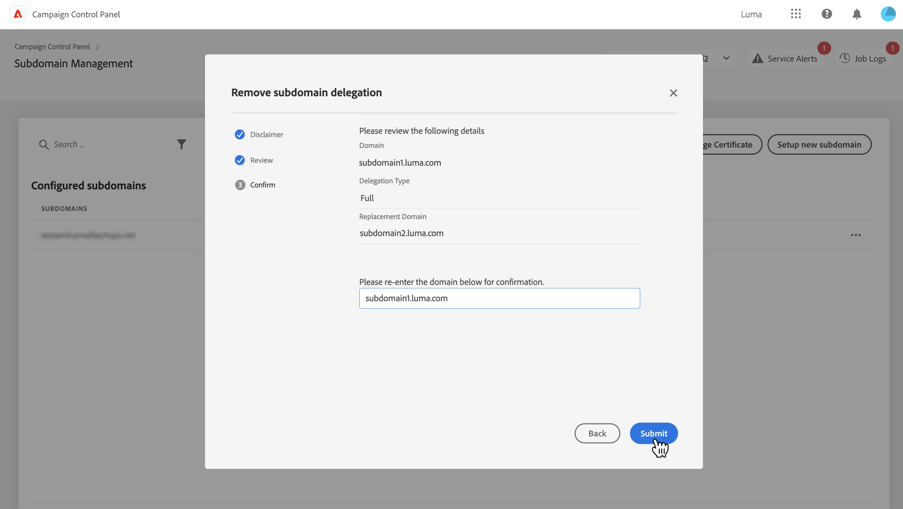
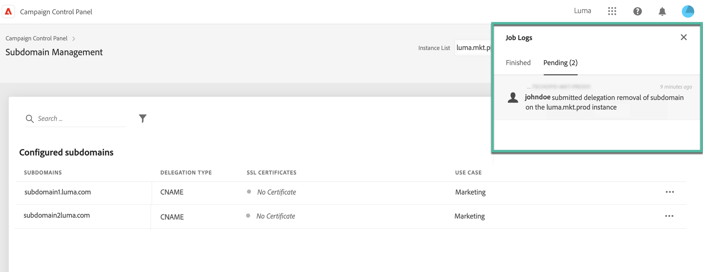

# Ta bort delegering av underdomäner till Adobe {#remove-delegated--subdomains}

>[!CONTEXTUALHELP]
>id="cp_subdomain_undelegate"
>title="Ta bort delegering av underdomäner"
>abstract="På den här skärmen kan du ta bort delegeringen av en underdomän till Adobe. Tänk på att den här processen inte kan ångras och att den är oåterkallelig tills körningen är slutförd.  Om du försöker ta bort delegeringen av en primär domän för den valda instansen blir du ombedd att välja den domän som ska ersätta den."

Med kontrollpanelen kan du ta bort delegeringen av en underdomän som har delegerats till Adobe.

>[!NOTE]
>
>Delegeringsborttagning är för närvarande inte tillgängligt för underdomäner som har konfigurerats med CNAME.

## Viktiga anteckningar {#important}

Innan du fortsätter bör du noggrant överväga vilka konsekvenser som uppstår när borttagningsprocessen har startats:

* När processen har startats går det inte att ångra borttagningen av underdomäner och den är oåterkallelig tills processen har slutförts.
* Ingen annan delegering av underdomäner kan tas bort när en liknande process pågår i en annan underdomän.
* En delegering som tagits bort från en underdomän kan inte delegeras på nytt förrän tre dagar efter borttagningen.

## Ta bort en delegering av underdomäner {#steps}

Följ de här stegen för att ta bort delegeringen av en underdomän till Adobe:

1. Klicka på ellipsknappen bredvid den domändelegering som du vill ta bort och klicka sedan på **[!UICONTROL Remove delegated subdomain]**.

   

1. Granska ansvarsfriskrivningen och bekräfta borttagningen av domändelegeringen till Adobe.

1. Granska information om instansen som underdomänen är kopplad till, inklusive relaterade IP-tillhörigheter och varumärkeskonfigurationer.

   Om du tar bort delegeringen av den primära domänen för den valda instansen måste du välja den domän som ska ersätta den med listan **[!UICONTROL Replacement Domain]**.

   Klicka på **[!UICONTROL Next]** för att fortsätta med borttagningen.

   

1. Granska sammanfattningen som visas. Bekräfta borttagningen genom att ange URL:en för den domän som du vill ta bort delegeringen för och klicka på **[!UICONTROL Submit]**.

   

När delegeringsborttagningen har startats visas det väntande jobbet i jobbloggarna tills det är klart.

## Felkoder {#FAQ}

I det här avsnittet visas felmeddelanden som du kan stöta på när du försöker ta bort delegeringen av en underdomän:

| Felkod | Meddelande | Beskrivning |
|  ---  |  ---  |  ---  |
| 8002 | Begärd delegerad domänborttagning kan inte åtgärdas eftersom en liknande överlappande begäran pågår. Försök igen efter tre dagar | Ett borttagningsjobb för underdomändelegering pågår redan för den valda instansen. Vänta i tre dagar innan du startar ett nytt borttagningsjobb. |
| 8003 | Begärd delegerad domänborttagning stöds inte för den här instansen. | Delegeringsborttagning stöds inte för den valda underdomänen på grund av ett tekniskt problem. Kontakta kundtjänst. |
| 8004 | Begärd delegerad domänborttagning tillåts inte eftersom det bara finns en domän i den här instansen. | Endast en underdomän har delegerats för den valda instansen. Delegeringsborttagning tillåts inte. |
| 8005 | Begärd delegerad domänborttagning stöds inte för den här konfigurationen. | Delegeringsborttagning stöds inte för den valda underdomänen på grund av ett tekniskt problem. Kontakta kundtjänst. |
| 8006 | Begärd delegerad domänborttagning tillåts inte på grund av okända orsaker. Kontakta kundtjänst. | Delegeringsborttagning stöds inte för den valda instansen på grund av okända problem. Kontakta kundtjänst. |
