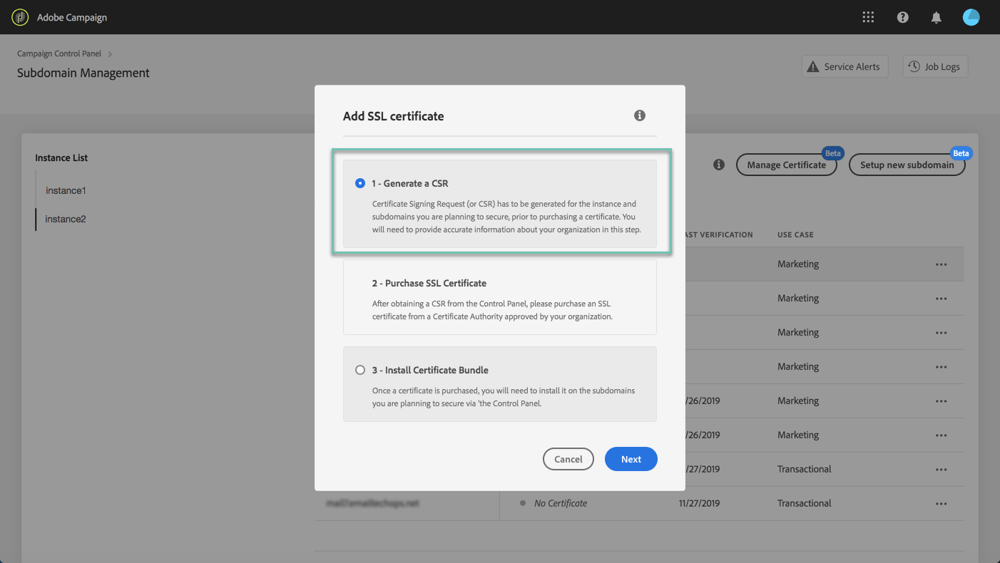
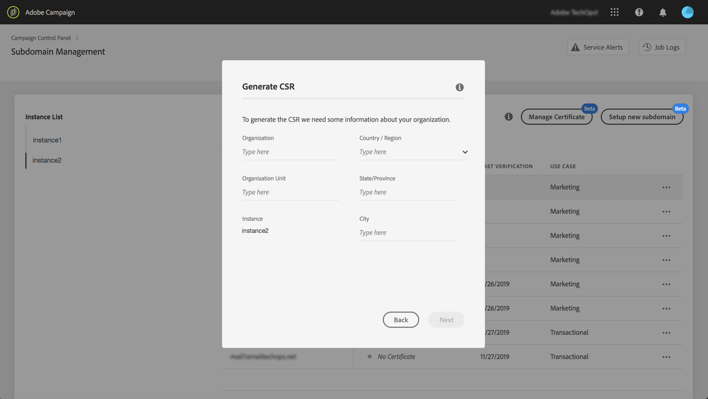
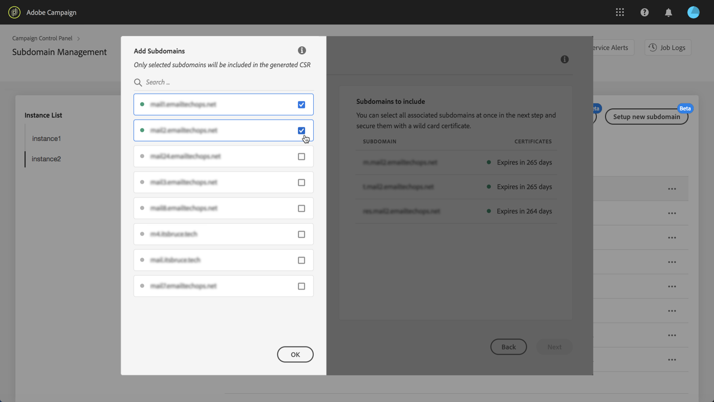
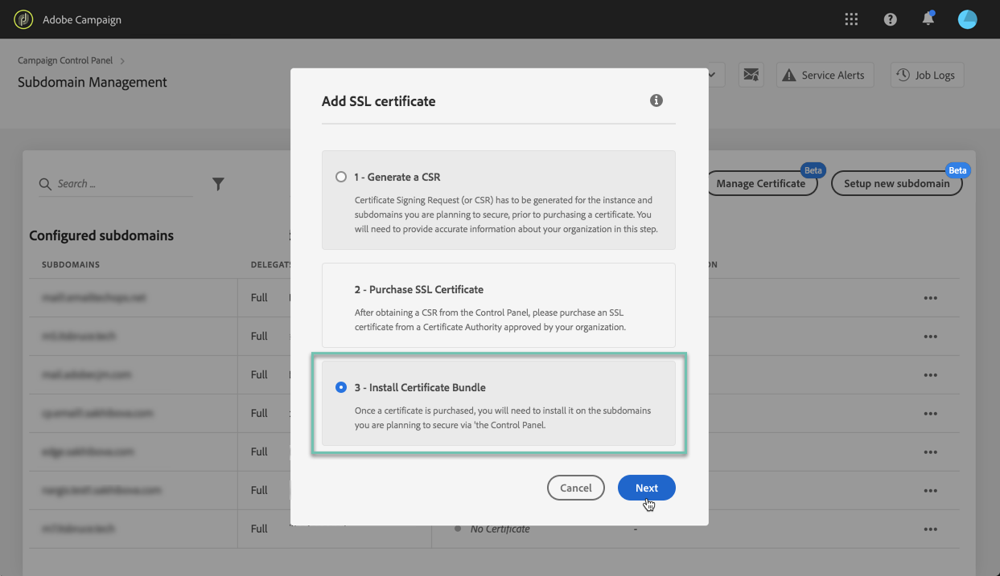
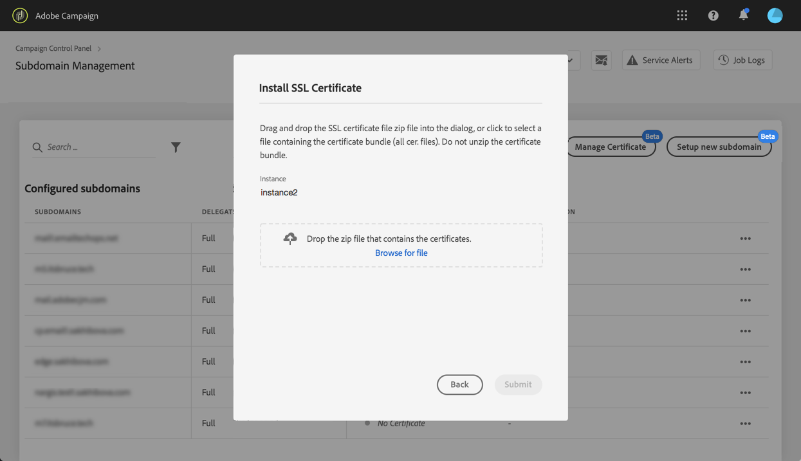

# Förnya en underdomäns SSL-certifikat {#renewing-subdomains-ssl-certificates}

>[!CONTEXTUALHELP]
>id="cp_add_ssl_certificate"
>title="Lägga till ett SSL-certifikat"
>abstract="För att lägga till ett SSL-certifikat måste du generera en begäran om certifikatsignering (CSR), köpa SSL-certifikatet för underdomänerna och installera certifikatpaketet."
>additional-url="https://docs.adobe.com/content/help/sv-SE/control-panel/using/subdomains-and-certificates/renewing-subdomain-certificate.html#generating-csr" text="Generera en begäran om certifikatsignering"
>additional-url="https://docs.adobe.com/content/help/sv-SE/control-panel/using/subdomains-and-certificates/renewing-subdomain-certificate.html#installing-ssl-certificate" text="Så installerar du ett SSL-certifikat"

## Om certifikatförnyelse {#about-certificate-renewal-process}

>[!IMPORTANT]
>
>Att konfigurera underdomäner i Kontrollpanelen finns tillgängligt som en betaversion och kan ofta uppdateras och ändras utan föregående meddelande.
>
>Den här funktionen är inte tillgänglig för Campaign v8.

Processen gällande förnyelse av SSL-certifikat omfattar tre steg:

1. **Generera en begäran om certifikatsignering**
Adobes kundtjänst genererar en begäran om certifikatsignering åt dig. Du måste ange viss information som krävs för att generera en Begäran om certifikatsignering (såsom ett nätverksnamn, organisationsnamn och adress etc.).
1. **Köpa SSL-certifikatet**
När en begäran om certifikatsignering har skapats kan du hämta och använda den för att köpa SSL-certifikatet från den certifikatutfärdare som ditt företag godkänner.
1. **Installera SSL-certifikatet**
När du har köpt SSL-certifikatet kan du installera det på önskad underdomän.

 Upptäck den här funktionen via video med [Campaign Classic](https://experienceleague.adobe.com/docs/campaign-classic-learn/control-panel/subdomains-and-certificates/adding-ssl-certificates.html?lang=en#subdomains-and-certificates) eller [Campaign Standard](https://experienceleague.adobe.com/docs/campaign-standard-learn/control-panel/subdomains-and-certificates/adding-ssl-certificates.html?lang=en#adding-ssl-certificates)

## Generera en begäran om certifikatsignering {#generating-csr}

>[!CONTEXTUALHELP]
>id="cp_generate_csr"
>title="Generera en begäran om certifikatsignering"
>abstract="Begäran om certifikatsignering måste genereras för den instans och de underdomäner som du planerar att skydda innan du köper ett certifikat."

>[!CONTEXTUALHELP]
>id="cp_select_subdomains"
>title="Välj underdomänerna för din begäran om certifikatsignering"
>abstract="Du kan välja att inkludera alla eller endast vissa underdomäner i din begäran om certifikatsignering. Endast valda underdomäner certifieras via inköpt SSL-certifikat."
>additional-url="https://docs.adobe.com/content/help/en/control-panel/using/subdomains-and-certificates/renewing-subdomain-certificate.html#generating-csr" text="Generera en begäran om certifikatsignering"
>additional-url="https://docs.adobe.com/content/help/sv-SE/control-panel/using/subdomains-and-certificates/subdomains-branding.html" text="Om att märka underdomäner"

Följ dessa steg för att skapa en begäran om certifikatsignering:

1. Markera den önskade instansen på **[!UICONTROL Subdomains & Certificates]**-kortet och klicka sedan på knappen **[!UICONTROL Manage Certificate]**.

   

1. Välj **[!UICONTROL 1 - Generate a CSR]** och klicka sedan på **[!UICONTROL Next]** för att starta guiden som leder dig genom genereringsprocessen till din begäran om certifikatsignering.

   

1. Ett formulär visas med all information som krävs för att generera din begäran om certifikatsignering.

   Se till att du fyller i den begärda informationen på ett fullständigt och korrekt sätt. I annat fall kanske inte certifikatet förnyas (kontakta vid behov ditt interna team samt säkerhets- och IT-team). Klicka sedan på **[!UICONTROL Next]**.

   * **[!UICONTROL Organization]**: officiellt organisationsnamn.
   * **[!UICONTROL Organization Unit]**: enhet som är länkad till underdomänen (exempel: marknadsföring och IT).
   * **[!UICONTROL Instance]** (förfylld): URL till Campaign-instansen som är associerad med underdomänen.

   

1. Välj underdomäner som ska ingå i din begäran om certifikatsignering och klicka sedan på **[!UICONTROL OK]**.

   

1. De valda underdomänerna visas i listan. För var och en av dem ska du välja de underdomäner som ska inkluderas och sedan klicka på **[!UICONTROL Next]**.

   

1. En sammanfattning av de underdomäner som ska inkluderas i din begäran om certifikatsignering visas. Klicka på **[!UICONTROL Submit]** för att bekräfta din begäran.

   

1. Filen med filnamnstillägget .csr som motsvarar ditt val genereras och hämtas automatiskt. Du kan nu använda den för att köpa SSL-certifikatet från den certifikatutfärdare som ditt företag har godkänt.

   >[!NOTE]
   >
   >Om din begäran om certifikatsignering inte sparas/hämtas går den förlorad och måste genereras igen.

## Köpa ett certifikat med din begäran om certifikatsignering {#purchasing-certificate}

När du har erhållit en begäran om certifikatsignering från Kontrollpanelen ska du köpa ett SSL-certifikat från en certifikatutfärdare som är godkänd av din organisation.

## Installera SSL-certifikatet {#installing-ssl-certificate}

>[!CONTEXTUALHELP]
>id="cp_install_ssl_certificate"
>title="Installera SSL-certifikat"
>abstract="Installera SSL-certifikatet som du har köpt från den certifikatutfärdare som har godkänts av din organisation."
>additional-url="https://docs.adobe.com/content/help/en/control-panel/using/subdomains-and-certificates/subdomains-branding.html" text="Om att märka underdomäner"

När ett SSL-certifikat har köpts kan du installera det på din instans. Innan du fortsätter ska du se till att du är medveten om förutsättningarna nedan:

* Din begäran om certifikatsignering måste ha genererats från Kontrollpanelen. I annat fall kan du inte installera certifikatet från Kontrollpanelen.
* CSR (Certificate Signing Request) ska matcha den underdomän som har konfigurerats för att fungera med Adobe. Den kan till exempel inte innehålla fler underdomäner än den som har konfigurerats.
* Certifikatet ska ha dagens datum. Det går inte att installera certifikat med datum i framtiden och de får inte ha förfallit (dvs. giltiga start- och slutdatum).
* Certifikatet måste utfärdas av en betrodd certifikatutfärdare (CA) såsom Comodo, DigiCert eller GoDaddy osv.
* Certifikatets storlek ska vara 2 048 bitar och algoritmen RSA.
* Certifikatet ska vara i formatet X.509 PEM.
* SAN-certifikat stöds.
* Wildcard-certifikat stöds inte.
* ZIP-filen eller certifikatet får inte vara lösenordsskyddade.
* ZIP-filen ska endast innehålla följande och helst i enskilda filer:
   * Slutenhetscertifikat.
   * Mellanliggande certifikatkedja (i rätt ordning).
   * Rotcertifikat (valfritt).

Följ dessa steg för att installera certifikatet:

1. Markera den önskade instansen på **[!UICONTROL Subdomains & Certificates]**-kortet och klicka sedan på knappen **[!UICONTROL Manage Certificate]**.

   

1. Välj **[!UICONTROL 3 - Install Certificate Bundle]** och klicka sedan på **[!UICONTROL Next]** för att starta guiden som leder dig genom certifikatets installationsprocess.

   

1. Välj .zip-filen som innehåller det certifikat som ska installeras och klicka sedan på **[!UICONTROL Submit]**.

   

>[!NOTE]
>
>Certifikatet installeras på alla domäner/underdomäner som ingår i din begäran om certifikatsignering. Eventuella ytterligare domäner/underdomäner i certifikatet beaktas inte.

När SSL-certifikatet har installerats uppdateras certifikatets giltighetsdatum och statusikon i enlighet med detta.

**Relaterade ämnen:**

* [Märka underdomäner](../../subdomains-certificates/using/subdomains-branding.md)
* [Övervaka underdomänerna](../../subdomains-certificates/using/monitoring-subdomains.md)
