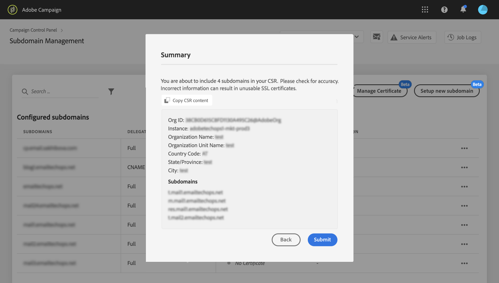

# Förnya en underdomäns SSL-certifikat {#renewing-subdomains-ssl-certificates}

>[!CONTEXTUALHELP]
>id="cp_add_ssl_certificate"
>title="Lägg till SSL-certifikat"
>abstract="Om du vill lägga till ett SSL-certifikat måste du generera en CSR, köpa SSL-certifikatet för dina underdomäner och installera certifikatpaketet."
>additional-url="https://docs.adobe.com/content/help/en/control-panel/using/subdomains-and-certificates/renewing-subdomain-certificate.html#generating-csr" text="Skapa en CSR-begäran (Certificate Signing Request)"
>additional-url="https://docs.adobe.com/content/help/en/control-panel/using/subdomains-and-certificates/renewing-subdomain-certificate.html#installing-ssl-certificate" text="Så här installerar du ett SSL-certifikat"

>[!IMPORTANT]
>
>Delegering av underdomäner från Kontrollpanelen är tillgänglig som betaversion och kan uppdateras ofta och ändras utan föregående meddelande.

## Om certifikatförnyelse {#about-certificate-renewal-process}

Processen för förnyelse av SSL-certifikat omfattar tre steg:

1. **Generering av CSR (Certificate Signing Request)** Adobes kundtjänst genererar en CSR åt dig. Du måste ange viss information som krävs för att generera CSR (till exempel Gemensamt namn, Organisationsnamn och adress).
1. **Köp av SSL-certifikatet** När CSR har skapats kan du hämta det och använda det för att köpa SSL-certifikatet från den certifikatutfärdare som ditt företag godkänner.
1. **Installation av SSL-certifikatet** När du har köpt SSL-certifikatet kan du installera det på önskad underdomän.

## Skapa en CSR-begäran (Certificate Signing Request) {#generating-csr}

>[!CONTEXTUALHELP]
>id="cp_generate_csr"
>title="Generera CSR"
>abstract="Begäran om certifikatsignering måste genereras för den instans och underdomäner som du planerar att skydda innan du köper ett certifikat."

>[!CONTEXTUALHELP]
>id="cp_select_subdomains"
>title="Välj underdomäner för din CSR"
>abstract="Du kan välja att inkludera alla eller endast vissa underdomäner i din begäran om certifikatsignering. Endast valda underdomäner certifieras via inköpt SSL-certifikat."
>additional-url="https://docs.adobe.com/content/help/en/control-panel/using/subdomains-and-certificates/renewing-subdomain-certificate.html#generating-csr" text="Skapa en CSR-begäran (Certificate Signing Request)"
>additional-url="https://docs.adobe.com/content/help/en/control-panel/using/subdomains-and-certificates/subdomains-branding.html" text="Om varumärken för underdomäner"

Så här skapar du en CSR-begäran (Certificate Signing Request):

1. Markera den önskade instansen på **[!UICONTROL Subdomains & Certificates]** kortet och klicka sedan på **[!UICONTROL Manage Certificate]** knappen.

   

1. Välj **[!UICONTROL 1 - Generate a CSR]** och klicka sedan på **[!UICONTROL Next]** för att starta guiden som leder dig genom CSR-genereringsprocessen.

   

1. Ett formulär visas med all information som krävs för att generera CSR.

   Se till att du fyller i den begärda informationen fullständigt och korrekt, annars kanske inte certifikatet förnyas (kontakta ditt interna team, säkerhets- och IT-team om det behövs) och klicka sedan på **[!UICONTROL Next]**.

   * **[!UICONTROL Organization]**: officiellt organisationsnamn.
   * **[!UICONTROL Organization Unit]**: Enhet som är länkad till underdomänen (exempel: Marknadsföring, IT).
   * **[!UICONTROL Instance]** (förfylld): URL för Campaign-instansen som är associerad med underdomänen.
   

1. Markera de underdomäner som ska ingå i CSR och klicka sedan på **[!UICONTROL OK]**.

   

1. De markerade underdomänerna visas i listan. För var och en av dem väljer du de underdomäner som ska inkluderas och klickar sedan på **[!UICONTROL Next]**.

   

1. En sammanfattning av de underdomäner som ska inkluderas i CSR-visningen. Klicka **[!UICONTROL Submit]** för att bekräfta din förfrågan.

   

1. CSV-filen som motsvarar ditt val genereras och hämtas automatiskt. Du kan nu använda det för att köpa SSL-certifikatet från den certifikatutfärdare som ditt företag godkänner.

   >[!NOTE]
   >
   >Om CSR inte sparas/hämtas går den förlorad och du måste generera den igen.

## Köpa ett certifikat med CSR {#purchasing-certificate}

När du har hämtat en CSR för CSR för certifikatsigneringsbegäran från Kontrollpanelen kan du köpa ett SSL-certifikat från en certifikatutfärdare som är godkänd av din organisation.

## Installera SSL-certifikatet {#installing-ssl-certificate}

>[!CONTEXTUALHELP]
>id="cp_install_ssl_certificate"
>title="Installera SSL-certifikat"
>abstract="Installera SSL-certifikatet som du har köpt från certifikatutfärdaren som har godkänts av din organisation."
>additional-url="https://docs.adobe.com/content/help/en/control-panel/using/subdomains-and-certificates/subdomains-branding.html" text="Om varumärken för underdomäner"

När ett SSL-certifikat har köpts kan du installera det på din instans. Innan du fortsätter bör du kontrollera att du är medveten om kraven nedan:

* CSR (Certificate Signing Request) måste ha genererats från kontrollpanelen. Annars kan du inte installera certifikatet från Kontrollpanelen.
* CSR (Certificate Signing Request) ska matcha den underdomän som har delegerats till Adobe. Den kan till exempel inte innehålla fler underdomäner än den som har delegerats.
* Certifikatet bör ha ett aktuellt datum. Det går inte att installera certifikat med datum i framtiden och de bör inte ha förfallit (dvs. giltiga start- och slutdatum).
* Certifikatet bör utfärdas av en betrodd certifikatutfärdare (CA) som Comodo, DigiCert, GoDaddy osv.
* Certifikatets storlek bör vara 2 048 bitar och algoritmen bör vara RSA.
* Certifikatet ska vara i formatet X.509 PEM.
* SAN-certifikat stöds.
* Jokertecken stöds inte.
* ZIP-filen eller certifikatet ska inte vara lösenordsskyddat.
* ZIP-filen bör endast innehålla följande i helst enskilda filer:
   * Slutenhetscertifikat.
   * Mellanliggande certifikatkedja (i rätt ordning).
   * Rotcertifikat (valfritt).

Så här installerar du certifikatet:

1. Markera den önskade instansen på **[!UICONTROL Subdomains & Certificates]** kortet och klicka sedan på **[!UICONTROL Manage Certificate]** knappen.

   

1. Välj **[!UICONTROL 3 - Install Certificate Bundle]** och klicka sedan på guiden **[!UICONTROL Next]** som hjälper dig genom certifikatinstallationen.

   

1. Välj den ZIP-fil som innehåller det certifikat som ska installeras och klicka sedan på **[!UICONTROL Submit]**.

   

>[!NOTE]
>
>Certifikatet installeras på alla domäner/underdomäner som ingår i CSR. Eventuella ytterligare domäner/underdomäner i certifikatet kommer inte att beaktas.

När SSL-certifikatet har installerats uppdateras certifikatets förfallodatum och statusikon i enlighet med detta.

**Relaterade ämnen:**

* [Lägga till SSL-certifikat (självstudievideo)](https://docs.adobe.com/content/help/en/campaign-learn/campaign-standard-tutorials/administrating/control-panel/adding-ssl-certificates.html)
* [Märke för underdomäner](../../subdomains-certificates/using/subdomains-branding.md)
* [Övervaka dina underdomäner](../../subdomains-certificates/using/monitoring-subdomains.md)