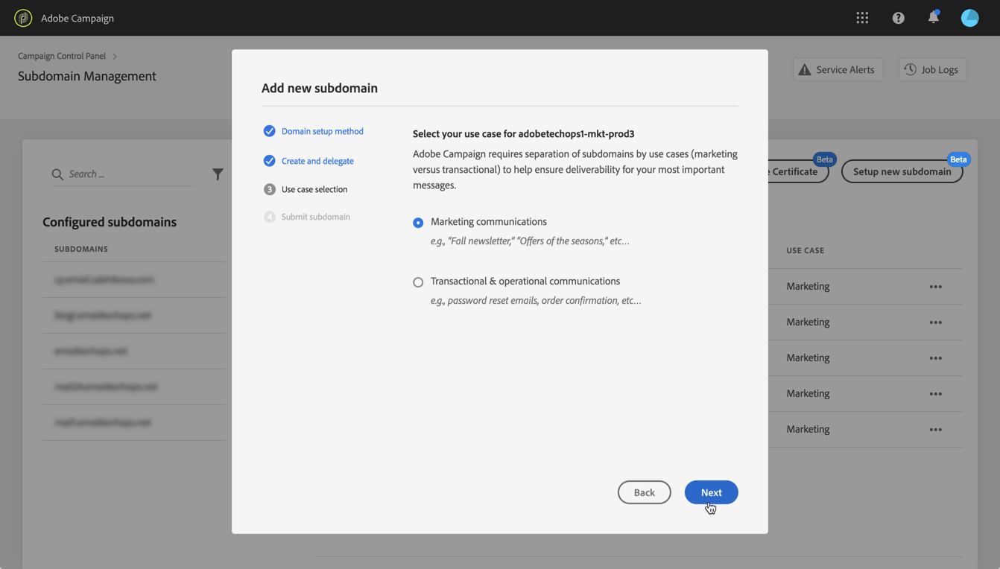
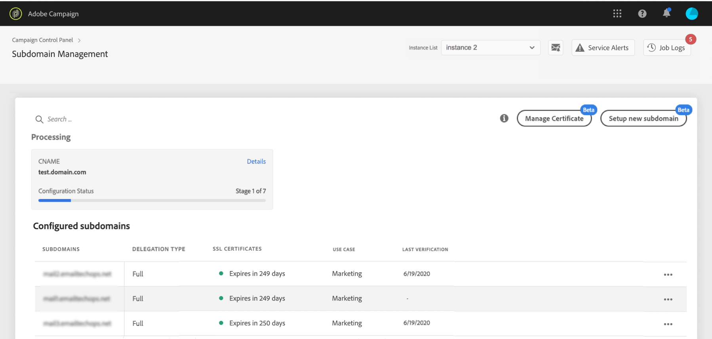

# Konfigurera en ny underdomän {#setting-up-subdomain}

>[!CONTEXTUALHELP]
>id="cp_subdomain_management"
>title="Konfigurera nya underdomäner och hantera certifikat"
>abstract="Du måste konfigurera en ny underdomän och hantera dina underdomäners SSL-certifikat för att kunna börja skicka e-post eller publicera landningssidor med Adobe Campaign."
>additional-url="https://docs.adobe.com/content/help/en/control-panel/using/subdomains-and-certificates/monitoring-ssl-certificates.html" text="Övervaka dina underdomäners SSL-certifikat"

>[!IMPORTANT]
>
>Delegering av underdomäner från Kontrollpanelen är tillgänglig som betaversion och kan uppdateras ofta och ändras utan föregående meddelande.

## Full underdomänsdelegering {#full-subdomain-delegation}

Med Kontrollpanelen kan du delegera en underdomän till Adobe Campaign helt och hållet. Gör så här:

>[!NOTE]
>
>Om den markerade instansen inte har några tidigare konfigurerade underdomäner kommer den första underdomänen som delegerats till Adobe att bli den **primära underdomänen** för den instansen, du kommer inte att kunna ändra den i framtiden.
>
>Omvända DNS-poster skapas för andra underdomäner med den primära underdomänen. Svars- och studsadresser för andra underdomäner genereras från den primära underdomänen.

1. Markera önskad produktionsinstans på **[!UICONTROL Subdomains & Certificates]** kortet och klicka sedan på **[!UICONTROL Setup new subdomain]**.

   

   >[!NOTE]
   >
   >Delegering via underdomän är endast tillgänglig för **produktionsinstanser** .

1. Klicka **[!UICONTROL Next]** för att bekräfta den fullständiga delegeringsmetoden.

   

   >[!NOTE]
   >
   >[CNAME](#use-cnames) och anpassade metoder stöds för närvarande inte av Kontrollpanelen.

1. Skapa önskad underdomän och önskade namnservrar i värdlösningen som används av organisationen. Det gör du genom att kopiera och klistra in den Adobe Nameserver-information som visas i guiden. Mer information om hur du skapar en underdomän i en värdlösning finns i [självstudievideon](https://video.tv.adobe.com/v/30175?captions=swe).

   >[!IMPORTANT]
   >
   >När du konfigurerar namnservrar ska du se till att du **aldrig delegerar din rotunderdomän till Adobe**. I annat fall kan domänen endast fungera med Adobe. All annan användning blir omöjlig, till exempel att skicka interna e-postmeddelanden till företagets anställda.
   >
   >Skapa **inte heller någon separat zonfil** för den nya underdomänen.

   

   När underdomänen har skapats med motsvarande Adobe-namnserverinformation klickar du på **[!UICONTROL Next]**.

1. Välj önskat användningsfall för underdomänen:

   * **Marknadsföringskommunikation**: Kommunikation som är avsedd för kommersiellt bruk. Exempel: e-postkampanj för försäljning.
   * **Transaktions- och verksamhetskommunikation**: Transaktionskommunikation innehåller information som syftar till att slutföra en process som mottagaren har startat med dig. Exempel: inköpsbekräftelse, e-post för lösenordsåterställning. Organisativ kommunikation rör utbyte av information, idéer och åsikter inom och utanför organisationen, utan kommersiellt syfte.
   

   **Att dela upp dina underdomäner efter användningsfall är det bästa sättet att leverera**. På så sätt isoleras och skyddas varje underdomän rykte. Om din underdomän för marknadsföringskommunikation till exempel blir svartlistad av Internet-tjänsteleverantörer påverkas inte din underdomän för transaktionskommunikation, utan den kan fortsätta att skicka kommunikation.

   **Du kan delegera en underdomän för både Marknadsföring och Transactional-användning**:

   * I marknadsföringsfall kommer underdomäner att konfigureras för **MID** -instanser (Mid sourcing).
   * För transaktionsanvändning kommer underdomäner att konfigureras på ALLA **RT** -instanser (Message Center/Real-time Messaging) för att säkerställa anslutningen. Underdomänerna fungerar därför med alla dina RT-instanser.
   >[!NOTE]
   >
   >Om du använder Campaign Classic kan du på Kontrollpanelen se vilka RT/MID-instanser som är kopplade till den marknadsinstans som du arbetar med. For more on this, refer to [this section](../../instances-settings/using/instance-details.md).

1. Ange den underdomän som du skapade i din värdlösning och klicka sedan på **[!UICONTROL Submit]**.

   Se till att du fyller i det **fullständiga namnet** för den underdomän som ska delegeras. Om du till exempel vill delegera underdomänen &quot;usoffers.email.weretail.com&quot; skriver du &quot;usoffers.email.weretail.com&quot;.

   

1. När underdomänen har skickats kontrollerar Kontrollpanelen att den pekar korrekt på Adobe NS-poster och att posten Start of Authority (SOA) inte finns för den här underdomänen.

1. Om kontrollerna lyckas kommer Kontrollpanelen att börja konfigurera underdomänen med DNS-poster, ytterligare URL:er, inkorgar osv. Du kan få mer information om konfigurationsförloppet genom att klicka på **[!UICONTROL Process details]** .

   

   >[!NOTE]
   >
   >I vissa fall går delegeringen igenom, men underdomänen kanske inte kan verifieras. Underdomänen placeras direkt i **[!UICONTROL Verified subdomains]** listan med **[!UICONTROL Unverified]** status och en jobblogg med information om felet. Kontakta kundtjänst om du har problem med att lösa problemet.
   >
   >Observera att när delegering av underdomäner körs, kommer andra begäranden via Kontrollpanelen att ställas i kö och utföras först när delegeringen av underdomäner har slutförts, för att undvika prestandaproblem.

När processen är slutförd konfigureras underdomänerna så att de fungerar med Adobe Campaign-instansen och elementen nedan skapas:

* **Underdomänen** med följande **DNS-poster**: SOA, MX, CNAME(s), DKIM, SPF, TXT,
* **Ytterligare underdomäner** för värdspegling, resurs, spårningssidor och domännyckel.
* **Inkorgar**: Avsändare, Fel, Svar till.

>[!NOTE]
>
>Som standard är inkorgen Svara till på Kontrollpanelen konfigurerad att rensa e-postmeddelanden och kan inte granskas. Använd inte den här adressen om du vill övervaka din svarsinkorg för dina marknadsföringskampanjer.

Du kan få mer information om underdomänen genom att klicka på **[!UICONTROL Subdomain details]** - och **[!UICONTROL Sender info]** -knapparna.

>[!IMPORTANT]
>
>Efter bearbetningsfasen bör du kontrollera med Adobes kundtjänst att en granskningsförfrågan har gjorts så att leveransgruppen kan granska den nya underdomänen som har skapats. Granskningsprocessen kan ta upp till 3 10 arbetsdagar efter att underdomänen har delegerats.
>
>De kontroller som utförs omfattar feedbackslingor och slingtest av skräppostklagomål. Därför rekommenderar vi inte att du använder underdomänen innan granskningen har slutförts eftersom det kan leda till dåligt anseende för underdomänen.

## Användning av CNAME {#use-cnames}

Det går inte att använda CNAME för delegering av underdomäner via Kontrollpanelen. Kontakta Adobes kundtjänst om du vill använda den här metoden.

**Relaterade ämnen:**

* [Delegera underdomäner (video med självstudiekurser)](https://docs.adobe.com/content/help/en/campaign-learn/campaign-standard-tutorials/administrating/control-panel/subdomain-delegation.html)
* [Märke för underdomäner](../../subdomains-certificates/using/subdomains-branding.md)
* [Övervaka dina underdomäner](../../subdomains-certificates/using/monitoring-subdomains.md)