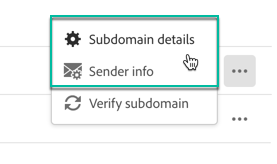

# Konfigurera en ny underdomän {#setting-up-subdomain}

>[!CONTEXTUALHELP]
>id="cp_subdomain_management"
>title="Konfigurera nya underdomäner och hantera certifikat"
>abstract="Du måste konfigurera en ny underdomän och hantera dina underdomäners SSL-certifikat för att kunna börja skicka e-postmeddelanden eller publicera landningssidor med Adobe Campaign."
>additional-url="https://docs.adobe.com/content/help/sv-SE/control-panel/using/subdomains-and-certificates/monitoring-ssl-certificates.html" text="Så övervakar du dina underdomäners SSL-certifikat"

>[!IMPORTANT]
>
>Att delegera underdomäner i Kontrollpanelen finns tillgängligt som en betaversion och kan ofta uppdateras och ändras utan föregående meddelande.

## Fullständig delegering av underdomäner {#full-subdomain-delegation}

Via Kontrollpanelen kan du fullständigt delegera en underdomän som tillhör Adobe Campaign. Följ dessa steg för att göra detta:

1. Välj önskad produktionsinstans på **[!UICONTROL Subdomains & Certificates]**-kortet och klicka sedan på **[!UICONTROL Setup new subdomain]**.

   

   >[!NOTE]
   >
   >Delegering av en underdomän är endast tillgänglig för **produktionsinstanser**.
   >
   >Om den valda instansen inte har några tidigare konfigurerade underdomäner blir den första underdomänen som delegeras till Adobe den **primära underdomänen** för den instansen. Du kan inte ändra den i framtiden. Omvända DNS-poster skapas för andra underdomäner med hjälp av den primära underdomänen. Svars- och returadresser för andra underdomäner genereras från den primära underdomänen.

1. Klicka på **[!UICONTROL Next]** för att bekräfta den fullständiga delegeringsmetoden.

   Observera att Kontrollpanelen för närvarande inte har stöd för [CNAME](#use-cnames) och anpassade metoder.

   

1. Skapa den önskade underdomänen och namnservrar i värdlösningen som används av organisationen. Gör detta genom att kopiera och klistra in Adobe Nameserver-informationen som visas i guiden. Se [videon med självstudiekurser](https://video.tv.adobe.com/v/30175?captions=swe) för mer information om hur du skapar en underdomän i en värdlösning.

   >[!IMPORTANT]
   >
   >Se till att du **aldrig delegerar din rotunderdomän till Adobe** när du konfigurerar namnservrar. Om du gör detta fungera domänen endast med Adobe. Att använda den på annat sätt – såsom att skicka interna e-postmeddelanden till företagets anställda – blir omöjligt.
   >
   >Skapa **inte heller någon separat zonfil** för den nya underdomänen.

   

1. Skapa underdomänen med motsvarande Adobe Nameserver-information och klicka sedan på **[!UICONTROL Next]**.

1. Välj önskat användningsfall för underdomänen:

   * **Marknadsföringskommunikation**: kommunikation som är avsedd för kommersiellt bruk. Exempel: försäljningskampanj via e-post.
   * **Transaktions- och verksamhetskommunikation**: transaktionskommunikation innehåller information som syftar till att slutföra en process som mottagaren har startat med dig. Exempel: inköpsbekräftelse och e-post för lösenordsåterställning. Organisationskommunikation rör utbyte av information, idéer och åsikter utan kommersiellt syfte. Detta gäller både inom och utanför organisationen .
   

   **Att dela upp underdomänerna per användningsfall är bästa praxis för levererbarhet**. På så sätt isoleras och skyddas varje underdomäns rykte. Om till exempel din underdomän för marknadsföringskommunikation läggs till i blockeringslistan hos internetleverantörer påverkas inte den för transaktionskommunikation och kan fortsätta att skicka kommunikation.

   **Du kan delegera en separat underdomän för användningsfallen Marknadsföring och Transaktioner**:

   * I användningsfall för Marknadsföring konfigureras underdomäner på **MID**-instanser (mid-sourcing).
   * I användningsfall för Transaktioner konfigureras underdomäner på ALLA **RT**-instanser (meddelandecenter/realtidsmeddelanden) för att säkerställa anslutningen. Underdomänerna fungerar därför med alla RT-instanser.
   >[!NOTE]
   >
   >Om du använder Campaign Classic kan du via Kontrollpanelen se vilka RT/MID-instanser som är anslutna till den marknadsföringsinstans du arbetar med. Se avsnittet [Information om instanser](../../instances-settings/using/instance-details.md) för mer information.

1. Öppna den underdomän du skapade i din värdlösning och klicka sedan på **[!UICONTROL Submit]**.

   Se till att du anger det **fullständiga namnet** på den underdomän som ska delegeras. Om du till exempel vill delegera underdomänen ”usoffers.email.weretail.com” ska du skriva ”usoffers.email.weretail.com”.

   

1. När underdomänen har angetts kontrollerar Kontrollpanelen att den pekar korrekt på Adobe NS-poster och att posten Start of Authority (SOA) inte finns för den här underdomänen.

   >[!NOTE]
   >
   >Observera att när delegering av underdomäner körs ställs andra begäranden via Kontrollpanelen i kö och utförs först när delegeringen av underdomäner har slutförts. Detta händer för att undvika prestandaproblem.

1. Om kontrollerna är godkända börjar Kontrollpanelen konfigurera underdomänen med DNS-poster, ytterligare URL:er och inkorgar osv.

   

   Slutligen kommer **Levererbarhetsteamet** att meddelas om den nya underdomänen för att kunna granska den. Granskningsprocessen kan ta upp till tio arbetsdagar efter att underdomänen har delegerats. De kontroller som utförs omfattar tester av feedbackslingor och feedbackslingor gällande skräppost. Vi rekommenderar därför inte att du använder underdomänen innan granskningen har slutförts eftersom det kan leda till ett dåligt rykte för underdomänen.

   Klicka på knappen **[!UICONTROL Process details]** för att få mer information om konfigurationsförloppet.

   

   **Felsökning:**

   * I vissa fall godkänns delegeringen medan underdomänen kanske inte kan verifieras. Underdomänen blir kvar i **[!UICONTROL Configured]**-listan med en jobblogg med information om felet. Kontakta kundtjänsten om du behöver hjälp med att lösa problemet.
   * Starta en ny verifiering av underdomäner (**…**/**[!UICONTROL Verify subdomain]**) om underdomänen visas som ”Ej verifierad” efter att den har konfigurerats. Om den fortfarande har samma status kan det bero på att det anpassningar utförs i mottagarschemat som inte kan verifieras med standardprocesser. Försök skicka en kampanj med den underdomänen.
   * Om konfigurationen av underdomänen vid granskning av leveransen tar för lång tid (mer än tio arbetsdagar) ska du kontakta Kundtjänst.

Vid slutet av processen konfigureras underdomänerna så att de fungerar med instansen i Adobe Campaign och elementen nedan skapas:

* **Underdomänen med följande DNS-poster**: SOA, MX, CNAME(:er), DKIM, SPF, TXT.
* **Ytterligare underdomäner** för värdspegling, resurser, spårningssidor och domännycklar.
* **Inkorgar**: avsändare, fel, svara till.

   Som standard är inkorgen ”Svara till” på Kontrollpanelen konfigurerad till att rensa e-postmeddelanden och kan inte granskas. Använd en annan adress om du vill övervaka din ”Svara till”-inkorg för marknadsföringskampanjerna.

Du får mer information om underdomänen genom att klicka på knapparna **[!UICONTROL Subdomain details]** och **[!UICONTROL Sender info]**.

## Använda CNAME:er {#use-cnames}

CNAME:er kan inte användas för att delegera underdomäner via Kontrollpanelen. Kontakta Adobes kundtjänst för att använda den här metoden.

**Relaterade ämnen:**

* [Delegera underdomäner (video med självstudiekurser)](https://docs.adobe.com/content/help/en/campaign-learn/campaign-standard-tutorials/administrating/control-panel/subdomain-delegation.html)
* [Märka underdomäner](../../subdomains-certificates/using/subdomains-branding.md)
* [Övervaka underdomänerna](../../subdomains-certificates/using/monitoring-subdomains.md)