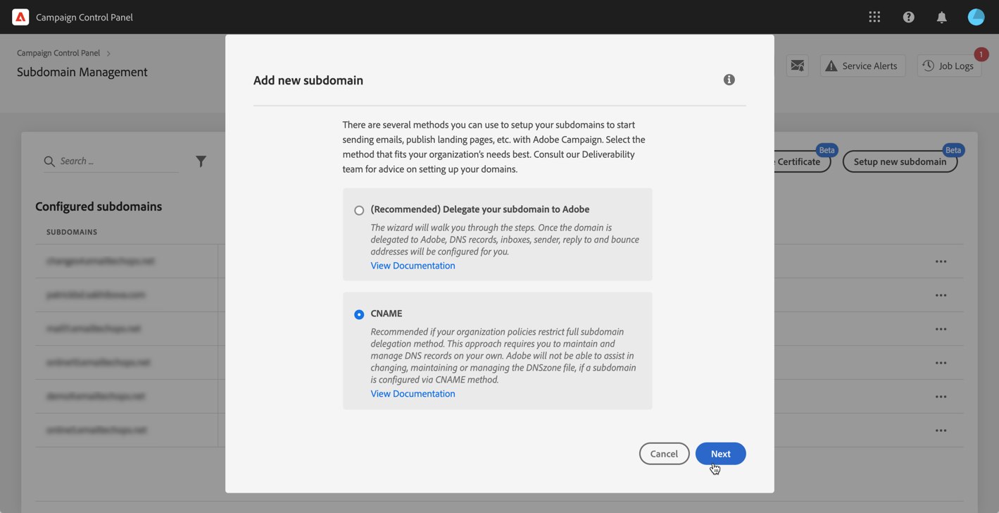
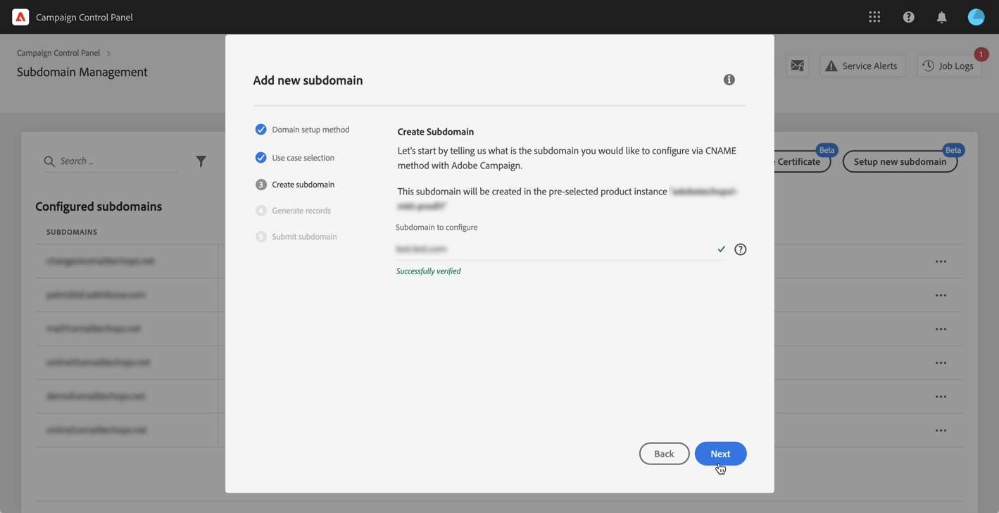

# Konfigurera en ny underdomän {#setting-up-subdomain}

>[!CONTEXTUALHELP]
>id="cp_subdomain_management"
>title="Konfigurera nya underdomäner och hantera certifikat"
>abstract="Du måste konfigurera en ny underdomän och hantera dina underdomäners SSL-certifikat för att kunna börja skicka e-postmeddelanden eller publicera landningssidor med Adobe Campaign."
>additional-url="https://experienceleague.adobe.com/docs/control-panel/using/subdomains-and-certificates/monitoring-ssl-certificates.html?lang=sv" text="Övervakning av SSL-certifikat "

## Måste läsas {#must-read}

>[!IMPORTANT]
>
>Konfiguration av underdomäner på Kontrollpanelen finns som betaversion, och funktionen uppdateras och ändras ofta utan föregående meddelande.

Den här sidan innehåller information om hur du konfigurerar nya underdomäner med fullständig underdomändelegering eller CNAME. Globala koncept för dessa två metoder beskrivs i detta avsnitt: [Varumärke för underdomäner](../../subdomains-certificates/using/subdomains-branding.md).

**Relaterat ämne:**

* [Övervaka underdomäner](../../subdomains-certificates/using/monitoring-subdomains.md)

### Val av instans

Konfiguration av en underdomän är endast tillgänglig för **produktionsinstanser**.

Om instansen som du väljer i guiden inte har några tidigare konfigurerade underdomäner, blir den första konfigurerade underdomänen den **primära underdomänen** för den instansen och du kan inte ändra den i framtiden.

Därför skapas **omvända DNS-poster** för andra underdomäner som använder den här primära underdomänen. **Svars- och returadresser för andra underdomäner genereras från den primära underdomänen.**

### Konfiguration av namnservrar

Se till att du **aldrig delegerar din rotunderdomän till Adobe** när du konfigurerar namnservrar. Om du gör detta fungera domänen endast med Adobe. Att använda den på annat sätt – såsom att skicka interna e-postmeddelanden till företagets anställda – blir omöjligt.

Skapa **inte heller någon separat zonfil** för den nya underdomänen.

## Fullständig delegering av underdomäner {#full-subdomain-delegation}

>[!CONTEXTUALHELP]
>id="cp_add_new_subdomain"
>title="Lägg till ny underdomän"
>abstract="Adobe rekommenderar fullständig delegering av underdomäner. Du kan dock använda CNAME eller en anpassad metod för att konfigurera dina underdomäner."
>additional-url="https://experienceleague.adobe.com/docs/control-panel/using/subdomains-and-certificates/setting-up-new-subdomain.html?lang=sv" text="Konfigurera en ny underdomän"
>additional-url="https://helpx.adobe.com/se/enterprise/using/support-for-experience-cloud.html" text="Kontakta kundtjänst"

>[!CONTEXTUALHELP]
>id="cp_add_subdomain_create_delegate"
>title="Skapa och delegera din underdomän"
>abstract="Skapa den underdomän som du vill använda med Adobe Campaign i din värdlösning och delegera den till Adobe."
>additional-url="https://experienceleague.adobe.com/docs/control-panel/using/subdomains-and-certificates/setting-up-new-subdomain.html" text="Konfigurera en ny underdomän"

>[!CONTEXTUALHELP]
>id="cp_add_subdomain_submit"
>title="Skicka in din underdomän"
>abstract="Bekräfta och skicka in den underdomän som har konfigurerats i föregående steg."
>additional-url="https://experienceleague.adobe.com/docs/control-panel/using/subdomains-and-certificates/setting-up-new-subdomain.html" text="Konfigurera en ny underdomän"

Följ stegen nedan om du vill delegera en underdomän fullständigt till Adobe Campaign.

 Upptäck den här funktionen via video med [Campaign Classic](https://experienceleague.adobe.com/docs/campaign-classic-learn/control-panel/subdomains-and-certificates/subdomain-delegation.html?lang=sv#subdomains-and-certificates) eller [Campaign Standard](https://experienceleague.adobe.com/docs/campaign-standard-learn/control-panel/subdomains-and-certificates/subdomain-delegation.html?lang=sv#subdomains-and-certificates)

1. Välj önskad produktionsinstans på kortet **[!UICONTROL Subdomains & Certificates]** och klicka sedan på **[!UICONTROL Setup new subdomain]**.

   

1. Klicka på **[!UICONTROL Next]** för att bekräfta den fullständiga delegeringsmetoden.

   

1. Skapa den önskade underdomänen och namnservrar i värdlösningen som används av organisationen. Gör detta genom att kopiera och klistra in Adobe Nameserver-informationen som visas i guiden. Se [videon med självstudiekurser](https://video.tv.adobe.com/v/30175) för mer information om hur du skapar en underdomän i en värdlösning.

   >[!NOTE]
   >
   > Med delegerade underdomäner i Adobe Campaign Standard kan du skicka både **marknads-** och **transaktionskommunikation**.

   

1. Skapa underdomänen med motsvarande Adobe-namnserverinformation och klicka sedan på **[!UICONTROL Next]**.

1. Om du har valt en Campaign Classic-instans väljer du önskat användningsfall för underdomänen: **Marknadskommunikation** eller **Transaktionell och operativ kommunikation**. Globala koncept för underdomäners användningsfall presenteras i [det här avsnittet](../../subdomains-certificates/using/subdomains-branding.md#about-subdomains-use-cases).

   

1. Öppna den underdomän du skapade i din värdlösning och klicka sedan på **[!UICONTROL Submit]**.

   Se till att du anger det **fullständiga namnet** på den underdomän som ska delegeras. Om du till exempel vill delegera underdomänen ”usoffers.email.weretail.com” ska du skriva ”usoffers.email.weretail.com”.

   

När underdomänen har skickats utförs olika kontroller och konfigurationssteg av Kontrollpanelen. Mer information finns i [Kontroller och konfiguration av underdomäner](#subdomain-checks-and-configuration).

## Konfiguration av underdomäner med CNAME {#use-cnames}

>[!CONTEXTUALHELP]
>id="cp_add_cname_subdomain_create_delegate"
>title="Konfigurera din underdomän"
>abstract="På den här skärmen anger du den underdomän som du vill konfigurera genom att använda CNAME."
>additional-url="https://experienceleague.adobe.com/docs/control-panel/using/subdomains-and-certificates/setting-up-new-subdomain.html" text="Konfigurera en ny underdomän"

>[!CONTEXTUALHELP]
>id="cp_add_cname_records"
>title="Generera poster"
>abstract="Navigera till din värdlösning för att generera listan med DNS-poster som visas på den här skärmen."
>additional-url="https://experienceleague.adobe.com/docs/control-panel/using/subdomains-and-certificates/setting-up-new-subdomain.html" text="Konfigurera en ny underdomän"

>[!CONTEXTUALHELP]
>id="cp_add_cname_subdomain_submit"
>title="Skicka in din underdomän"
>abstract="Bekräfta och skicka in den underdomän som har konfigurerats i föregående steg."
>additional-url="https://experienceleague.adobe.com/docs/control-panel/using/subdomains-and-certificates/setting-up-new-subdomain.html" text="Konfigurera en ny underdomän"

Följ stegen nedan för att konfigurera en underdomän med CNAME.

 Upptäck den här funktionen via video med [Campaign Classic](https://experienceleague.adobe.com/docs/campaign-classic-learn/control-panel/subdomains-and-certificates/delegating-subdomains-using-cname.html?lang=sv#subdomains-and-certificates) eller [Campaign Standard](https://experienceleague.adobe.com/docs/campaign-standard-learn/control-panel/subdomains-and-certificates/delegating-subdomains-using-cname.html?lang=sv)

1. Välj önskad produktionsinstans på kortet **[!UICONTROL Subdomains & Certificates]** och klicka sedan på **[!UICONTROL Setup new subdomain]**.

   

1. Välj metoden **[!UICONTROL CNAME]** och klicka sedan på **[!UICONTROL Next]**.

   

1. Om du har valt en Campaign Classic-instans väljer du önskat användningsfall för underdomänen: **Marknadskommunikation** eller **Transaktionell och operativ kommunikation**. Globala koncept för underdomäners användningsfall presenteras i [det här avsnittet](../../subdomains-certificates/using/subdomains-branding.md#about-subdomains-use-cases).

   

1. Öppna den underdomän du skapade i din värdlösning och klicka sedan på **[!UICONTROL Next]**.

   Se till att du anger det **fullständiga namnet** på den underdomän som ska konfigureras. Om du till exempel vill konfigurera underdomänen ”usoffers.email.weretail.com” ska du skriva ”usoffers.email.weretail.com”.

   

1. Listan med poster som ska placeras på dina DNS-servrar visas. Kopiera de här posterna, antingen en efter en eller genom att hämta en CSV-fil, och navigera sedan till din värdlösning för domänen för att generera matchande DNS-poster.

   

1. Se till att alla DNS-poster från tidigare steg har genererats i domänens värdlösning. Om allt är korrekt konfigurerat markerar du den första satsen och klickar sedan på **[!UICONTROL Submit]** för att bekräfta.

   

   >[!NOTE]
   >
   >Om du vill skapa posterna och skicka konfigurationen för underdomänen senare, väljer du den andra satsen och klickar sedan på **[!UICONTROL Submit later]**. Du kan sedan återuppta konfigurationen av underdomänen direkt från området **[!UICONTROL Processing]** på underdomänens hanteringsskärm.
   >
   >Observera att DNS-poster som ska placeras på servern behålls av Kontrollpanelen i 30 dagar. Efter den perioden måste du konfigurera underdomänen från grunden.

När underdomänen har skickats utförs olika kontroller och konfigurationssteg av Kontrollpanelen. Mer information finns i [Kontroller och konfiguration av underdomäner](#subdomain-checks-and-configuration).

## Kontroll och konfiguration av underdomäner {#subdomain-checks-and-configuration}

1. När underdomänen har skickats in kontrollerar Kontrollpanelen att den pekar korrekt på Adobe NS-poster och att posten Start of Authority (SOA) inte finns för den här underdomänen.

   >[!NOTE]
   >
   >Observera att när konfiguration av underdomäner körs ställs andra begäranden via Kontrollpanelen i kö och utförs först när konfigurationen av underdomäner har slutförts. Det här händer för att undvika prestandaproblem.

1. Om kontrollerna är godkända börjar Kontrollpanelen konfigurera underdomänen med DNS-poster, ytterligare URL:er, inkorgar osv.

   

   Klicka på knappen **[!UICONTROL Details]** för att få mer information om konfigurationsförloppet.

   

1. Slutligen kommer **Levererbarhetsteamet** att meddelas om den nya underdomänen för att kunna granska den. Granskningsprocessen kan ta upp till 10 arbetsdagar efter att underdomänen har konfigurerats.

   >[!IMPORTANT]
   >
   >De kontroller som utförs omfattar tester av feedbackslingor och feedbackslingor gällande skräppost. Vi rekommenderar därför inte att du använder underdomänen innan granskningen har slutförts eftersom det kan leda till ett dåligt rykte för underdomänen.

1. Vid slutet av processen konfigureras underdomänerna så att de fungerar med instansen i Adobe Campaign och elementen nedan skapas:

   * **Underdomänen med följande DNS-poster**: SOA, MX, CNAME(:er), DKIM, SPF, TXT.
   * **Ytterligare underdomäner** för värdspegling, resurser, spårningssidor och domännycklar.
   * **Inkorgar**: avsändare, fel, svara till.

   Som standard är inkorgen ”Svara till” på Kontrollpanelen konfigurerad till att rensa e-postmeddelanden och kan inte granskas. Använd en annan adress om du vill övervaka din ”Svara till”-inkorg för marknadsföringskampanjerna.

Du får mer information om underdomänen genom att klicka på knapparna **[!UICONTROL Subdomain details]** och **[!UICONTROL Sender info]**.

## Felsökning {#troubleshooting}

* I vissa fall godkänns konfigurationen medan underdomänen kanske inte kan verifieras. Underdomänen blir kvar i **[!UICONTROL Configured]**-listan med en jobblogg med information om felet. Kontakta kundtjänsten om du behöver hjälp med att lösa problemet.
* Starta en ny verifiering av underdomäner (**…**/**[!UICONTROL Verify subdomain]**) om underdomänen visas som ”Ej verifierad” efter att den har konfigurerats. Om den fortfarande har samma status kan det bero på att det anpassningar utförs i mottagarschemat som inte kan verifieras med standardprocesser. Försök skicka en kampanj med den underdomänen.
* Om konfigurationen av underdomänen vid granskning av leveransen tar för lång tid (mer än tio arbetsdagar) ska du kontakta Kundtjänst.
